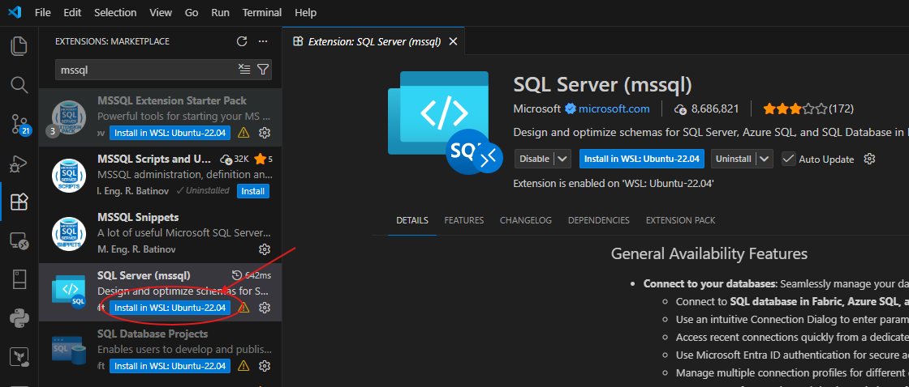
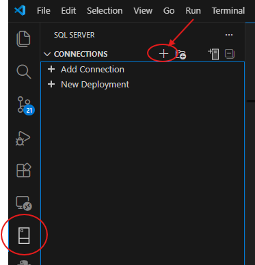
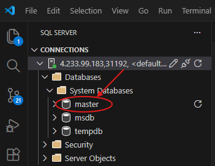
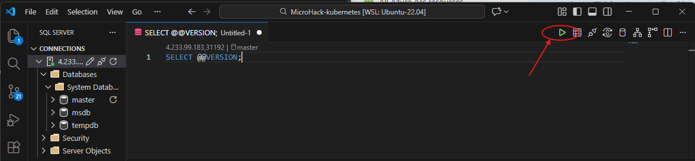

# Walkthrough Challenge 4 - Deploy SQL Managed Instance to your cluster

[Back to challenge](../../challenges/challenge-04.md) - [Next Challenge's Solution](../challenge-05/solution.md)

## prerequisites
- [client tools](https://learn.microsoft.com/en-us/azure/azure-arc/data/install-client-tools)
- Provider reqistration
```shell
az provider register --namespace Microsoft.AzureArcData
```

## Read about the prerequisites and concepts
1. Create Azure Arc [data services cluster extension](https://learn.microsoft.com/en-us/azure/azure-arc/kubernetes/conceptual-extensions)
2. Create a [custom location] on your arc-enabled k8s(https://learn.microsoft.com/en-us/azure/azure-arc/kubernetes/custom-locations#create-custom-location)
3. create the Arc data controller

## Task 1 - Create arc data services controller

The deployment uses ARM templates as this is the most robust way for deployment at the time of writing this microhack. Before deploying, you need to prepare the parameter file with your specific values.

### Step 1: Gather required values

```bash
# Get current user's number (e.g., LabUser-37@... or hackuser-067@... -> 37 or 67)
export azure_user=$(az account show --query user.name --output tsv)
export user_number=$(echo "$azure_user" | cut -d'@' -f1 | sed -E -n 's/.*[^0-9]([0-9]+)$/\1/p' | sed 's/^0*//')
export resource_group="$user_number-k8s-arc"
export connected_cluster_name="$user_number-k8s-arc-enabled"
export extension_name="$user_number-arc-data-controller-ext"
export namespace="$user_number-arc-data-controller"
export custom_location_name="$user_number-arc-data-controller"
export data_controller_name="$user_number-dc"

# Get Log Analytics workspace details
export log_analytics_workspace_id=$(az monitor log-analytics workspace show -g $resource_group -n "$user_number-law" --query customerId -o tsv)
export log_analytics_primary_key=$(az monitor log-analytics workspace get-shared-keys -g $resource_group -n "$user_number-law" --query primarySharedKey -o tsv)

echo "Your values:"
echo "RESOURCE_GROUP: $resource_group"
echo "CONNECTED_CLUSTER_NAME: $connected_cluster_name"
echo "EXTENSION_NAME: $extension_name"
echo "NAMESPACE: $namespace"
echo "CUSTOM_LOCATION_NAME: $custom_location_name"
echo "DATA_CONTROLLER_NAME: $data_controller_name"
echo "LOG_ANALYTICS_WORKSPACE_ID: $log_analytics_workspace_id"
```

### Step 2: Update parameters.json

Copy the template file and replace placeholders:

```bash
cd walkthrough/challenge-04/templates

# Remove the old one and start fresh
rm parameters-my.json
# Create a working copy
cp parameters.json parameters-my.json

# Replace placeholders (Linux/WSL)
# Note: Escape special sed characters in the primary key to handle any potential delimiters
escaped_key=$(printf '%s\n' "$log_analytics_primary_key" | sed 's/[\/&]/\\&/g')

sed -i "s/<CONNECTED_CLUSTER_NAME>/$connected_cluster_name/g" parameters-my.json
sed -i "s/<EXTENSION_NAME>/$extension_name/g" parameters-my.json
sed -i "s/<NAMESPACE>/$namespace/g" parameters-my.json
sed -i "s/<CUSTOM_LOCATION_NAME>/$custom_location_name/g" parameters-my.json
sed -i "s/<DATA_CONTROLLER_NAME>/$data_controller_name/g" parameters-my.json
sed -i "s/<LOG_ANALYTICS_WORKSPACE_ID>/$log_analytics_workspace_id/g" parameters-my.json
sed -i "s/<LOG_ANALYTICS_PRIMARY_KEY>/$escaped_key/g" parameters-my.json
sed -i "s/<DC_DASHBOARD_USERNAME>/mhadmin/g" parameters-my.json

# Alternative: manual replacement
# Edit parameters-my.json and replace:
#   <CONNECTED_CLUSTER_NAME> with the name of your arc-enabled connected cluster
#   <EXTENSION_NAME> with the desired extension name
#   <NAMESPACE> with the Kubernetes namespace for arc data services
#   <CUSTOM_LOCATION_NAME> with the custom location name
#   <DATA_CONTROLLER_NAME> with the desired data controller name
#   <LOG_ANALYTICS_WORKSPACE_ID> with workspace ID
#   <LOG_ANALYTICS_PRIMARY_KEY> with workspace key
#   <DC_DASHBOARD_USERNAME> with the desired dashboard username (e.g., mhadmin)
```

### Step 3: Deploy the Arc Data Controller

```bash
read -s -p "Enter password for metrics/logs dashboard: " DC_PASSWORD && echo

# Validate the deployment first
az deployment group validate \
  --resource-group $resource_group \
  --template-file template.json \
  --parameters parameters-my.json \
  --parameters dataController_metricsAndLogsDashboardPassword="$DC_PASSWORD"

# Deploy (you'll be prompted for the dashboard password)
az deployment group create \
  --resource-group $resource_group \
  --template-file template.json \
  --parameters parameters-my.json \
  --parameters dataController_metricsAndLogsDashboardPassword="$DC_PASSWORD" \
  --verbose
```
*NOTE*: At the time of writing there is a bug in the az cli command to create the arc data controller. This is why we are using a workaround based on an ARM template deployment.

The deployment takes 10-15 minutes. You can monitor progress with:

```bash
# Watch deployment status
az deployment group show \
  --resource-group $resource_group \
  --name template \
  --query properties.provisioningState

# Monitor operations
az deployment operation group list \
  --resource-group $resource_group \
  --name template \
  --query "[].{Resource:properties.targetResource.resourceName, State:properties.provisioningState}" -o table
```

## Task 2 - Create SQL Managed Instance in connected cluster

**IMPORTANT: 'sa' is not allowed as sql admin at managed instance level!**

```bash
# Set SQL MI name (must start with a letter for Kubernetes naming rules)
export sqlmi_name="sqlmi-${user_number}-1"

# Create SQL MI (you'll be prompted for sql admin user and password)
az sql mi-arc create \
  --name $sqlmi_name \
  --resource-group $resource_group \
  --custom-location $custom_location_name \
  --cores-request 1 \
  --memory-request 3Gi
```

The creation takes 5-10 minutes. Monitor progress:

```bash
# Check deployment status
az sql mi-arc show --name $sqlmi_name --resource-group $resource_group --query "properties.k8sRaw.status.state" -o tsv

# Check pods in the namespace
kubectl get pods -n $namespace -l app.kubernetes.io/name=$sqlmi_name
```

## Task 3 - Connect to your SQL Managed Instance

### Prerequisites
* In this microhack the K3s cluster is configured to expose services on the private IP address of the master node per default. So you should use the Windows workstation in your lab environment to connect to the SQL MI.
* **Network Security Group (NSG)**: The Terraform deployment has already configured the NSG to allow external access to the NodePort range (30000-32767) required for SQL MI connectivity. No additional NSG configuration is needed.

### Get connection details

```bash
# Get public ip of master node via Azure cli according to user-number
master_ip=$(az vm list-ip-addresses --resource-group "${user_number}-k8s-onprem" --name "${user_number}-k8s-master" --query "[0].virtualMachine.network.privateIpAddresses[0]" --output tsv)

# Get the NodePort assigned to SQL MI
node_port=$(kubectl get svc ${sqlmi_name}-external-svc -n $namespace -o jsonpath='{.spec.ports[0].nodePort}')

echo "Connection details:"
echo "Server: $master_ip,$node_port"
echo "Username: <your-user-name>"
echo "Password: <your-sql-password>"
echo ""
echo "Connection string:"
echo "Server=$master_ip,$node_port;Database=master;User Id=sa;Password=<your-password>;TrustServerCertificate=true;"
```

### Connect using VS Code SQL Server extension

#### 1. Install the **SQL Server (mssql)** extension in VS Code:



#### 2. After installation completed, in the SQL PlugIn click **Add Connection**:



#### 3. Enter connection details:
**💡Note: In this lab we are using the public ip to connect to the service.**
   - **Input type**: Parameters
   - **Server:** `<Public-IP-Master-Node>,<NODE_PORT>` (e.g., `20.123.45.67,31433`, optionally, use the following command: ```echo "$master_ip,$(kubectl get svc ${sqlmi_name}-external-svc -n $namespace -o jsonpath='{.spec.ports[0].nodePort}')"```
   - **Trust Server Certificate:** Yes
   - **Authentication Type:** SQL Login
   - **User name:** (the admin account you entered during SQL MI creation)
   - **Password:** (the password you entered during SQL MI creation)
   - **Database:** `master` (or leave empty)

#### 4. Click **Connect**
#### 5. Expand Databases, then expand System Databases and right click on **master**. In the context menu select **New Query**.


#### 6. Query database version using ```SELECT @@VERSION;```:


You successfully completed challenge 4! 🚀🚀🚀

[Next challenge](../../challenges/challenge-05.md) - [Next Challenge's Solution](../challenge-05/solution.md)