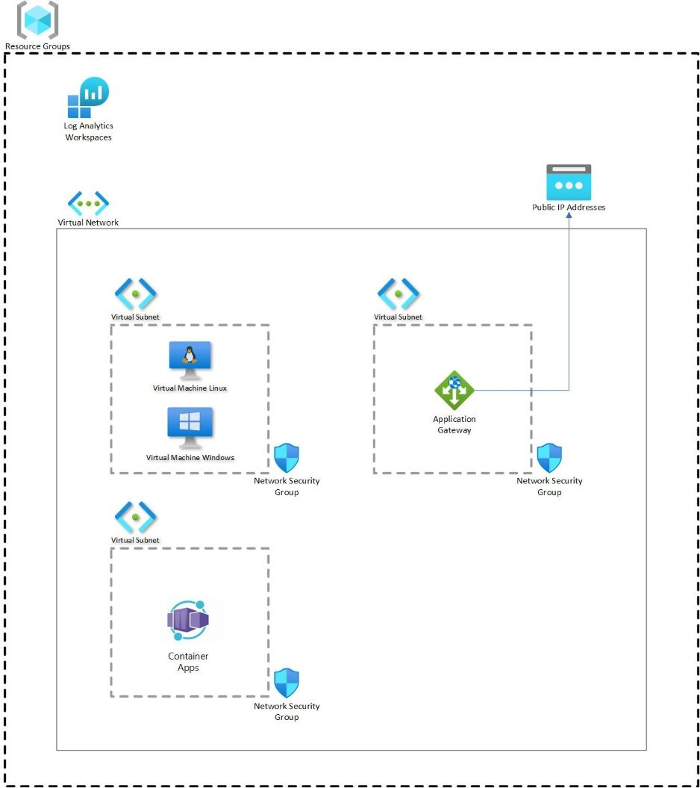

# **MicroHack Azure Monitor**

- [MicroHack introduction and context](#microhack-introduction-and-context)
- [Objectives](#objectives)
- [Prerequisites](#prerequisites)
- [Lab environment for this MicroHack](#lab-environment-for-this-microhack)
  - [Architecture](#architecture)
- [MicroHack Challenges](#microhack-challenges)
  - [Challenge 1 - Deploy the Lab environment](#challenge-1---deploy-the-lab-environment)
    - [Goal](#goal)
    - [Task 1: Deploy Baseline](#task-1-deploy-baseline)
    - [Task 2: Verify baseline](#task-2-verify-baseline)
- [Challenge 2 : Name..](#challenge-2--name)
    - [Goal](#goal-1)
    - [Task 1:](#task-1)
    - [Task 2:](#task-2)
    - [Task 3:](#task-3)
    - [Task 4:](#task-4)
- [Challenge 3 : Name ...](#challenge-3--name-)
    - [Goal](#goal-2)
    - [Task 1:](#task-1-1)
    - [Task 2:](#task-2-1)
    - [Task 3:](#task-3-1)
    - [Task 4:](#task-4-1)
- [Finished? Delete your lab](#finished-delete-your-lab)

# MicroHack introduction and context

Monitoring your infrastructure and applications is important because it provides visibility into the health of backend components that run your applications, allowing you to ensure that critical services are available for users and that they work as expected. Infrastructure monitoring is at the core of the operation, and it boosts reliability by helping you discover current issues and quickly resolving them. It also reduces end-user complaints and keeps you out of trouble.

Application monitoring is also important because it helps you identify issues before they become problems. It allows you to track the performance of your application over time and identify trends that could indicate a problem. By monitoring your application, you can ensure that it is running smoothly and that your users are having a good experience.

Setting up monitoring for your infrastructure and applications is a critical part of any cloud deployment. And it can be a complex task.

This MicroHack scenario walks through the use of **Azure Monitor** with a focus on the best practices and the design principles of how to monitor your overall Azure infrastructure (Iaas and PaaS) and applications accordingly. Specifically, this builds up to include working with an existing infrastructure like Virtual Machines, Application Gateway, Container Apps etc.

**Azure Monitor** is a comprehensive monitoring solution for collecting, analyzing, and responding to telemetry from your cloud and on-premises environments. You can use Azure Monitor to maximize the availability and performance of your applications and services. Azure Monitor collects and aggregates the data from every layer and component of your system into a common data platform. It correlates data across multiple Azure subscriptions and tenants, in addition to hosting data for other services. Because this data is stored together, it can be correlated and analyzed using a common set of tools. The data can then be used for analysis and visualizations to help you understand how your applications are performing and respond automatically to system events.

Use Azure Monitor to monitor these types of resources in Azure, other clouds, or on-premises:

- Applications
- Virtual machines
- Guest operating systems
- Containers including Prometheus metrics
- Databases
- Security events in combination with Azure Sentinel
- Networking events and health in combination with Network Watcher
- Custom sources that use the APIs to get data into Azure Monitor

You can also export monitoring data from Azure Monitor into other systems so you can:

- Integrate with other third-party and open-source monitoring and visualization tools
- Integrate with ticketing and other ITSM systems

Please be aware that this lab is not a full explanation of Kubernetes (AKS), Containers Apps etc. as a technology. Please consider the following articles required pre-reading to build foundational knowledge.

# Objectives

After completing this MicroHack you will:

- Know how to build a monitoring solution for your Azure infrastructure and applications
- Understand default monitoring capabilities of Azure Monitor
- Understand how to use Azure Monitor to monitor your infrastructure and applications

# Prerequisites

In order to use the MicroHack time most effectively, the following tasks should be completed prior to starting the session:

- Ensure that you have an active Azure subscription. If you do not have one, you can create a free account [here](https://azure.microsoft.com/en-us/free/).

- Ensure that you have the necessary permissions to create resources in your Azure subscription. If you do not have the necessary permissions, please contact your Azure subscription administrator.

## Deployment
There are actually two different ways to deploy the lab environment. The first is to use the Azure Portal and the second is to use the the provided terraform scripts. The terraform method is the preferred method as it is faster and more reliable. However, if you are not familiar with terraform, you can use the Azure Portal method.

### Azure Portal Method
To deploy the lab environment using the Azure Portal, click the button below. This will open the Azure Portal and start the deployment process.

### Terraform Method

# Lab environment for this MicroHack

## Architecture
  

# MicroHack Challenges 

## Challenge 1 - Deploy the Lab environment

### Goal 

The goal of this exercise is to deploy...

### Task 1: Deploy Baseline

We are going to use a predefined ARM template to deploy the base environment. It will be deployed in to *your* Azure subscription, with resources running in the your specified Azure region.

To start the ARM deployment, follow the steps listed below:

- Login to Azure cloud shell [https://shell.azure.com/](https://shell.azure.com/)
- Ensure that you are operating within the correct subscription via:

`az account show`

- Clone the following GitHub repository 

`git clone Link to Github Repo `

### Task 2: Verify baseline

Now that we have the base lab deployed, we can progress to the ... challenges!

# Challenge 2 : Name..

### Goal

### Task 1: 

### Task 2: 

### Task 3: 

**Explain the background...**

### Task 4: 

Before proceeding to challenge 3, ...

# Challenge 3 : Name ...

### Goal

### Task 1: 

### Task 2: 

### Task 3: 

**Explain the background...**

### Task 4: 

# Finished? Delete your lab

Thank you for participating in this MicroHack!
