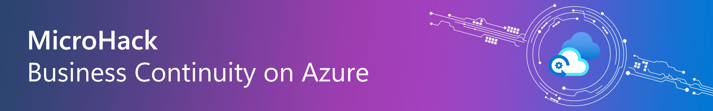
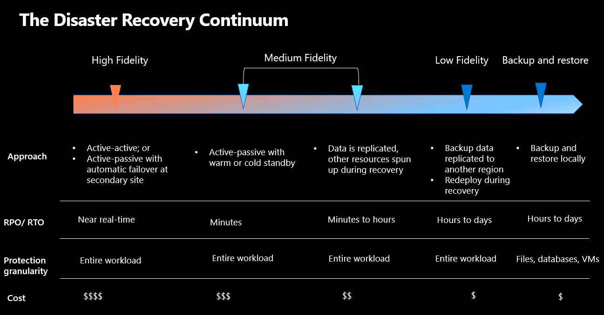

# MicroHack - Business Continuity on Azure

- [**MicroHack introduction**](#MicroHack-introduction)
  - [What is Business Continuity?]()
- [**MicroHack context**](#microhack-context)
- [**Objectives**](#objectives)
- [**MicroHack Challenges**](#microhack-challenges)
  - [General prerequisites](#general-prerequisites)
  - [Challenge 0 - Understand the Disaster Recovery terms and define a strategy](#challenge-0---understand-the-disaster-recovery-terms-and-define-a-strategy)
  - [Challenge 1 - Prerequisites and landing zone preperation](#challenge-1---prerequisites-and-landing-zone-preperation)
  - [Challenge 2 - Protect in Azure - Backup / Restore](#challenge-2---protect-in-azure---backup--restore)
  - [Challenge 3 - Protect in Azure with Disaster Recovery](#challenge-3---protect-in-azure-with-disaster-recovery)
  - [Challenge 4 - Protect to Azure with Azure Backup & Restore](#challenge-4---protect-to-azure-with-azure-backup--restore)
  - [Challenge 5 - Protect to Azure with Disaster Recovery](#challenge-5---protect-to-azure-with-disaster-recovery)
- [**Contributors**](#contributors)

## MicroHack introduction

### What is Business Continuity?

When you design for resiliency, you must understand your availability requirements.
- How much downtime is acceptable? 
- How much will potential downtime cost your business?
- How much should you invest in making the application highly available?
- You also must define what it means for the application to be available.

💡 For instance, would you consider the application to be ‘unavailable’ if it allows you to place an order, but fails to process it within the usual time period? Also, it’s crucial to evaluate the likelihood of a system failure. Is implementing a countermeasure strategy financially justifiable? Remember, effective resilience planning is rooted in the business’s needs. Here are some strategies to guide your thinking when planning for system resiliency.

The following picture describes in details the individual levels / disaster recovery tier levels and also provides an overview of which topics we should deal with when talking about disaster recovery. The individual terms, terminologies and categories will be discussed in this microhack which will also provide one approach and a few tips on how to define them in your own company.

## MicroHack context

This MicroHack scenario walks through the use of building a Business Continuity Strategy with a focus on best practices and the design principles, as well as some interesting challenges for real world scenarios. Specifically, it builds up to include working with an existing infrastructure in your datacenter.

Further resources: 

* [Azure Business Continuity & Disaster Recovery](https://learn.microsoft.com/en-us/azure/site-recovery/site-recovery-overview#what-does-site-recovery-provide)
* [How does Microsoft ensure business continuity](https://learn.microsoft.com/en-us/compliance/assurance/assurance-resiliency-and-continuity)
* [Common questions about Azure Site Recovery](https://learn.microsoft.com/en-us/azure/site-recovery/site-recovery-faq)

💡 Optional: Once you’ve completed this lab, consider reading the following material to further enhance your understanding!

* [Overview of the reliability pillar](https://learn.microsoft.com/en-us/azure/architecture/framework/resiliency/overview)
* [Whitepaper - Resiliency in Azure ](https://azure.microsoft.com/en-us/resources/resilience-in-azure-whitepaper/)

## Objectives

After completing this MicroHack you will:

* Know how to use the right business continuity strategy for your infrastructure or your particular workload.
* Understand use cases and possible scenarios in your own business continuity & disaster recovery strategy.
* Get insights into real world challenges and scenarios.

## MicroHack Challenges

### General prerequisites

This MicroHack has a few but important prerequisites to be understood before starting this lab!

* Your own Azure subscription with Owner RBAC rights at the subscription level
  * [Azure Evaluation free account](https://azure.microsoft.com/en-us/free/search/?OCID=AIDcmmzzaokddl_SEM_0fa7acb99db91c1fb85fcfd489e5ca6e:G:s&ef_id=0fa7acb99db91c1fb85fcfd489e5ca6e:G:s&msclkid=0fa7acb99db91c1fb85fcfd489e5ca6e)

## Challenge 0 - Understand the Disaster Recovery (DR) terms and define a DR strategy

If you have already worked at a senior level or have been working in IT for many years, you may be able to skip this intro challenge.

The DR terms and strategy should be defined in every organization, and most importantly, is that the Business Continuity Management and all the necessary steps for disaster recovery are regularly tested.

### Goal

The goal from this challenge is to help you comprehend the complexities of business continuity management and familiarize yourself with its key terms. In second place, it is to support you to define a strategy and to put yourself into different roles to view the requirements from different perspectives.

1. What exactly is the difference between Disaster Recovery & Business Continuity?
2. Who is responsible for BCDR?
3. Is there a difference between High Availability & Disaster Recovery?
4. Do I really need Backup & Disaster Recovery?

### Actions

* Write down the first 3 steps you would go for if your company got attacked by ransomware.
* Think about if you ever participated in a business continuity test scenario.
* Put yourself in the position of an application owner and define the necessary steps to make sure your application stays available in case of a disaster.
* Identify who defines the requirements for Business Continuity and what are the necessary KPI´s for an application to reach a good SLA in terms of availability.
* Define and write down four different categories of Disaster Recovery Tier Levels that applications can use incl. the availability SLA.
* Plan the different geographic regions you need to use for reaching the highest availability SLA (you can also include your datacenter locations).

### Success criteria

* Understood the different terms from BCDR.
* Identified the initial three steps to take following a ransomware attack in your company.
* Thought about the last successful disaster recovery of daily used applications.
* Identified the responsibilities and roles within your current company in respect to BCDR.
* Defined four levels of disaster recovery categories, including availability SLA.

### Learning resources

* [Business continuity and disaster recovery - Cloud Adoption Framework | Microsoft Learn](https://learn.microsoft.com/azure/cloud-adoption-framework/ready/landing-zone/design-area/management-business-continuity-disaster-recovery)
* [Build high availability into your BCDR strategy - Azure Architecture Center | Microsoft Learn](https://learn.microsoft.com/azure/architecture/solution-ideas/articles/build-high-availability-into-your-bcdr-strategy)
* [Disaster recovery with Azure Site Recovery - Azure Solution Ideas | Microsoft Learn](https://learn.microsoft.com/azure/architecture/solution-ideas/articles/disaster-recovery-smb-azure-site-recovery)

### Solution - Spoilerwarning

[Solution Steps](./walkthrough/challenge-0/solution.md)

## Challenge 1 - Prerequisites and landing zone preparation

### Goal

In challenge 1, you will understand and prepare your environment with the needed infrastructure to enable business continuity with Cloud Native / PaaS Services on Azure.

### Actions

Create all necessary Azure resources
* Region 1: Germany West Central (Source enviroment)
  * Resource Group: mh-bcdr-gwc-rg<your assigned number>
  * Recovery Services Vault: mh-rsv-gwc
  * Storage Account with GRS (geo-redundant storage) redundancy option: mhstweu\<Suffix\>
* Region 2: Sweden Central (Target environment)
  * Resource Group: mh-bcdr-sc-rg<your assigned number>
  * Recovery Services Vault: mh-rsv-sc

### Success criteria

* You've created Resource Groups in both regions (Germany West Central & Sweden Central).
* Recovery Services Vaults have been created in both regions.
* A geo-redundant Storage Account has been created.

### Learning resources

* [Manage resource groups - Azure Portal - Azure Resource Manager | Microsoft Learn](https://learn.microsoft.com/azure/azure-resource-manager/management/manage-resource-groups-portal)
* [Create a storage account - Azure Storage | Microsoft Learn](https://learn.microsoft.com/azure/storage/common/storage-account-create)
* [Create and configure Recovery Services vaults - Azure Backup | Microsoft Learn](https://learn.microsoft.com/azure/backup/backup-create-recovery-services-vault)

### Solution - Spoilerwarning

[Solution Steps](./walkthrough/challenge-1/solution.md)

## Challenge 2 - Protect in Azure - Backup / Restore 

### Goal

In challenge 2, you will successfully onboard your Windows and Linux Virtual Machines to a centralized Recovery Services Vault and leverage Azure Backup Center to Protect with Backup in Azure. 

### Actions

* Deploy a Windows Server 2022 VM in Germany West Central Resource Group. Please use the "Data Science Virtual Machine - Windows 2022" image from the market place.
> **Note:** The 'Data Science Virtual Machine (DSVM)' is a 'Windows Server 2022 with Containers' VM that has several popular tools for data exploration, analysis, modeling & development pre installed.
> You will to use Microsoft SQL Server Management Studio to connect to the database and Storage Explorer to the storage Account.
* Deploy a Ubuntu Server VM in Sweden Central Resource Group.
* Deploy a azure SQL database server with a database containing the sample data of AdventureWorksLT.
* From the Data Science Windows Server VM, connect to the database  and to the storage account.
* Create a blob container and upload a sample file to it.
* Enable Azure Backup for both VMs.
* Enable Azure Backup for blobs on the storage account.
* Restore a VM in Azure.
* Delete and restore the sample blob file.

### Success criteria

* You have deployed two VMs in Azure (one with Window Server 2022, the other one with Ubuntu Server).
* You have deployed a azure SQL database with sample data (AdventureWorksLT) and can access the database for the Windows Server (Data Science Edition).
* You successfully connected to the database and the storage account from the Windows Server.
* You successfully enabled Azure Backup on the two virtual machines.
* You have successfully setup Azure Backup Policies for both virtual machines.
* You successfully enabled Azure Backup for blob.
* You have successfully restored a VM of your choice to Azure.
* You have successfully restored blobs.

### Learning resources

* https://learn.microsoft.com/en-us/azure/azure-sql/database/single-database-create-quickstart?view=azuresql&tabs=azure-portal
* https://learn.microsoft.com/en-us/azure/backup/quick-backup-vm-portal
* https://learn.microsoft.com/en-us/azure/backup/quick-backup-vm-portal#apply-a-backup-policy
* https://learn.microsoft.com/en-us/azure/backup/tutorial-backup-vm-at-scale
* https://learn.microsoft.com/en-us/azure/backup/backup-azure-arm-restore-vms
* https://learn.microsoft.com/en-us/azure/backup/restore-azure-encrypted-virtual-machines
* https://learn.microsoft.com/en-us/azure/backup/blob-backup-overview

### Solution - Spoilerwarning

[Solution Steps](./walkthrough/challenge-2/solution.md)

## Challenge 3 - Protect in Azure with Disaster Recovery 

### Goal

In Challenge 3, you will learn how to protect Azure VM with Azure Site Recovery, and how to enable replication to the secondary site. In addition you will successfully run the test & production failover from Germany West Central to Sweden Central, and failback again from Sweden to Germany.

### Actions

* Set up and enable disaster recovery with Azure Site Recovery and monitor the progress.
* Perform a disaster recovery drill, create recovery plan and run a test failover.
* Run a production failover from Germany West Central to Sweden Central and monitor the progress.

### Success Criteria

* You enabled the replication for the virtual machine to the Sweden Central region.
* You successfully initiated a Testfailover from Azure Region Germany West Central to Sweden Central with a near zero downtime requirement.
* You ran successfully the production failover to the Sweden Central region.

### Learning resources

* https://learn.microsoft.com/en-us/azure/site-recovery/azure-to-azure-how-to-enable-replication
* https://learn.microsoft.com/en-us/azure/site-recovery/site-recovery-create-recovery-plans
* https://learn.microsoft.com/en-us/azure/site-recovery/site-recovery-test-failover-to-azure

### Solution - Spoilerwarning

[Solution Steps](./walkthrough/challenge-3/solution.md)

## Challenge 4 - Protect your Azure PaaS (Azure SQL Database and Storage Account) with Disaster recovery

### Goal

In challenge 4, you will focus on implementing disaster recovery strategies for Azure SQL databases using Failover Groups, and for Azure storage accounts using replication. The primary objective is to ensure business continuity by protecting critical data stored in Azure SQL databases and Azure storage accounts against potential disasters.

### Actions
* Implement Failover Groups for Azure SQL Database:
  * Create a Failover Group between two Azure SQL databases located in different Azure regions (Germany West central and Sweden Central).
  * Configure automatic failover policies and test the failover mechanism to ensure seamless transition in case of a disaster.
* Disaster Recovery for Azure Storage Account:
  * Set up and configure Azure Storage Account replication to another region using Geo-redundant storage (GRS) or Geo-zone-redundant storage (GZRS) to ensure data availability in case of regional outages.
  * Perform a failover test for the storage account to validate the disaster recovery setup.

### Success Criteria
* You have successfully created and configured a Failover Group for Azure SQL Database, ensuring data is replicated and accessible across regions.
* You have implemented disaster recovery for an Azure Storage Account using GRS or GZRS, protecting against regional outages.
* You have conducted failover tests for both the Azure SQL Database and Azure Storage Account, demonstrating the effectiveness of your disaster recovery strategy.
* You were able to connect to the failed-over SQL DB and the failed-over Storage Account from the failed-over VM.

### Learning resources
* [Azure SQL Database Failover Groups and Active Geo-Replication](https://learn.microsoft.com/en-us/azure/azure-sql/database/auto-failover-group-overview)
* [Geo-redundant storage (GRS) for cross-regional durability](https://learn.microsoft.com/en-us/azure/storage/common/storage-redundancy-grs)
* [Disaster recovery and storage account failover](https://learn.microsoft.com/en-us/azure/storage/common/storage-disaster-recovery-guidance)
* [Testing for disaster recovery](https://learn.microsoft.com/en-us/azure/site-recovery/site-recovery-test-failover-to-azure)
	
### Solution - Spoilerwarning

[Solution Steps](./walkthrough/challenge-4/solution.md)

## Challenge 5 -Failback to the primary region (Germany West Central)

### Goal

In challenge 5, you will failback again the VM, SQL DB from Sweden central to Germany West Central. The storage account should be failed back as well to Germany West Central.

### Actions

* Failback the VM from Sweden Central to Germany West Central region (Source environment) and monitor the progress.
* Failback Azure SQL DB to Germany West Central.
* Failback Storage Account to Germany West Central.

### Success Criteria

* The failback of all resources to the Germany West Central region has been successfully performed.

### Learning resources
* https://learn.microsoft.com/en-us/azure/site-recovery/azure-to-azure-how-to-reprotect
* https://learn.microsoft.com/en-us/azure/site-recovery/azure-to-azure-tutorial-failback
* https://learn.microsoft.com/en-us/azure/site-recovery/azure-to-azure-tutorial-enable-replication

### Solution - Spoilerwarning

[Solution Steps](./walkthrough/challenge-5/solution.md)

## Finish

Congratulations! You finished the MicroHack Business Continuity / Disaster Recovery. We hope you had the chance to learn about how to implement a successful DR strategy to protect resources in Azure and to Azure. 
If you want to give feedback please don't hesitate to open an Issue on the repository or get in touch with one of us directly.

Thank you for investing the time and see you next time!

## Contributors
* Markus Klein 
* Bernd Loehlein 
* Hengameh Bigdeloo 
* Tara
* Nils Bankert [GitHub](https://github.com/nilsbankert); [LinkedIn](https://www.linkedin.com/in/nilsbankert/)
* Herman Diessongo
* Demir Senturk
* Andressa Jendreieck

