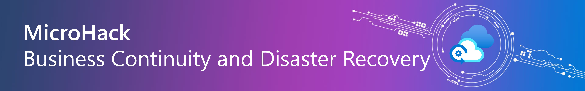

# MicroHack - Business Continuity on Azure

- [**MicroHack introduction**](#microhack-introduction)
  - [What is Business Continuity?](#what-is-business-continuity)
- [**MicroHack context**](#microhack-context)
- [**MicroHack Challenges**](#microhack-challenges)
  - [General Prerequisites](#general-prerequisites)
- [**Contributors**](#contributors)

## MicroHack introduction

### What is Business Continuity?

When you design for resiliency, you must understand your availability requirements.
- How much downtime is acceptable? 
- How much will potential downtime cost your business?
- How much should you invest in making the application highly available?
- You also must define what it means for the application to be available.

💡 For instance, would you consider the application to be ‘unavailable’ if it allows you to place an order, but fails to process it within the usual time period? Also, it’s crucial to evaluate the likelihood of a system failure. Is implementing a countermeasure strategy financially justifiable? Remember, effective resilience planning is rooted in the business’s needs. Here are some strategies to guide your thinking when planning for system resiliency.

The following picture describes in detail the individual levels / disaster recovery tier levels and also provides an overview of which topics we should deal with when talking about disaster recovery. The individual terms, terminologies and categories will be discussed in this microhack which will also provide one approach and a few tips on how to define them in your own company.

## MicroHack context

This MicroHack scenario walks through the use of building a Business Continuity Strategy with a focus on best practices and the design principles, as well as some interesting challenges for real world scenarios. Specifically, it builds up to include working with an existing infrastructure in your datacenter.

Further resources: 

* [Azure Business Continuity & Disaster Recovery](https://learn.microsoft.com/en-us/azure/site-recovery/site-recovery-overview#what-does-site-recovery-provide)
* [How does Microsoft ensure business continuity](https://learn.microsoft.com/en-us/compliance/assurance/assurance-resiliency-and-continuity)
* [Common questions about Azure Site Recovery](https://learn.microsoft.com/en-us/azure/site-recovery/site-recovery-faq)

💡 Optional: Once you’ve completed this lab, consider reading the following material to further enhance your understanding!

* [Overview of the reliability pillar](https://learn.microsoft.com/en-us/azure/architecture/framework/resiliency/overview)
* [Whitepaper - Resiliency in Azure](https://azure.microsoft.com/en-us/resources/resilience-in-azure-whitepaper/)

## Objectives

After completing this MicroHack you will:

* Know how to use the right business continuity strategy for your infrastructure or your particular workload.
* Understand use cases and possible scenarios in your own business continuity & disaster recovery strategy.
* Get insights into real world challenges and scenarios.

## MicroHack Challenges

### General prerequisites

This MicroHack has a few but important prerequisites to be understood before starting this lab!

* Your own Azure subscription with Owner RBAC rights at the subscription level
  * [Azure Evaluation free account](https://azure.microsoft.com/en-us/free/search/?OCID=AIDcmmzzaokddl_SEM_0fa7acb99db91c1fb85fcfd489e5ca6e:G:s&ef_id=0fa7acb99db91c1fb85fcfd489e5ca6e:G:s&msclkid=0fa7acb99db91c1fb85fcfd489e5ca6e)

Azure Copilot is a new tool that helps you manage and optimize your Azure resources with the help of AI. In this Hack Azure Copilot can guide you and help answer some of your questions.

In this section, you will:
- Learn how to use Azure Copilot
- Explore key features and capabilities

### References
- [What is Microsoft Copilot in Azure?](https://learn.microsoft.com/en-us/azure/copilot/overview)
- [📄 Microsoft Copilot in Azure - Documentation](https://docs.microsoft.com/en-us/azure/copilot/)

### Challenges

Let's get started with the **[challenges](./challenges/challenge-01.md)** and dive into the world of Azure! 🌐

By the end of this MicroHack, you'll be equipped with the knowledge and skills to design and implement effective Business Continuity and Disaster Recovery strategies using Azure services. 

Happy hacking! 🚀

- [Challenge 1 - Understand the Disaster Recovery terms and define a strategy](./challenges/challenge-01.md)
- [Challenge 2 - Setup and landing zone preparation](./challenges/challenge-02.md)
- [Challenge 3 - Regional Protection and Disaster Recovery (DR)](./challenges/challenge-03.md)
  - [Challenge 3.1 - Protect in Azure - Backup / Restore](./challenges/challenge-03.md#challenge-31---protect-in-azure---backup--restore)
  - [Challenge 3.2 - Protect in Azure with Disaster Recover (DR) within an Azure Region](./challenges/challenge-03.md#challenge-32---protect-in-azure-with-disaster-recover-dr-within-an-azure-region)
- [Challenge 4 - Protect in Azure with Disaster Recovery (Inter-regional)](./challenges/challenge-04.md)
- [Challenge 5 - Protect your Azure PaaS with Disaster Recovery](./challenges/challenge-05.md)
- [Challenge 6 - Failback to the Primary Region (Germany West Central)](./challenges/challenge-06.md)
- [Extra Challenge - Monitor & Protect your Azure PaaS (Azure SQL Database)](./challenges/challenge-07.md)

## Solutions - Spoilerwarning

- [Solution 1 - Understand the Disaster Recovery terms and define a strategy](./walkthrough/challenge-01/solution-01.md)
- [Solution 2 - Setup and landing zone preparation](./walkthrough/challenge-02/solution-02.md)
- [Solution 3 - Regional Protection and Disaster Recovery (DR)](./walkthrough/challenge-03/solution-03.md)
  - [Solution 3.1 - Protect in Azure - Backup / Restore](./walkthrough/challenge-03/solution-03.md#challenge-31---protect-in-azure---backup--restore)
  - [Solution 3.2 - Protect in Azure with Disaster Recover (DR) within an Azure Region](./walkthrough/challenge-03/solution-03.md#challenge-32---protect-in-azure-with-disaster-recover-dr-within-an-azure-region)
- [Solution 4 - Protect in Azure with Disaster Recovery (Inter-regional)](./walkthrough/challenge-04/solution-04.md)
- [Solution 5 - Protect your Azure PaaS with Disaster Recovery](./walkthrough/challenge-05/solution-05.md)
- [Solution 6 - Failback to the Primary Region (Germany West Central)](./walkthrough/challenge-06/solution-06.md)
- [Extra Solution - Monitor & Protect your Azure PaaS (Azure SQL Database)](./walkthrough/challenge-07/solution-07.md)

### Azure Business Continuity Guide (ABC Guide)
The Azure Business Continuity Guide provides a comprehensive set of recommendations to help customers define what BCDR looks like for their applications.

[Azure Business Continuity Guide](https://github.com/Azure/BusinessContinuityGuide)

## Contributors
* Nils Bankert [GitHub](https://github.com/nilsbankert); [LinkedIn](https://www.linkedin.com/in/nilsbankert/)
* Demir Senturk [GitHub](https://github.com/demirsenturk); [LinkedIn](https://www.linkedin.com/in/demirsenturk/)
* Hengameh Bigdeloo
* Herman Diessongo
* Andressa Jendreieck
* Sebastian Pfaller [LinkedIn](https://www.linkedin.com/in/sebastian-pfaller/)