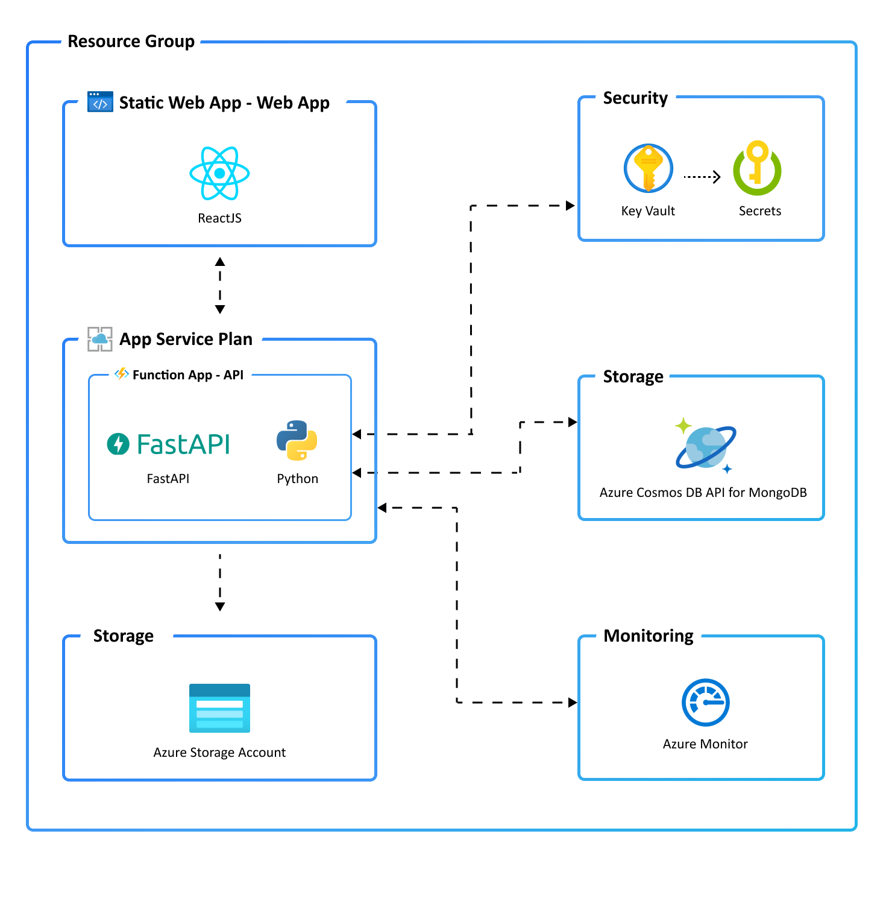

# 🚀 Deploying the Lab environment and an N-tier App

## Introduction
This guide will walk you through deploying a ready-to-go N-tier application and additional resources you need for this lab using the Awesome Azure Developer CLI and Azure Copilot. 
We will use Awesome Azure Developer CLI to deploy a ready-to-go N-tier application. Azure Copilot will help us with what to do and will answer our questions, if we have any.

## Prerequisites
- 🔑 Azure Subscription
- 🛠️ Azure Developer CLI installed (pre-installed in CloudShell - no further action needed)
- 📚 Basic knowledge of Azure services

## Lab Environment & the N-tier Application

To experiment with Azure Monitor & BCDR Solutions and learn how to use it, a lab environment is provided. This includes a sample application, several virtual machines and other Azure services to generate telemetry data.

### N-tier Application



## Guide
By following this guide, you have successfully deployed a ready-to-go N-tier application using the Awesome Azure Developer CLI and Azure Copilot.

## References
- [📄 Azure Developer CLI Documentation](https://docs.microsoft.com/en-us/azure/developer/cli/)
- [📄 Azure Copilot Documentation](https://docs.microsoft.com/en-us/azure/copilot/)

# N-tier Application Deployment

## 1. Initialize the Templates for the N-tier Application
Use the Awesome Azure Developer CLI to initialize the environment.

```bash
azd auth login
```

```bash
azd init --template Azure-Samples/todo-python-mongo-swa-func
```

## 2. Deploy the N-tier Application
Use the Awesome Azure Developer CLI to deploy the N-tier application.

```bash
azd up
```

Use the Awesome Azure Developer CLI to check the status of your deployment.

## 3. Access the Application
Retrieve the URL of the deployed application and open it in your web browser.

Below an architecure diagram displays the setup. Tutorials and documentation that provide step-by-step guidance on how to deploy the environment comes along.

---

# Lab Environment with Virtual Machines


### Deployment

There are **two different ways** to deploy the lab environment. The first is using ARM via **Deploy to Azure-Button** and the second is to use the provided **terraform** scripts. The terraform method is the preferred method as it is faster and more reliable. However, if you are not familiar with terraform, you can use the Azure Portal method.

#### ARM Deployment

[](https://portal.azure.com/#create/Microsoft.Template/uri/https%3A%2F%2Fraw.githubusercontent.com%2Finfracsademos%2FMicroHack%2Fmain%2F03-Azure%2F01-03-Infrastructure%2F07_Azure_Monitor%2Fresources%2FARM%2Ftemplate.json)

Choose the same **resource Group** as the N-tier Application.

#### Terraform Method

To deploy the lab environment using **terraform**, click the link below.

- [Deploy to Azure (terraform)](./resources/terraform/README.md)

**| [< Microhack Overview](../README.md) | [Challenge 1 >](./01_challenge.md) |**