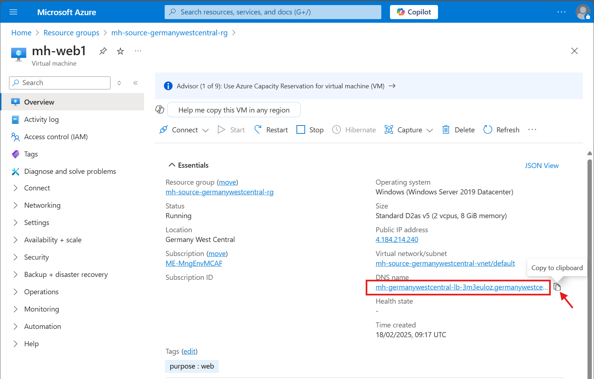
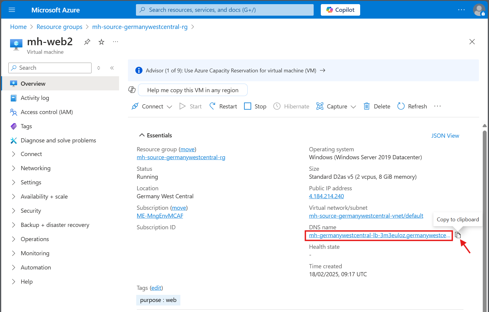
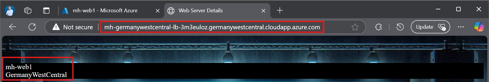
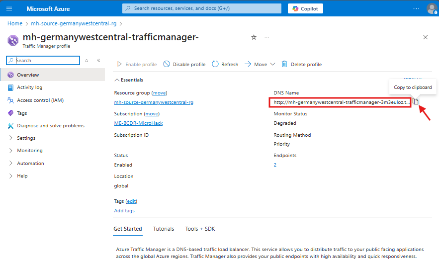
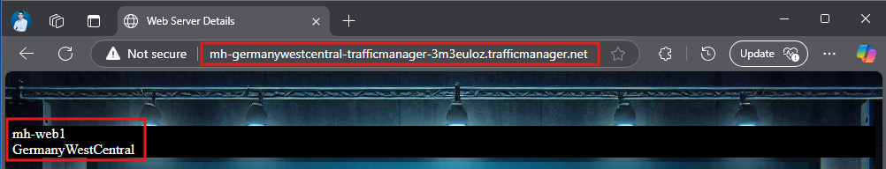

## Challenge 1 - Prerequisites and Landing Zone Preparation

### Goal 🎯

In Challenge 1, you will set up your environment with the necessary infrastructure to ensure business continuity using Cloud Native / PaaS Services on Azure.

Below is an architecture diagram illustrating the setup. Tutorials and documentation providing step-by-step guidance on deploying the environment are included.

---

# Lab Environment with Virtual Machines

## Deployment

We will use **Infrastructure as Code** to deploy the lab environment. There are **two methods** to achieve this:

1. **Azure Portal**: Suitable for those unfamiliar with IaaS deployment, allowing deployment by uploading the provided **ARM** scripts.
1. Alternative: **Bicep/ARM scripts via CloudShell**: This method is preferred for automation

### Option 1 - Deploy from the Azure Portal

1. Go to the Azure portal and sign in.
2. In the Azure portal search bar, search for "deploy a custom template" and select it from the available options.
3. Upload the templates `deploy.json` and `main.parameters.json`.

> **Note:** The template `deploy.json` and the parameter file `main.parameters.json` is available in the GitHub repository. You can access it directly via [this link](https://github.com/microsoft/MicroHack/tree/main/03-Azure/01-03-Infrastructure/04_BCDR_Azure_Native/Infra/App1) or navigate to the path: `.\04_BCDR_Azure_Native\Infra\App1`. Alternatively, you can download it from the repository.

Refer to the [Step-by-Step Deployment Guide](../walkthrough/challenge-1/img/deployment/solution.md) for detailed guidance.

### Option 2 - Infrastructure as Code (ARM/Bicep) Deployment via CloudShell

To deploy the lab environment using **Bicep**, use the command documented here:
 [CloudShell Deployment command](../Infra/App1/ReadMe.md) 

### 📚 Deploy a custom template
* [Quickstart: Create and deploy ARM templates using the Azure portal](https://learn.microsoft.com/en-us/azure/azure-resource-manager/templates/quickstart-create-templates-use-the-portal)

## Exploration of the Lab

After a successful deployment, you should see two new resource groups: `mh-source-germanywestcentral-rg` and `mh-target-swedencentral-rg`.

Verify the following resources and setup. Ensure the storage account has geo-redundancy enabled.

* **Region 1: Germany West Central (Source environment)**
  * Resource Group: `mh<your assigned number>-source-germanywestcentral-rg`
  * Recovery Services Vault: `mh-germanywestcentral-asrvault`
  * Backup Vault: `mh-germanywestcentral-asrvault-backupVault`
  * Storage Account with LRS (locally-redundant storage) redundancy: `mhgermanywestcentral` \<Suffix\>
* **Region 2: Sweden Central (Target environment)**
  * Resource Group: `mh<your assigned number>-target-swedencentral-rg`
  * Recovery Services Vault: `mh-swedencentral-asrvault`
  * Backup Vault: `mh-swedencentral-asrvault-backupVault`

There is a WebApp running on the machines deployed in the Lab Environment. The Web Application uses two Virtual Machines as backend servers, so it might be running from either VM `mh-web1` or VM `mh-web2`. The lab environment provides a UI to see which host the web application is running from.

### Success Criteria ✅

* Resource Groups created in both regions (Germany West Central & Sweden Central).
* Recovery Services Vaults created in both regions.
* Backup Vaults created in both regions.
* A locally-redundant Storage Account created.
* The Web application is successfully deployed using a backend pool of two Virtual Machines.

### 📚 Learning Resources

* [Manage resource groups - Azure Portal - Azure Resource Manager | Microsoft Learn](https://learn.microsoft.com/azure/azure-resource-manager/management/manage-resource-groups-portal)
* [Create a storage account - Azure Storage | Microsoft Learn](https://learn.microsoft.com/azure/storage/common/storage-account-create)
* [Create and configure Recovery Services vaults - Azure Backup | Microsoft Learn](https://learn.microsoft.com/azure/backup/backup-create-recovery-services-vault)

### Solution - Spoiler Warning ⚠️

[Solution Steps](../walkthrough/challenge-1/img/deployment/solution.md)

---

**[ ➡️ Next Challenge 2 - Regional Protection and Disaster Recovery (DR)](./02_challenge.md)** |

**[ ⬅️ Previous Challenge 0 - Understand the Disaster Recovery (DR) terms and define a DR strategy](../Readme.md#contoso-ltd---business-continuity-and-disaster-recovery-bcdr-strategy)**
