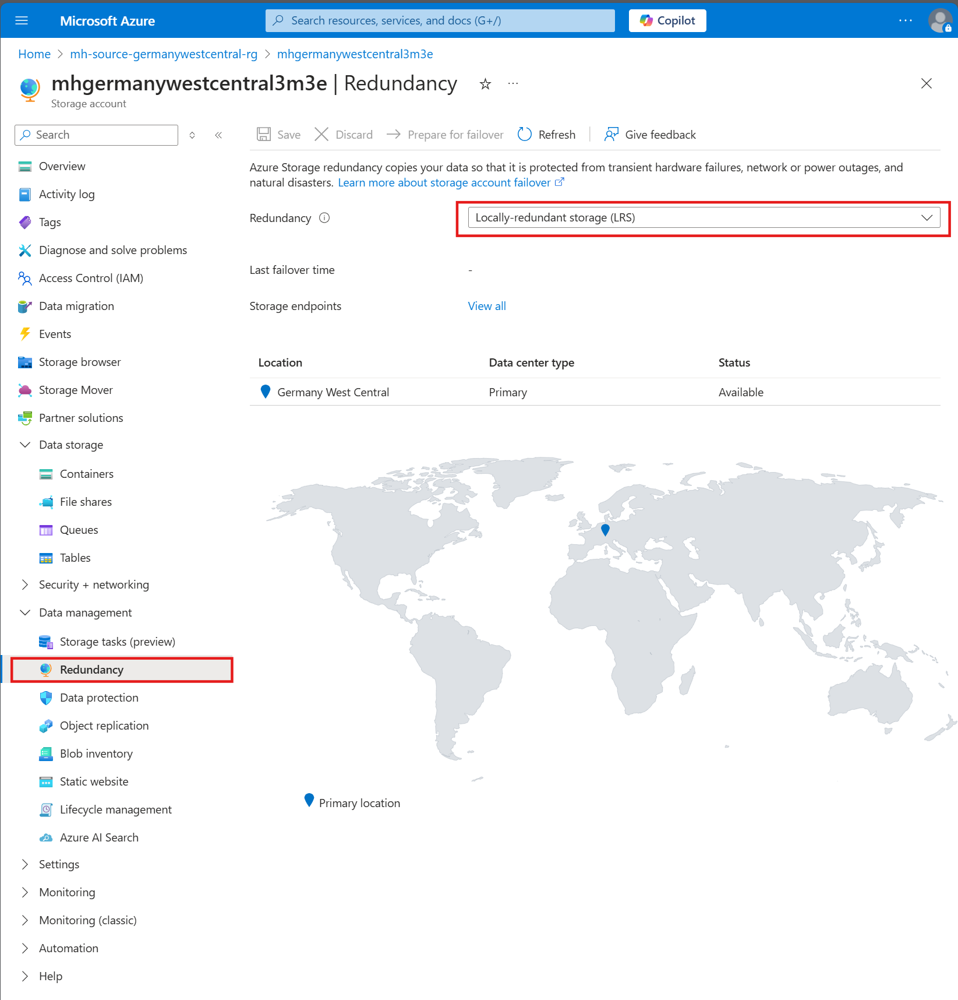

## Challenge 1 - Prerequisites and Landing Zone Preparation

### Goal 🎯

In Challenge 1, you will set up your environment with the necessary infrastructure to ensure business continuity using Cloud Native / PaaS Services on Azure.

Below is an architecture diagram illustrating the setup. Tutorials and documentation providing step-by-step guidance on deploying the environment are included.

---

# Lab Environment with Virtual Machines

## Deployment

We will use **Infrastructure as Code** to deploy the lab environment. There are **two methods** to achieve this:

1. **ARM/Bicep scripts via CloudShell**: This method is preferred as it is faster and more reliable.
2. **Azure Portal**: Suitable for those unfamiliar with IaaS deployment, allowing deployment by uploading the provided **ARM** or **Bicep** scripts.

### Option 1 - Infrastructure as Code (ARM) Deployment via CloudShell

To deploy the lab environment using **ARM**, click the link below.

<!--  -->

### Option 2 - Deploy from the Azure Portal

1. Go to the Azure portal and sign in.
2. In the Azure portal search bar, search for "deploy a custom template" and select it from the available options.
3. Upload the templates `deploy.json` and `main.parameters.json`.

Refer to the [Step-by-Step Deployment Guide](../walkthrough/challenge-1/img/deployment/solution.md) for detailed guidance.

### 📚 Deploy a custom template
* [Quickstart: Create and deploy ARM templates using the Azure portal](https://learn.microsoft.com/en-us/azure/azure-resource-manager/templates/quickstart-create-templates-use-the-portal)

## Exploration of the Lab

After a successful deployment, you should see two new resource groups: `mh-source-germanywestcentral-rg` and `mh-target-swedencentral-rg`.

Verify the following resources and setup. Ensure the storage account has geo-redundancy enabled.

* **Region 1: Germany West Central (Source environment)**
  * Resource Group: `mh<your assigned number>-source-germanywestcentral-rg`
  * Recovery Services Vault: `mh-germanywestcentral-asrvault`
  * Backup Vault: `mh-germanywestcentral-asrvault-backupVault`
  * Storage Account with GRS (geo-redundant storage) redundancy: `mhgermanywestcentral` \<Suffix\>
* **Region 2: Sweden Central (Target environment)**
  * Resource Group: `mh<your assigned number>-target-swedencentral-rg`
  * Recovery Services Vault: `mh-swedencentral-asrvault`
  * Backup Vault: `mh-swedencentral-asrvault-backupVault`

There is a WebApp running on the machines deployed in the Lab Environment. The Web Application uses two Virtual Machines as backend servers, so it might be running from either VM `mh-web1` or VM `mh-web2`. The lab environment provides a UI to see which host the web application is running from.

💡 Enable GRS on storage account

 

### Success Criteria ✅

* Resource Groups created in both regions (Germany West Central & Sweden Central).
* Recovery Services Vaults created in both regions.
* Backup Vaults created in both regions.
* A geo-redundant Storage Account created.

### 📚 Learning Resources

* [Manage resource groups - Azure Portal - Azure Resource Manager | Microsoft Learn](https://learn.microsoft.com/azure/azure-resource-manager/management/manage-resource-groups-portal)
* [Create a storage account - Azure Storage | Microsoft Learn](https://learn.microsoft.com/azure/storage/common/storage-account-create)
* [Create and configure Recovery Services vaults - Azure Backup | Microsoft Learn](https://learn.microsoft.com/azure/backup/backup-create-recovery-services-vault)

### Solution - Spoiler Warning ⚠️

[Solution Steps](../walkthrough/challenge-1/solution.md)

---

**[> Next Challenge 2 - Protect in Azure - Backup / Restore](./02_challenge.md)** |

**[< Previous Challenge 0 - 🚀 Deploying a Ready-to-Go N-tier App with Awesome Azure Developer CLI](./00_challenge.md)**
