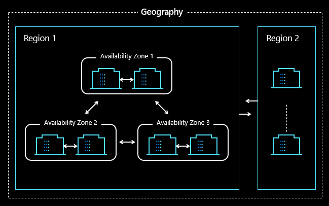

## Challenge 2 - Regional Protection and Disaster Recovery (DR)

### Goal 🎯

* Protect in Azure - **Backup / Restore**
* Protect in Azure with **Disaster Recover (DR)** within a Region

In this challenge, you will learn how to back up and restore your Linux Virtual Machine using Azure's Recovery Services Vault. You will also practice simulating a regional failover between two datacenters to handle a regional failure, such as a datacenter outage.

## Actions

### Challenge 2.1 - Protect in Azure - Backup / Restore
1. Enable Azure Backup for the Linux VM in the primary region.
2. Enable Azure Backup for Blobs
3. Restore a VM in Azure.

> [!IMPORTANT]
> To enable backup for the storage account, you need to grant the Backup Vault appropriate **access permissions**.
> 
> 💡 **Need help?** Refer to the [step-by-step guidance](../walkthrough/challenge-2/solution.md#enable-system-managed-identity-for-the-backup-vault-and-copy-the-mi-object-id) in the solution.

### Challenge 2.2 - Protect in Azure with Disaster Recover (DR) within an Azure Region
4. Set up disaster recovery for the Linux VM in the primary region.
5. Simulate a failover from one part of the primary region to another part within the same region.

> [!IMPORTANT]
> To enable disaster recovery (DR), you may need to grant the Recovery Services Vault appropriate **access permissions**.
> 
> 💡 **Need help?** Refer to the [step-by-step guidance](../walkthrough/challenge-2/solution.md#enable-system-managed-identity-for-the-recovery-services-vault) in the solution.

### Success Criteria ✅

- You have successfully set up Azure Backup Policies for both virtual machines.
- You have successfully restored a VM of your choice to Azure.
- You have successfully configured replication between two availability zones and simulated a failover between two datacenters using Azure Site Recovery.

### 📚 Learning Resources

- [Quickstart: Back up a VM with the Azure portal](https://learn.microsoft.com/en-us/azure/backup/quick-backup-vm-portal)
- [Apply a backup policy](https://learn.microsoft.com/en-us/azure/backup/quick-backup-vm-portal#apply-a-backup-policy)
- [Tutorial: Back up multiple VMs at scale](https://learn.microsoft.com/en-us/azure/backup/tutorial-backup-vm-at-scale)
- [Restore VMs from Azure Backup](https://learn.microsoft.com/en-us/azure/backup/backup-azure-arm-restore-vms)
- [Restore encrypted virtual machines](https://learn.microsoft.com/en-us/azure/backup/restore-azure-encrypted-virtual-machines)
- [Azure Blob Storage: Backup overview](https://learn.microsoft.com/en-us/azure/backup/blob-backup-overview)

### Solution - Spoiler Warning ⚠️

For detailed steps, refer to the [Solution Steps](../walkthrough/challenge-2/solution.md).

---

**[➡️ Next Challenge 3 - Protect in Azure with Disaster Recovery (Inter-regional)](./03_challenge.md)**

**[⬅️ Previous Challenge 1 - Prerequisites and landing zone preparation](./01_challenge.md)**