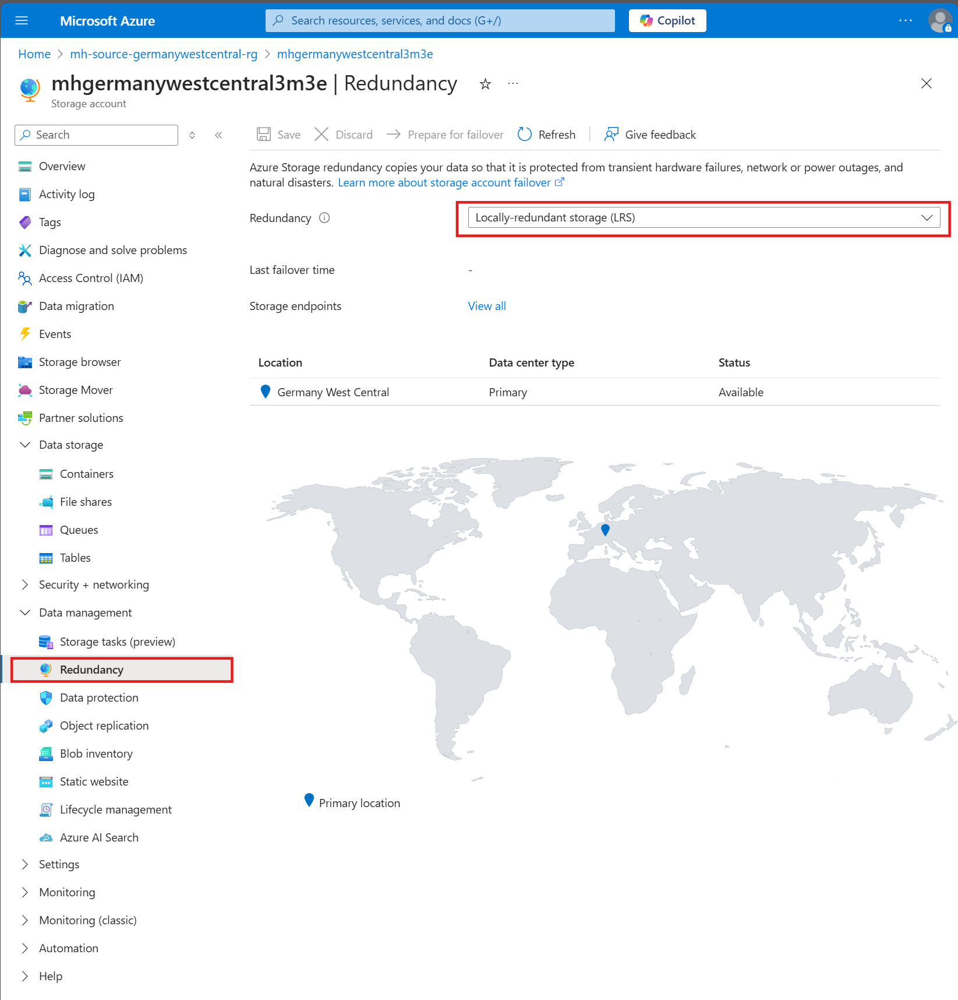
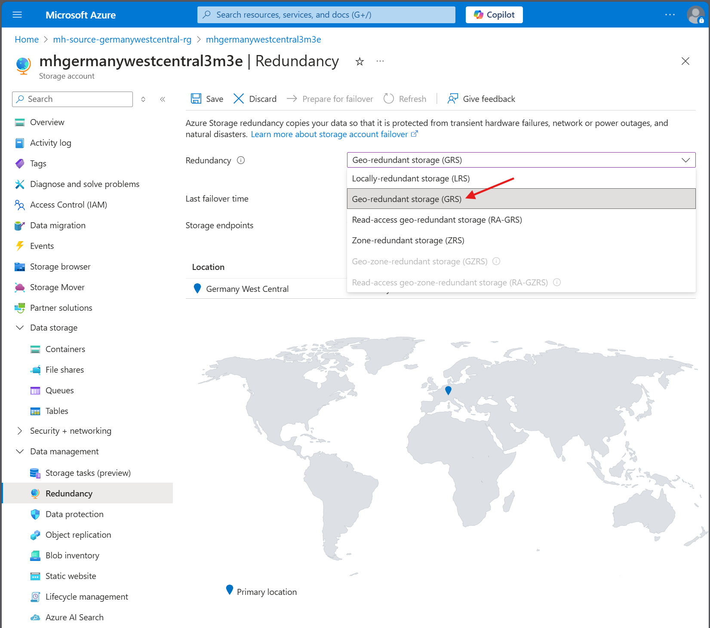
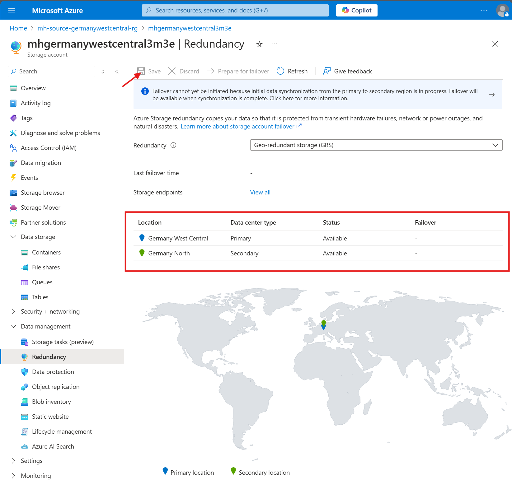

## Challenge 4 - Protect your Azure PaaS (Storage Account) with Disaster Recovery

### Goal 🎯

In this challenge, you will re-establish the connection to your web application from the failed-over region. You will then focus on implementing disaster recovery strategies for Azure storage accounts using replication. The primary objective is to ensure business continuity by protecting critical data stored in Azure storage accounts against potential disasters.

### Actions
* Task 1: Re-establish your connection to the Web Application from the secondary region.
  * Add your failed-over Virtual Machines in the secondary region to the backend pool of your Load Balancer.
  * Test the connection to the Web Application.
  * High AVailability & SLA Discussion
* Disaster Recovery for Azure Storage Account:
  * Task 2: Set up and configure Azure Storage Account replication to another region using Geo-redundant storage (GRS) or Geo-zone-redundant storage (GZRS) to ensure data availability in case of regional outages.
  * Task 3: Perform a failover test for the storage account to validate the disaster recovery setup.

## Challenge 1 - Calculate Composite SLAs with Azure Copilot

Learn how to calculate composite SLAs, enhance monitoring with alerts, logging, and Kusto queries.

## References
- [📄 Azure Copilot Documentation](https://docs.microsoft.com/en-us/azure/copilot/)

## Use Azure Copilot to calculate the composite SLAs for your application.

### Example Prompts

```
What are the SLAs for my Azure resources?
```

```
Can you show me the SLAs for Azure App Service?
```

<details close>
<summary>💡 Hint: Use the SLAs</summary>
<br>

Find the latest SLA provided by Microsoft in [Service Level Agreements (SLA) for Online Services](https://www.microsoft.com/licensing/docs/view/Service-Level-Agreements-SLA-for-Online-Services?lang=1&year=2024).

</details>

### Example Prompts

```
How do I calculate the composite SLA for my application?

Can you provide an example of composite SLA calculation?
```

<details close>
<summary>💡 Hint: Composite SLA Calculation</summary>
<br>

1. Identify the Azure services (components) that are connected.
2. Determine the chains of components within the application.
3. Use the latest SLA provided by Microsoft in [Service Level Agreements (SLA) for Online Services](https://www.microsoft.com/licensing/docs/view/Service-Level-Agreements-SLA-for-Online-Services?lang=1&year=2024) to find the SLA for each component in the chain.
4. Multiply the SLA values of each individual component (link) in the chain to get the composite SLA for that chain.
5. Identify the weakest link – the component/composites with the lowest SLA.

</details>

## Challenge 2 & 3 - Disaster Recovery for Azure Storage Account

* Disaster Recovery for Azure Storage Account:
  * Task 2: Set up and configure Azure Storage Account replication to another region using Geo-redundant storage (GRS) or Geo-zone-redundant storage (GZRS) to ensure data availability in case of regional outages.
  * Task 3: Perform a failover test for the storage account to validate the disaster recovery setup.

<details close>
<summary>💡 Enable GRS on storage account</summary>
<br>





</details>

---

### Success Criteria ✅
* You have implemented disaster recovery for an Azure Storage Account using GRS or GZRS, protecting against regional outages.
* You have conducted failover tests for the Azure Storage Account, demonstrating the effectiveness of your disaster recovery strategy.
* You were able to connect to the failed-over Storage Account from the failed-over VM.

### 📚 Learning Resources
* [Geo-redundant storage (GRS) for cross-regional durability](https://learn.microsoft.com/en-us/azure/storage/common/storage-redundancy-grs)
* [Disaster recovery and storage account failover](https://learn.microsoft.com/en-us/azure/storage/common/storage-disaster-recovery-guidance)
* [Testing for disaster recovery](https://learn.microsoft.com/en-us/azure/site-recovery/site-recovery-test-failover-to-azure)
    
### Solution - Spoiler Warning ⚠️

[Solution Steps](../walkthrough/challenge-4/solution.md)

---

**[> Next Challenge 5 - Failback to the primary region](./05_challenge.md)** |

**[< Previous Challenge 3 - Protect in Azure with Disaster Recovery](./03_challenge.md)**
