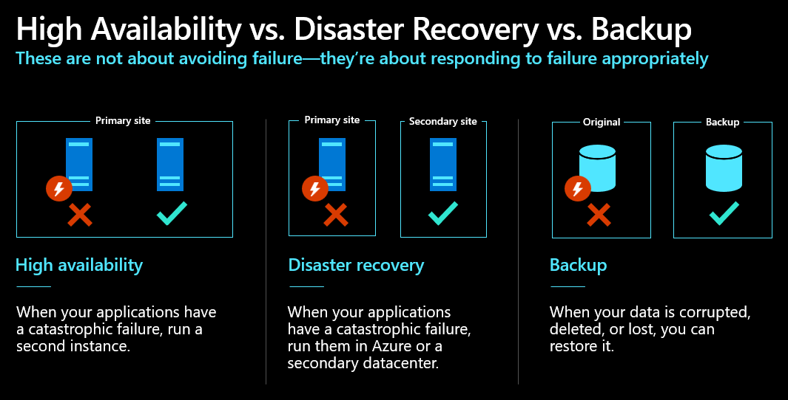

# Challenge 1 - Understand the Disaster Recovery (DR) terms and define a DR strategy

**[Home](../Readme.md)** - [Next Challenge Solution](challenge-02.md)

# Contoso Ltd - Business Continuity and Disaster Recovery (BCDR) Strategy

## Background
Contoso Ltd is a global company that relies on advanced technology to manage its operations efficiently. Their business applications, all hosted in the Azure cloud, are crucial to their daily functions and overall success. These applications power a wide range of essential business processes:
- **App 1:** Fabric Robot Automation
- **App 2:** Customer Help Desk Services
- **App 3:** Archive Service

Leaders at Contoso Ltd understand that any downtime can result in significant financial losses and operational disruptions. Therefore, the company has mandated a thorough review of its Business Continuity and Disaster Recovery (BCDR) strategies to strike a balance between business continuity, customer satisfaction, and operational costs. The goal is to design and implement recovery plans that can swiftly restore services and minimize downtime in the event of unforeseen disasters.

## Scenario Overview
A natural disaster struck the region hosting Contoso applications on Azure one Friday evening, causing outages in many services and leading to a cascading failure of all Contoso applications. The sudden disruption impacted essential business functions, leaving the company to grapple with significant financial losses and operational chaos. Customers and stakeholders were left in a state of uncertainty as they awaited updates on service restoration. The IT team faced immense pressure to rapidly deploy recovery strategies to minimize downtime, restore critical operations, and ensure that such an incident would not recur in the future.

Participants must design and implement recovery strategies to meet business targets while considering costs for high availability.

## Application Overview
| Application | Business Function | Criticality | SLA | RTO | RPO | Downtime Cost |
|-------------|-------------------|-------------|-----|-----|-----|---------------|
| App1        | Fabric Robot Automation  | Critical    | 99.995% | 1 hour | 10 minutes | $50,000/hour |
| App2        | Customer Help Desk Services  | High        | 99.95%  | 2 hours | 15 minutes | $25,000/hour |
| App3        | Archive Service  | Medium      | 99.9%   | 6 hours | 4 hours    | $10,000/hour |

## Recovery Costs for High Availability
| Application | Cost of RTO Compliance | Cost of RPO Compliance | Cost of SLA Compliance | Fully Highly Available Cost |
|-------------|------------------------|------------------------|------------------------|-----------------------------|
| App1        | $100,000               | $50,000                | $75,000                | $200,000                    |
| App2        | $75,000                | $35,000                | $50,000                | $125,000                    |
| App3        | $50,000                | $20,000                | $25,000                | $75,000                     |

## Challenge Objective
### Actions
Participants must:
1. **Write down the first 3 steps** you would take if your company was attacked by ransomware, considering different perspectives (employee, CISO, CEO).
2. **Reflect on business continuity testing** - Think about whether you've ever participated in a business continuity test scenario in your organization.
3. **Define application owner responsibilities** - Put yourself in the position of an application owner and define the necessary steps to ensure your application stays available during a disaster.
4. **Identify BCDR stakeholders** - Determine who defines the requirements for Business Continuity and identify the necessary KPIs for achieving good SLA in terms of availability.
5. **Plan geographic distribution** - Design the different geographic regions needed to reach the highest availability SLA (including potential datacenter locations).
6. **Analyze the Contoso scenario** - Apply your understanding to prioritize recovery of the three applications based on their criticality, business impact, and cost considerations.

### Success criteria

* **Understood BCDR terminology** - Clearly distinguish between High Availability, Disaster Recovery, and Business Continuity concepts.
* **Identified emergency response steps** - Documented the first three critical steps for ransomware response from different organizational perspectives.
* **Assessed current BCDR maturity** - Reflected on your organization's business continuity testing practices and identified improvement opportunities.
* **Defined application owner responsibilities** - Listed the nine key steps application owners should take to ensure disaster preparedness.
* **Identified BCDR roles and KPIs** - Determined who sets BCDR requirements and what metrics are essential for measuring availability SLA.
* **Planned geographic redundancy** - Designed a multi-region strategy considering RPO/RTO requirements and cost implications.
* **Applied BCDR principles to real scenario** - Successfully analyzed the Contoso case study and made informed decisions about recovery priorities and high availability investments.

### Learning resources

* [Business continuity and disaster recovery - Cloud Adoption Framework | Microsoft Learn](https://learn.microsoft.com/azure/cloud-adoption-framework/ready/landing-zone/design-area/management-business-continuity-disaster-recovery)
* [Build high availability into your BCDR strategy - Azure Architecture Center | Microsoft Learn](https://learn.microsoft.com/azure/architecture/solution-ideas/articles/build-high-availability-into-your-bcdr-strategy)
* [Disaster recovery with Azure Site Recovery - Azure Solution Ideas | Microsoft Learn](https://learn.microsoft.com/azure/architecture/solution-ideas/articles/disaster-recovery-smb-azure-site-recovery)

### High Availability vs. Disaster Recovery vs. Backup

