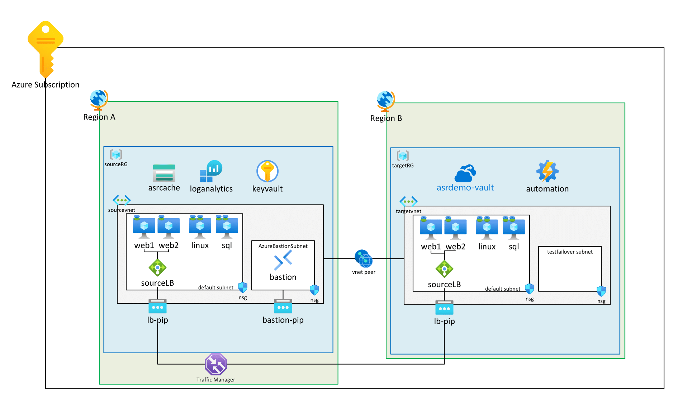

# Challenge 2 - Prerequisites and Landing Zone Preparation

[Previous Challenge](challenge-01.md) - **[Home](../Readme.md)** - [Next Challenge](challenge-03.md)

### Goal 🎯

In Challenge 2, you will set up your environment with the necessary infrastructure to ensure business continuity using Cloud Native / PaaS Services on Azure.

Below is an architecture diagram illustrating the setup.

---

# Lab Environment with Virtual Machines

## Subscription validation
Before deploying the lab environment, validate that your Azure subscription meets the necessary prerequisites:

1. Navigate to the `Infra/App1` folder in the downloaded zip file.
2. Run the **`validate-prerequisites.sh`** script to verify your subscription readiness.
  > **Note:** The script can be executed using the Azure CLI locally or directly within the Azure Cloud Shell (accessible via the terminal icon in the top navigation bar of the Azure Portal).
3. The script will check:
  - Azure CLI installation and authentication status
  - RBAC permissions (Owner role required at subscription level)
  - Required resource providers are registered (and automatically registers any missing ones)
4. Address any issues identified by the script before proceeding with deployment.
  > **Tip:** If any resource providers were missing and automatically registered, you can re-run the script to confirm they are now successfully registered.

## Deployment

We will use **Infrastructure as Code** to deploy the lab environment. There are **two methods** to achieve this:

1. **Azure Portal**: Suitable for those unfamiliar with IaaS deployment, allowing deployment by uploading the provided **ARM** scripts.
1. Alternative: **Bicep/ARM scripts via CloudShell**: This method is preferred for automation

### Option 1 - Infrastructure as Code Template Deployment via Azure Portal (ARM)

1. Go to the Azure portal and sign in.
2. In the Azure portal search bar, search for "Deploy a custom template" and select it from the available options.
3. Click **Build your own template in the editor**.
4. **Load file** to upload the `deploy.json`.
5. Click **Save**.
6. **Edit Parameters** to upload the parameter file.
7. **Load file** to upload `main.parameters.json`.
8. Click **Save**.
9. Change the **deployment prefix** `<insertParticipantNumber>` and define a **VM Admin Password**.
10. Proceed with the deployment.

> **Note:** The template `deploy.json` and the parameter file `main.parameters.json` can be found in the downloaded zip file within the folder Infra/App1.

### Option 2 - Infrastructure as Code Template Deployment via CloudShell (Bicep)

To deploy the lab environment using **Bicep**, use the command documented here:
 [CloudShell Deployment command](../Infra/App1/ReadMe.md) 

## Exploration of the Lab

After a successful deployment, you should see two new resource groups: `mh-source-germanywestcentral-rg` and `mh-target-swedencentral-rg`.

Verify the following resources and setup. Ensure the storage account has geo-redundancy enabled.

* **Region 1: Germany West Central (Source environment)**
  * Resource Group: `mh<your assigned number>source-germanywestcentral-rg`
  * Recovery Services Vault: `mh-germanywestcentral-asrvault`
  * Backup Vault: `mh-germanywestcentral-asrvault-backupVault`
  * Storage Account with GRS (geo-redundant storage) redundancy: `mhgermanywestcentral` \<Suffix\>
* **Region 2: Sweden Central (Target environment)**
  * Resource Group: `mh<your assigned number>target-swedencentral-rg`
  * Recovery Services Vault: `mh-swedencentral-asrvault`
  * Backup Vault: `mh-swedencentral-asrvault-backupVault`

There is a WebApp running on the machines deployed in the Lab Environment. The Web Application uses two Virtual Machines as backend servers, so it might be running from either VM `mh-web1` or VM `mh-web2`. The lab environment provides a UI to see which host the web application is running from.

### Success Criteria ✅

* Resource Groups created in both regions (Germany West Central & Sweden Central).
* Recovery Services Vaults created in both regions.
* Backup Vaults created in both regions.
* A geo-redundant Storage Account created.
* The Web application is successfully deployed using a backend pool of two Virtual Machines.

### 📚 Learning Resources

* [Manage resource groups - Azure Portal - Azure Resource Manager | Microsoft Learn](https://learn.microsoft.com/azure/azure-resource-manager/management/manage-resource-groups-portal)
* [Create a storage account - Azure Storage | Microsoft Learn](https://learn.microsoft.com/azure/storage/common/storage-account-create)
* [Create and configure Recovery Services vaults - Azure Backup | Microsoft Learn](https://learn.microsoft.com/azure/backup/backup-create-recovery-services-vault)
* [Quickstart: Create and deploy ARM templates using the Azure portal](https://learn.microsoft.com/en-us/azure/azure-resource-manager/templates/quickstart-create-templates-use-the-portal)

