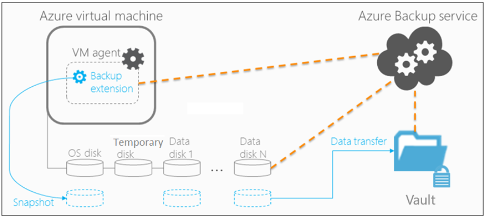

# Challenge 3 - Regional Protection (Backup)

[Previous Challenge](challenge-02.md) - **[Home](../Readme.md)** - [Next Challenge](challenge-04.md)

### Goal 🎯

* Protect in Azure - **Backup / Restore**

In this challenge, you will learn how to back up and restore a Linux Virtual Machine and an Azure Blob Storage using Azure Backup and Azure Backup Vaults.

## Actions

### Protect in Azure - Backup / Restore
1. Enable Azure Backup for the Linux VM in the primary region.
2. Enable Azure Backup for Azure Blob Storage.
3. Restore a VM in Azure.
4. Optional: Restore a file vom Azure Blob.

### Success Criteria ✅

- You have successfully set up Azure Backup for a virtual machine.
- You have successfully restored a VM on Azure.
- Optional: You have successfully restored an Azure Blob Storage container.

### 📚 Learning Resources

- [Quickstart: Back up a VM with the Azure portal](https://learn.microsoft.com/en-us/azure/backup/quick-backup-vm-portal)
- [Apply a backup policy](https://learn.microsoft.com/en-us/azure/backup/quick-backup-vm-portal#apply-a-backup-policy)
- [Tutorial: Back up multiple VMs at scale](https://learn.microsoft.com/en-us/azure/backup/tutorial-backup-vm-at-scale)
- [Restore VMs from Azure Backup](https://learn.microsoft.com/en-us/azure/backup/backup-azure-arm-restore-vms)
- [Restore encrypted virtual machines](https://learn.microsoft.com/en-us/azure/backup/restore-azure-encrypted-virtual-machines)
- [Azure Blob Storage: Backup & Restore](https://learn.microsoft.com/en-us/azure/backup/blob-backup-overview)
