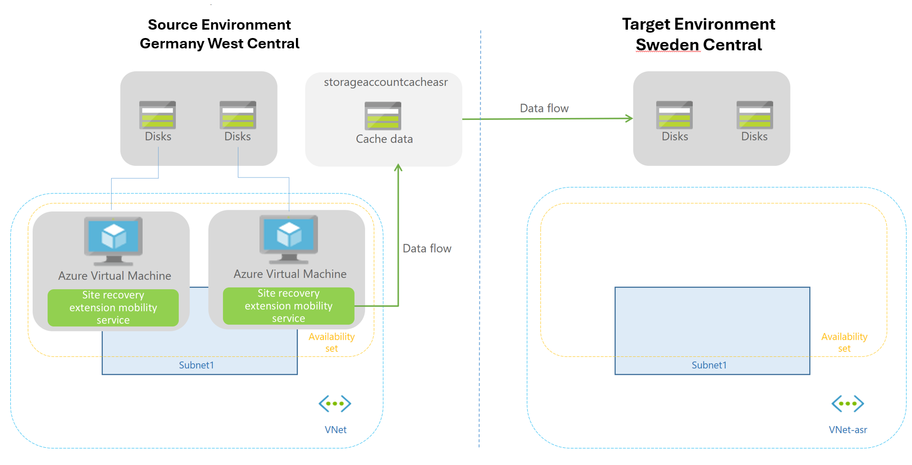

# Challenge 5 - Disaster Recovery (DR) across Azure Regions

[Previous Challenge](challenge-04.md) - **[Home](../Readme.md)** - [Next Challenge](challenge-06.md)

### Goal 🎯

In Challenge 5, you will learn how to protect Azure VMs using Azure Site Recovery and enable replication to a secondary Azure Region. Additionally, You will also perform test and production failovers and failbacks.

* Source/Primary Region: Germany West Central
* Target/Secondary Region: Sweden Central
* VMs requiring cross-region protection: *-web1 and *-web2.

### Actions

* Task 1: Set up and enable disaster recovery with Azure Site Recovery and monitor the progress.
* Task 2: Perform a **disaster recovery drill**, **create recovery plan** and run a **test failover**.
* Task 3: Run a **production failover** from the source to the target Region, and once successful, failback.

### Success Criteria ✅

* Replication of the web servers to the Sweden Central region was successfully enabled.
* A test failover from Germany West Central to Sweden Central was successfully initiated with zero impact on production.
* The production failover to the Sweden Central region was successfully completed.

### 📚 Learning Resources

* [Enable Replication](https://learn.microsoft.com/en-us/azure/site-recovery/azure-to-azure-how-to-enable-replication)
* [Create Recovery Plans](https://learn.microsoft.com/en-us/azure/site-recovery/site-recovery-create-recovery-plans)
* [Test Failover to Azure](https://learn.microsoft.com/en-us/azure/site-recovery/site-recovery-test-failover-to-azure)

