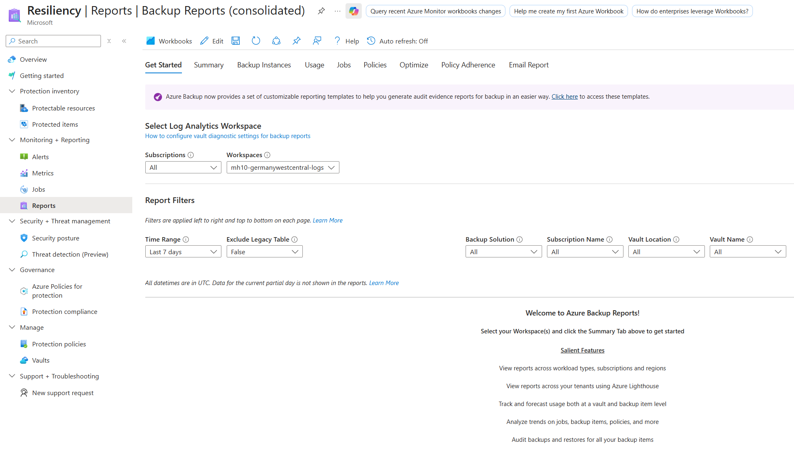

# Optional: Challenge 8 - Monitoring and Alerting for BCDR Operations

[Previous Challenge](challenge-07.md) - **[Home](../Readme.md)** - [Congratulations](finish.md)

### Goal 🎯

In this challenge 8, you will implement comprehensive monitoring and reporting for your Azure Backup and Azure Site Recovery configurations. Continuous monitoring is essential for ensuring the health and effectiveness of your BCDR strategy, enabling you to detect issues proactively before they impact your ability to recover from disasters.

You will explore built-in monitoring dashboards, configure diagnostic logging for advanced analytics, and leverage Azure Business Continuity Center for unified reporting across your backup and disaster recovery operations.

### Actions 🛠️

#### Part 1: Configure Azure Backup Monitoring & Reporting
* Configure diagnostic settings to send Azure Backup logs to the existing Log Analytics workspace deployed in your infrastructure.
* Use **Azure Business Continuity Center (Resiliency)** to leverage reports for comprehensive data insights across backup operations.
* Explore the monitoring capabilities within the Recovery Services Vault, including built-in alerts, job monitoring, and the different interfaces available for analyzing backup health and performance. Ensure monitoring is configured.

> **Note:** After diagnostics configuration, it takes up to 24 hours for the initial data push to complete. Once the data migrates to the Log Analytics workspace, the data in the reports might take some time to appear because the data for the current day isn't available in the reports.

#### Part 2: Configure Azure Site Recovery (ASR) Monitoring
* Enable diagnostics settings for the Recovery Services Vault to send ASR logs to Log Analytics. 

> **Hint:** If you selected "all logs" when configuring diagnostic settings in Part 1, Azure Site Recovery logs are already being sent to Log Analytics and this step can be skipped. Additionally, if you have a Recovery Services Vault in your secondary region for replication, ensure you replicate the same diagnostic settings configuration on that vault as well to capture comprehensive ASR monitoring data across both regions.

* Explore the Azure Site Recovery monitoring capabilities using the built-in dashboard in the Recovery Services Vault, including replication health status, infrastructure view, and job monitoring features.
* Review the built-in Azure Monitor alerts available for Azure Site Recovery and understand the types of events they monitor.

### Success Criteria ✅
* Comprehensive monitoring and reporting is properly configured for all BCDR operations
* Diagnostic settings configured for Recovery Services Vault(s) to send Azure Backup and ASR logs to Log Analytics workspace
* Azure Business Continuity Center (Resiliency) reports accessed and displaying backup insights across all protected resources
* Recovery Services Vault monitoring capabilities explored including built-in alerts, job monitoring, backup health interfaces, replication health status, infrastructure view, and ASR job monitoring
* Built-in Azure Monitor alerts for both Azure Backup and Azure Site Recovery reviewed and understood

### Learning Resources 📚

#### Azure Backup Monitoring
* [Configure reporting and data insights with Azure Business Continuity Center](https://learn.microsoft.com/en-us/azure/business-continuity-center/tutorial-reporting-for-data-insights)
* [Alert for Backup job failures](https://learn.microsoft.com/en-us/azure/backup/backup-azure-monitoring-alerts?tabs=recovery-services-vaults#turn-on-azure-monitor-alerts-for-job-failure-scenarios)

#### Azure Site Recovery Monitoring
* [Monitor Azure Site Recovery in the dashboard](https://learn.microsoft.com/en-us/azure/site-recovery/site-recovery-monitor-and-troubleshoot#monitor-in-the-dashboard)
* [Monitor Azure Site Recovery](https://learn.microsoft.com/en-us/azure/site-recovery/monitor-site-recovery)
* [Set up diagnostics for a Recovery Services vault](https://learn.microsoft.com/en-us/azure/site-recovery/monitor-log-analytics)
* [Monitor replication health with Azure Monitor Logs](https://learn.microsoft.com/en-us/azure/site-recovery/monitor-log-analytics)
* [Built-in Azure Monitor alerts for Azure Site Recovery](https://learn.microsoft.com/en-us/azure/site-recovery/site-recovery-monitor-and-troubleshoot#built-in-azure-monitor-alerts-for-azure-site-recovery)