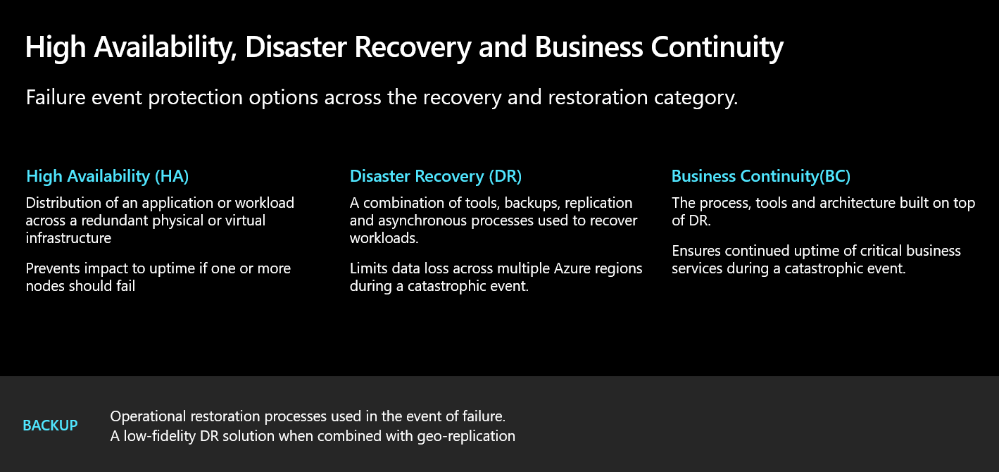
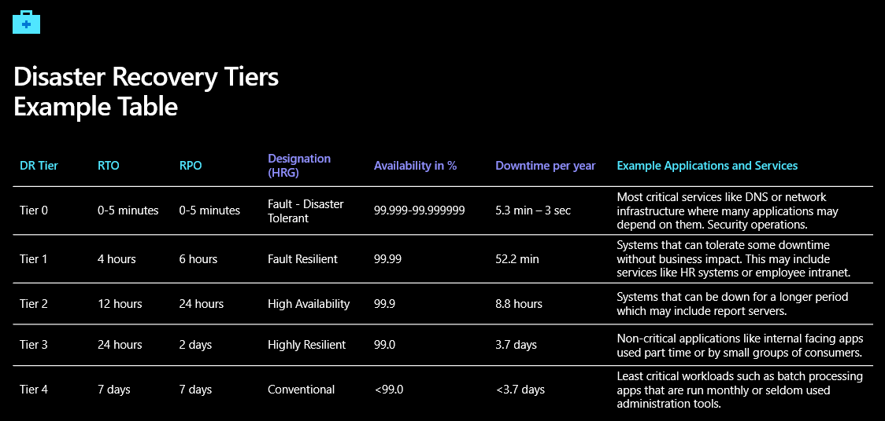

# Walkthrough Challenge 0 - Understand the Disaster Recovery terms and define a strategy

⏰ Duration: 45 minutes

## Prerequisites

Please ensure that you successfully verified the [General prerequisits](../../Readme.md#general-prerequisites) before continuing with this challenge.

### **Task 1: Write down the first 3 steps you would go for if your company got attacked by ransomware**

💡 The first three steps often depend on the employee's perspective. Are you an IT leader, a CIO, a CEO, or just can't work with the systems you are using on a daily basis?

* An employee's perspective:
  * In order to be prepared for an emergency, it is normal that employees are informed at regular intervals about the emergency plan, as well as provided exercises for such emergencies at predefined intervals. If, for example, an employee is the victim of a ransomware attack, they should be informed about any necessary steps through previous exercises.

* A CISO´s perspective:
  * The CISO plays a very special role and should be informed at all times about such incidents. In order to ensure this, they should always know how to react in an emergency and also ensure, together with the IT manager, that teams are well-informed and regularly trained in coordination and emergency drills. 

* A CEO perspective:
  * In order to keep the damage of any incidents / emergencies as low as possible, appropriate requirements should be defined to enable the C-Suite to act as a role model in case of a disaster. In order to keep the damage of any incidents / emergencies as low as possible, appropriate requirements should be defined to enable the C-Suite to act as a role model in case of a disaster. To protect the company from image loss or complete standstill, priority should be given to highly business-critical applications (that always have to run) in case of an emergency. The availability requirements the company can and must guarantee should be clearly defined, and, above all, they must ensure to regularly demand them within the framework of the Business Continuity Management.

💥 **Here are the first three common steps that typically happen:** 
1. Everybody struggles with finding the right person and process for triggering the Disaster Recovery & Business Continuity plan.
2. If somebody finds the plan, the first three actions are not valid anymore because of changes in the organization structure (plan not up-to-date).
3. Do not stress too much as we have a backup, and the availability requirements are defined on Hypervisor and Storage level - let´s start the failover to the 2nd Datacenter and the users are able to work again in half an hour or so.

🔑 **Key to a successful strategy in case of a disaster**
- The key to success is not a technical consideration of the topic, but a clear demarcation of responsibilities, requirements and regular test. True success is only guaranteed if you test regularly according to the previously defined requirements.

### **Task 2: Think about if you ever participated in a business continuity test scenario**

Here it is only a matter of dedicating oneself to the topic and considering whether the emergency plan has ever been tested in the company and who is part of it. It can also be considered whether appropriate measures in case of success or failure were derived to increase the quality next time.

Ask yourself the questions: 
1. Can I take an active part in the optimization process from the emergency plan? 
2. Whom should I involve? 
3. Do I have feedback from the application owners for the applications I am working with? 
4. When was the last succesful failover in my organization? 
5. Ask internally when the next failover is planned to test the disaster recovery plan.

### **Task 3: Put yourself in the position of an application owner and define the necessary steps to make sure your application stays available in case of a disaster**

Here is a small outlook on which topics you should deal with or at least work closely with IT to sharpen the requirements and be prepared in case of errors.

    1. Test regularly.
    2. Test for resiliency. 
    3. Design a backup strategy .
    4. Design a Disaster Recovery strategy .
    5. Codify steps to failover and fallback.
    6. Plan for regional failures.
    7. Implement a retry logic.
    8. Configure test and health probes.
    9. Segregate read and write interfaces.

* [Checklist Testing for reliability](https://learn.microsoft.com/en-us/azure/architecture/framework/resiliency/test-checklist)
* [Resiliency testing](https://learn.microsoft.com/en-us/azure/architecture/framework/resiliency/testing)
* [Backup and disaster recovery plan](https://learn.microsoft.com/en-us/azure/architecture/framework/resiliency/backup-and-recovery)

### **Task 4: Identify who defines the requirements for Business Continuity and what are the necessary KPI´s for an application to reach a good SLA in terms of availability**

- What is the difference between High Availability, Disaster Recovery and Business Continuity?
- There is a big difference, and in most of the infrastructure of traditional IT departments, there is a 100% mirror from hardware over two datacenters
  - The 100% mirroring of the hardware ensures that all applications have a fully redundant setup, but in just a few cases this is needed
  - According to experience, however, only 10-20% of applications really need a classification in Highly Business Critical, the rest are often grouped into Moderate, Low or even just Backup & Restore.

### **Task 5: Plan the different geographic regions you need to use for reaching the highest availability SLA (can also include your datacenter locations)**

You successfully completed challenge 0! 🚀🚀🚀

### Azure Business Continuity Guide (ABC Guide)
The Azure Business Continuity Guide provides a comprehensive set of recommendations to help customers define what BCDR looks like for their applications.

[Azure Business Continuity Guide](https://github.com/Azure/BusinessContinuityGuide)

 **[Home](../../Readme.md)** - [Next Challenge](../../challenges/01_challenge.md)