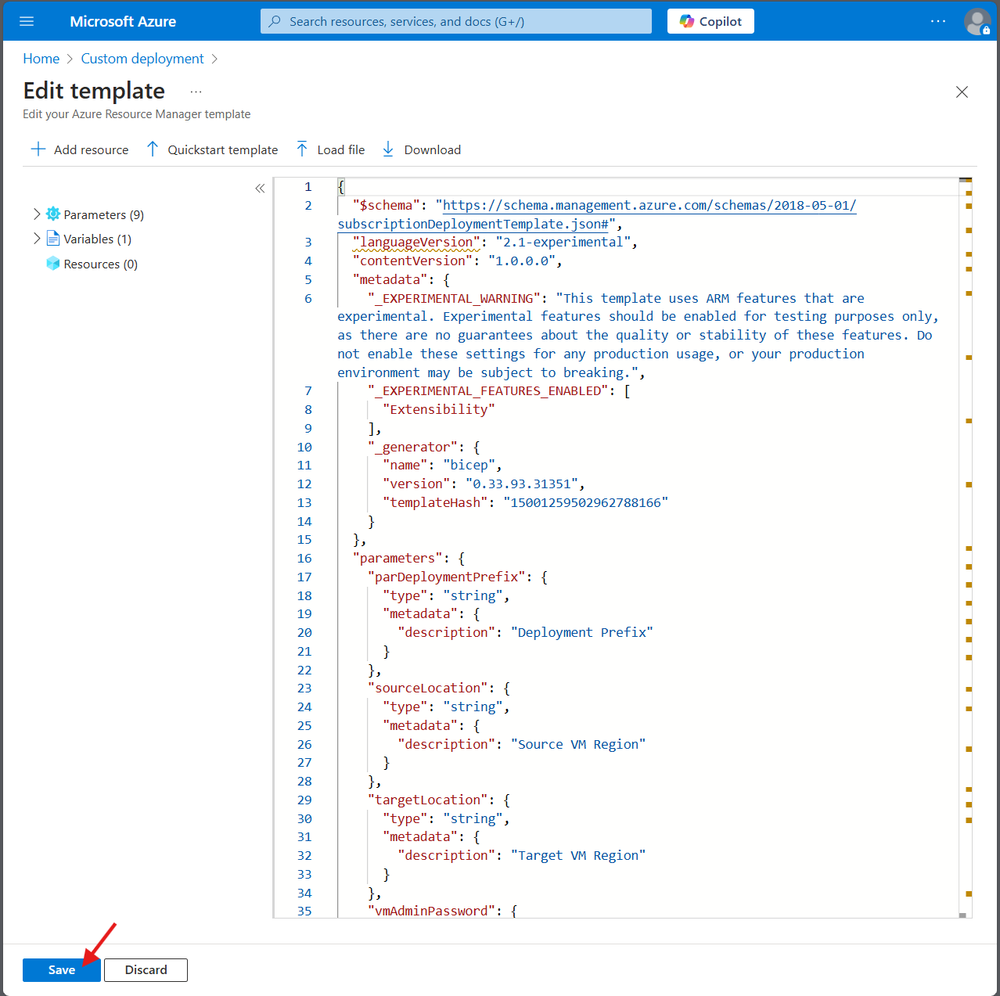
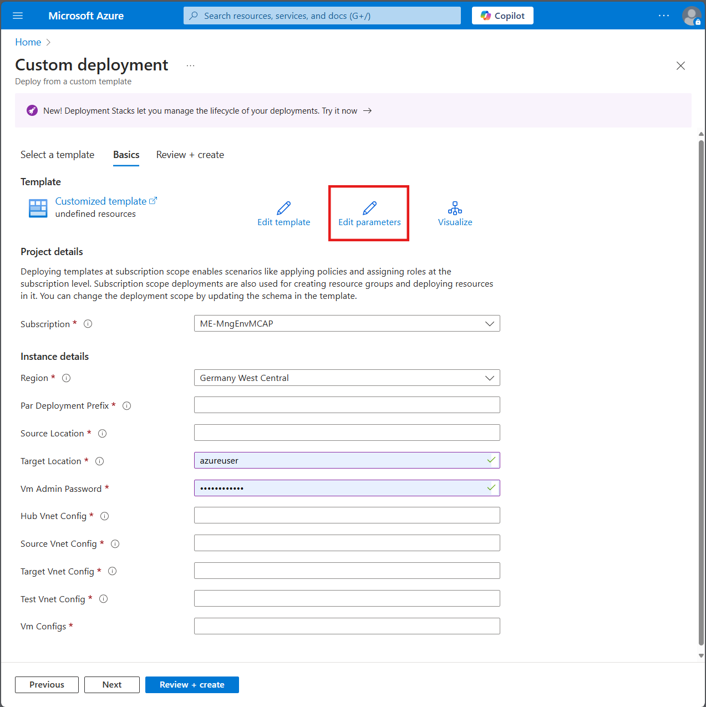
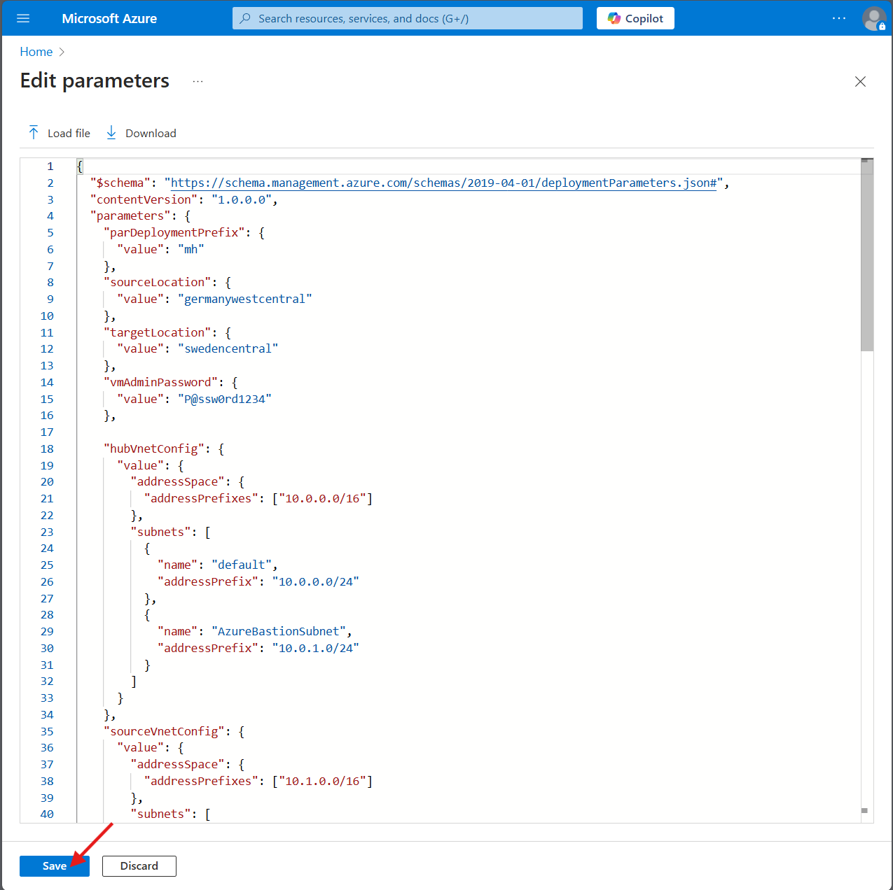
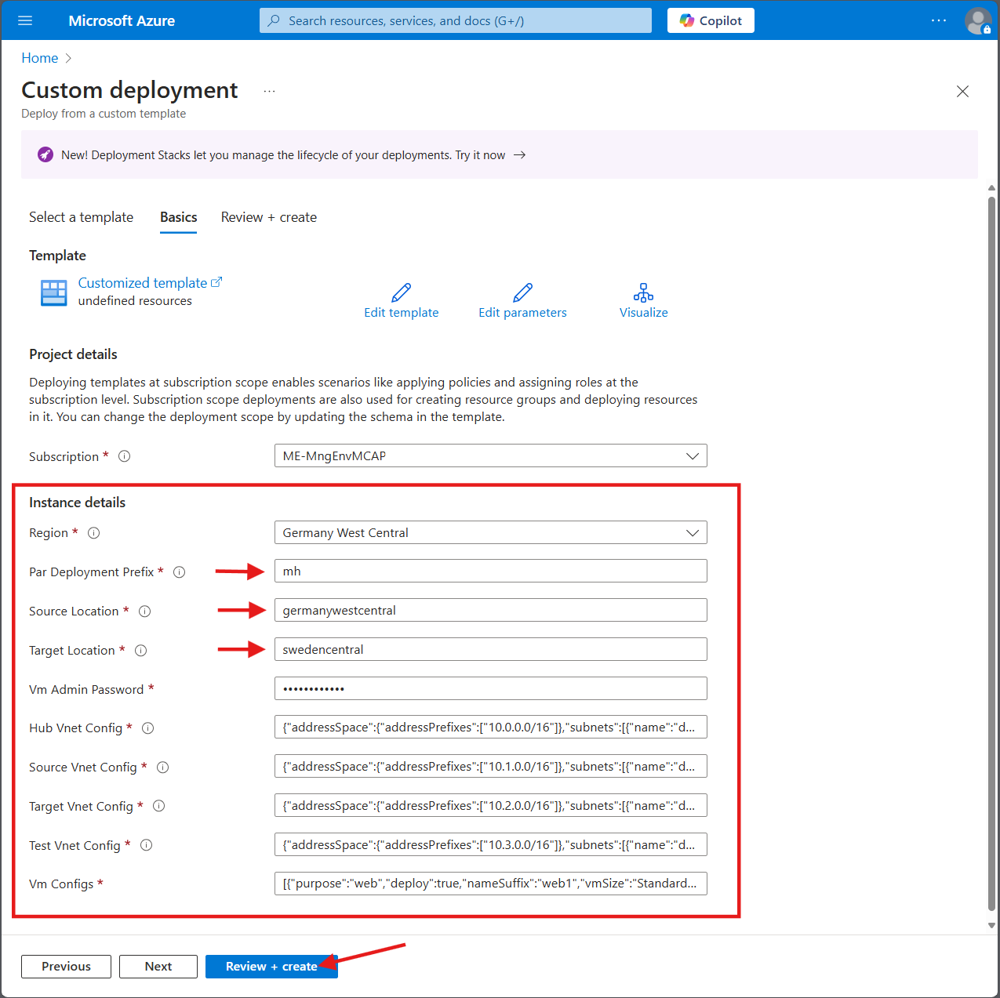
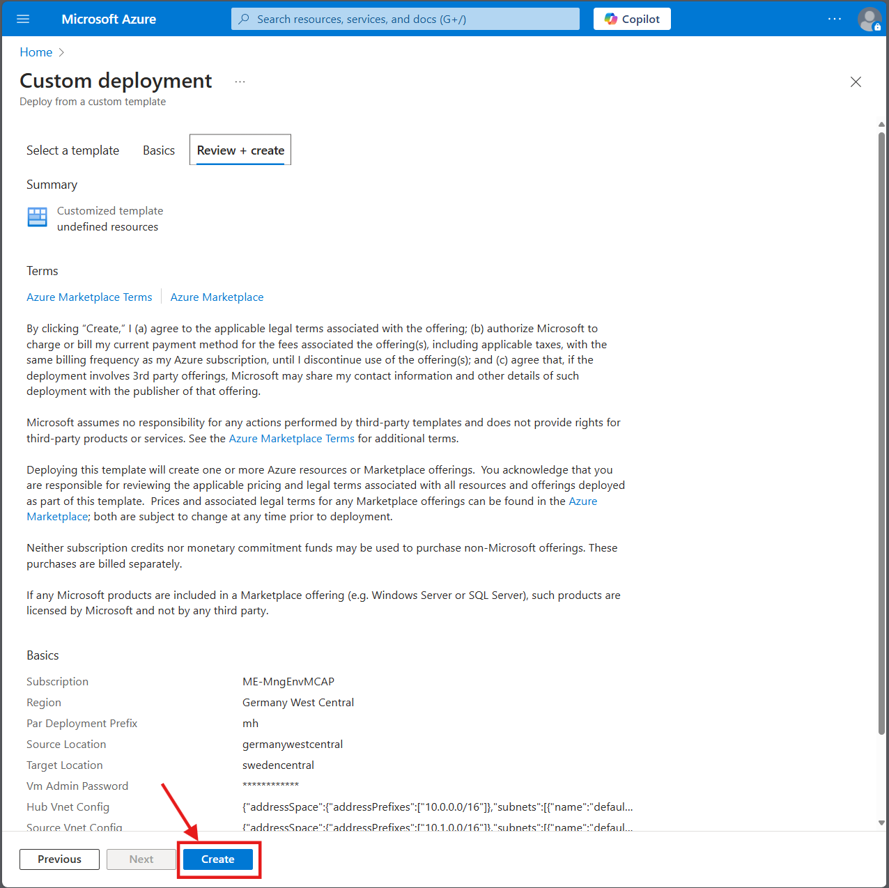
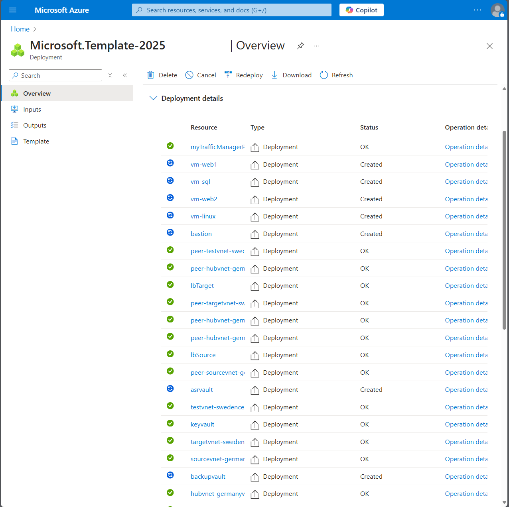

# Walkthrough Challenge 2 - Prerequisites and Landing Zone Preparation

[Previous Challenge Solution](../challenge-01/solution-01.md) - **[Home](../../Readme.md)** - [Next Challenge Solution](../challenge-03/solution-03.md)

⏰ Duration: 30 minutes

## Solution Overview

This challenge deploys the lab environment using Infrastructure as Code (IaC). The deployment creates resource groups in two Azure regions (Germany West Central and Sweden Central) along with Recovery Services Vaults, Backup Vaults, and a geo-redundant storage account.

## Prerequisites Validation

1. Navigate to the `Infra/App1` folder
2. Run the `validate-prerequisites.sh` script (can be executed locally with Azure CLI or uploaded/copy-pasted into Azure Cloud Shell):
   ```bash
   bash validate-prerequisites.sh
   ```
3. The script will validate:
   - Azure CLI installation and authentication
   - Subscription access and selection
   - RBAC permissions (Owner role)
   - Resource provider registration (and auto-register if needed)
4. Resolve any errors before proceeding with deployment

## Deployment

Choose one of the deployment methods described in [Challenge 2](../../challenges/challenge-02.md):

### Option 1: Azure Portal (ARM Template)
Follow the step-by-step instructions in the challenge to deploy using the Azure Portal's custom template deployment feature with `deploy.json` and `main.parameters.json`.

#### Deployment Steps with Screenshots:

1. Search for "Deploy a custom template" in the Azure Portal
   

2. Click "Build your own template in the editor"
   

3. Load the `deploy.json` file
   

4. Save the template
   

5. Edit parameters
   

6. Load the `main.parameters.json` file
   

7. Save the parameters
   

8. Review the deployment settings
   

9. Click "Review + create" and then "Create"
   

10. Monitor the deployment progress
    

11. Wait for deployment completion
    

12. Verify the deployed resources
    


### Option 2: CloudShell (Bicep) - Recommended
Use the deployment command documented in [Infra/App1/ReadMe.md](../../Infra/App1/ReadMe.md) for automated deployment via CloudShell.

## Validation

After deployment, verify the following resources exist:

**Germany West Central (Source):**
- Resource Group: `mh<number>source-germanywestcentral-rg`
- Recovery Services Vault: `mh-germanywestcentral-asrvault`
- Backup Vault: `mh-germanywestcentral-asrvault-backupVault`
- Storage Account (GRS): `mhgermanywestcentral<suffix>`

**Sweden Central (Target):**
- Resource Group: `mh<number>target-swedencentral-rg`
- Recovery Services Vault: `mh-swedencentral-asrvault`
- Backup Vault: `mh-swedencentral-asrvault-backupVault`

**Web Application:**
- Access the web application to verify it's running
- Confirm it shows which backend VM (`mh-web1` or `mh-web2`) is serving the request
