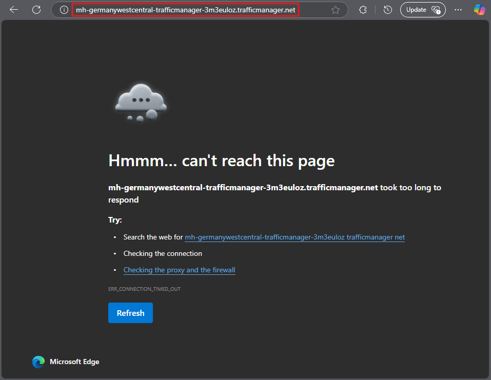
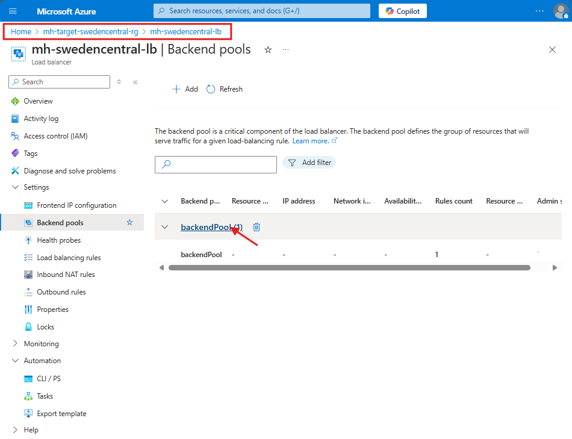
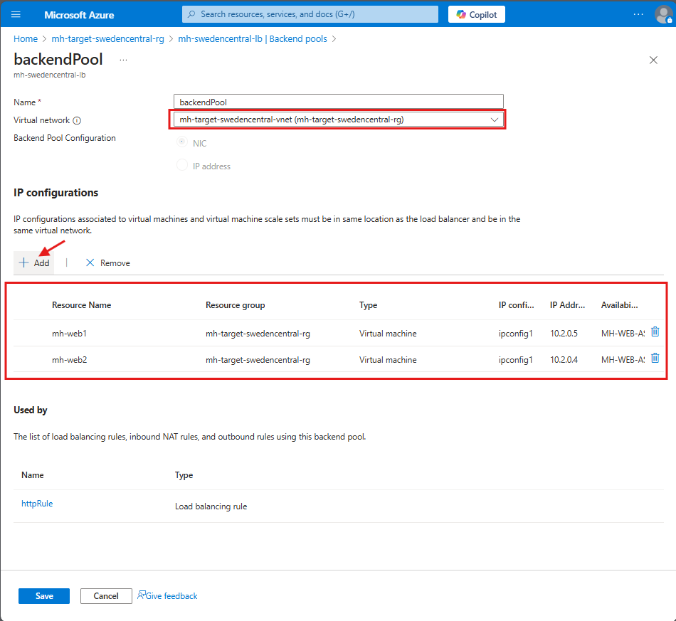
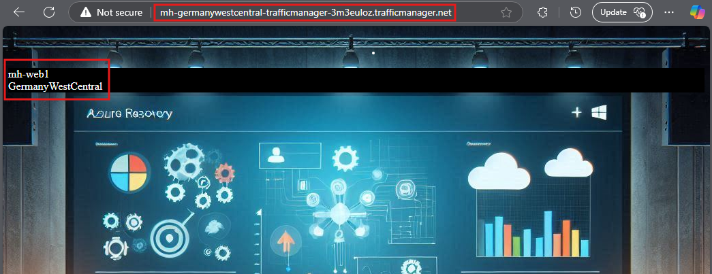
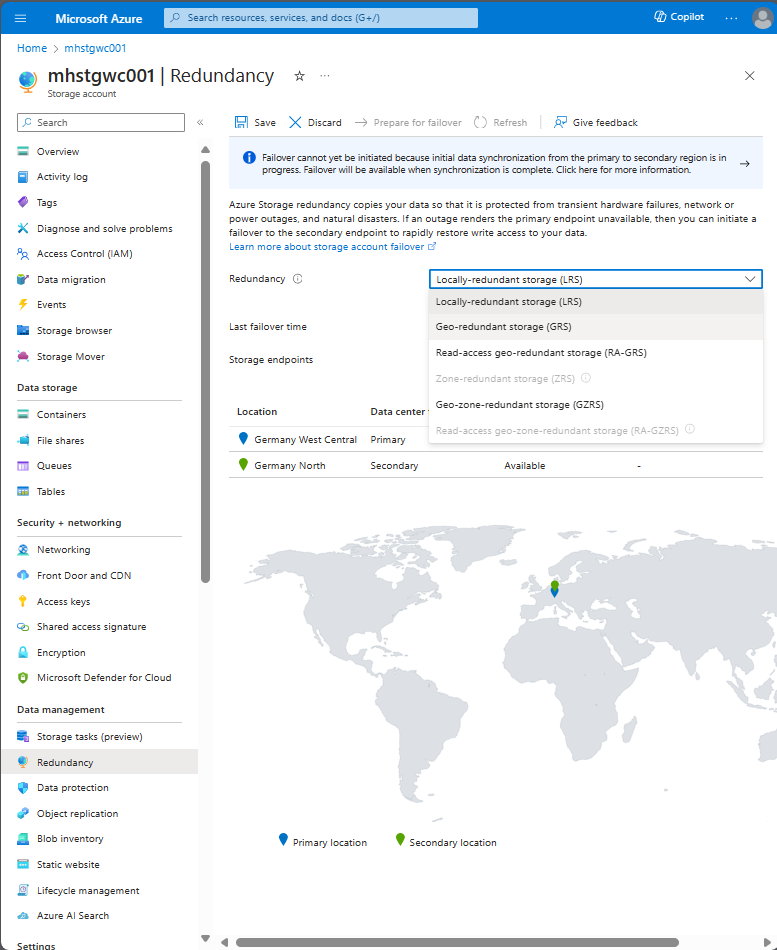
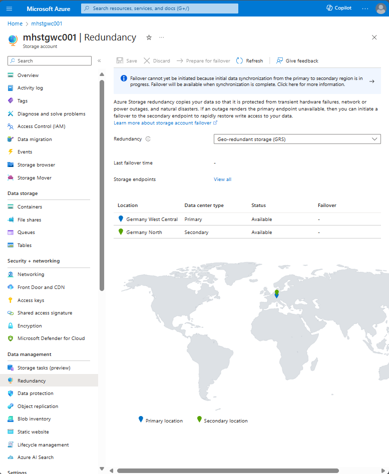
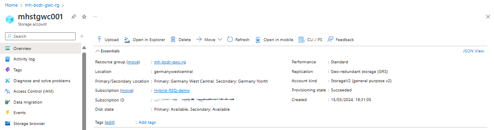
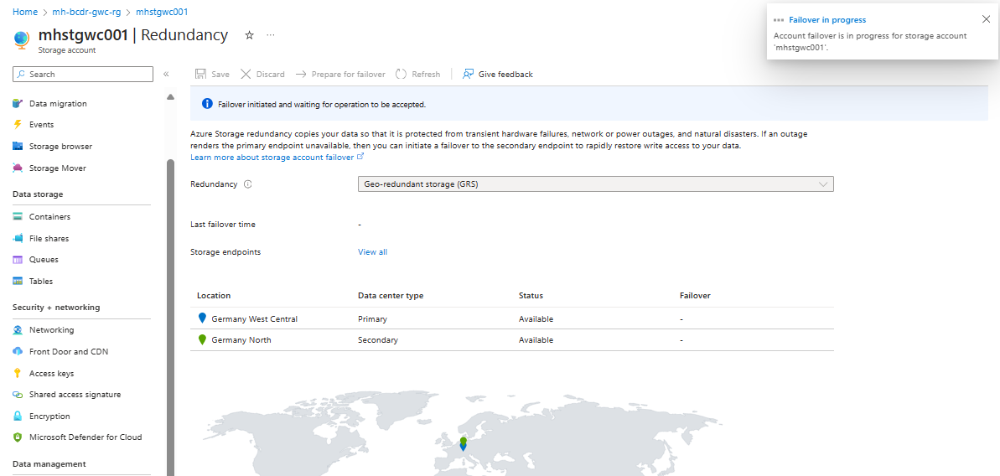
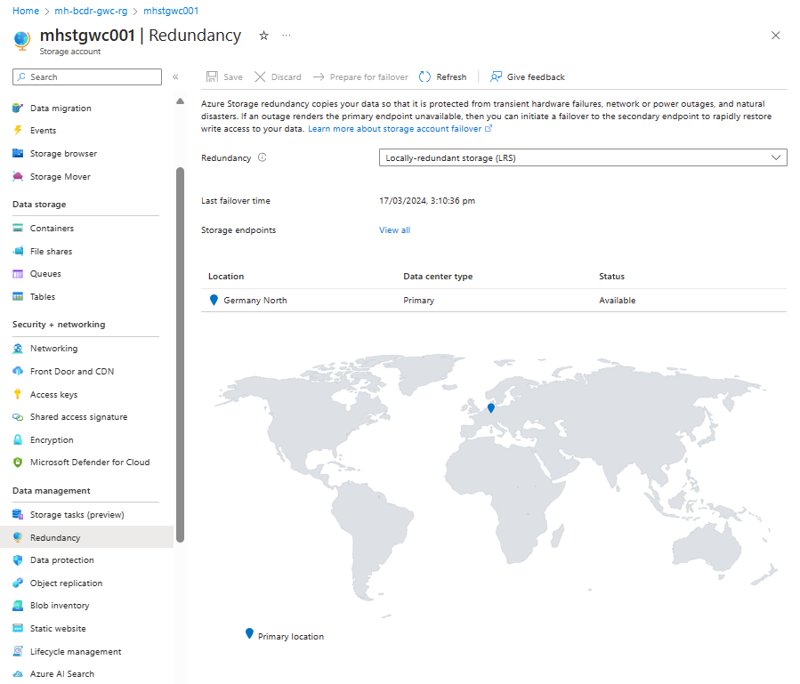

# Walkthrough Challenge 5 - Protect your Azure PaaS (Azure SQL Database and Storage Account) with Disaster recovery

[Previous Challenge Solution](../challenge-04/solution-04.md) - **[Home](../../Readme.md)** - [Next Challenge Solution](../challenge-06/solution-06.md)

⏰ Duration: 50 minutes

### Actions
* Task 1: Re-establish your connection to the Web Application from the secondary region.
  * Add your failed-over Virtual Machines in the secondary region to the backend pool of your Load Balancer.
  * Test the connection to the Web Application.
  * High Availability & SLA Discussion
* Disaster Recovery for Azure Storage Account:
  * Task 2: Set up and configure Azure Storage Account replication to another region using Geo-redundant storage (GRS) or Geo-zone-redundant storage (GZRS) to ensure data availability in case of regional outages.
  * Task 3: Perform a failover test for the storage account to validate the disaster recovery setup.

# Solution

## Task 1: Re-establish your connection to the Web Application from the secondary region

Add your failed-over Virtual Machines in the secondary region to the backend pool of your Load Balancer.

Test the connection to the Web Application.

You have successfully failed-over the Web Application!

## Disaster Recovery for Azure Storage Account

## Task 2: Set up and configure Azure Storage Account replication to another region using Geo-redundant storage (GRS) or Geo-zone-redundant storage (GZRS) to ensure data availability in case of regional outages.

Navigate to the **Azure Storage Account** in the Germany West Central Region. Open the tab **Redundancy**:

### Choose Geo-redundant storage (GRS) as redundancy option. This will enable cross-replication of your storage account with the paired region Germany North. 

### You can see now Germany North as the Secondary Region of the Storage Account:

### Learning resources
* [Geo-redundant storage (GRS) for cross-regional durability](https://learn.microsoft.com/en-us/azure/storage/common/storage-redundancy-grs)
* [Disaster recovery and storage account failover](https://learn.microsoft.com/en-us/azure/storage/common/storage-disaster-recovery-guidance)
* [Microsoft Learn - Azure Cross-region replication](https://learn.microsoft.com/en-us/azure/reliability/cross-region-replication-azure#cross-region-replication)

## Task 3: Perform a failover test for the storage account to validate the disaster recovery setup.

### Run the test failover from Germany West Central to the Sweden Central Region

### Failover Completed

**You successfully completed challenge 4!** 🚀🚀🚀

[➡️ Next Challenge 5 Instructions](../../challenges/05_challenge.md)