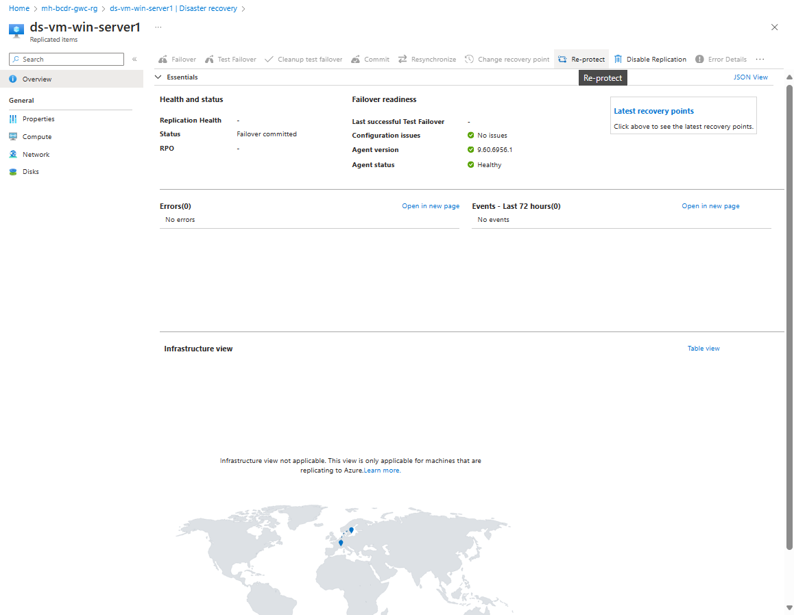
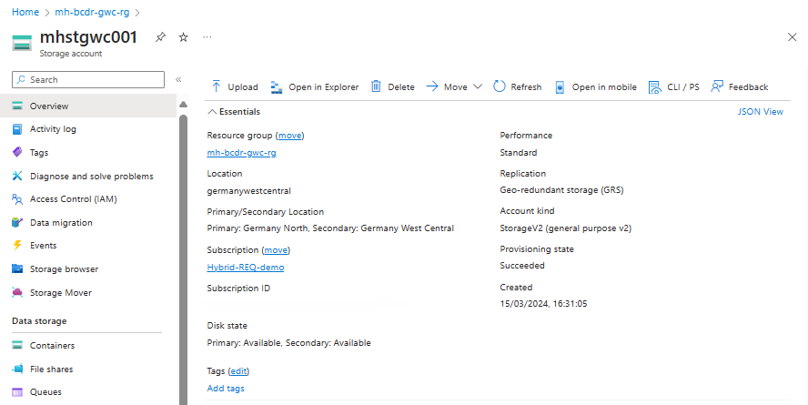
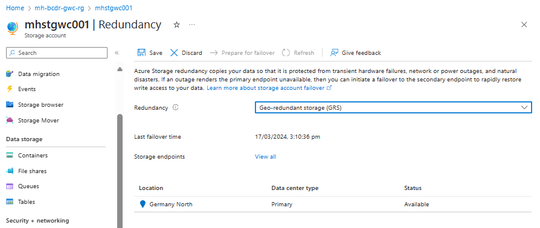
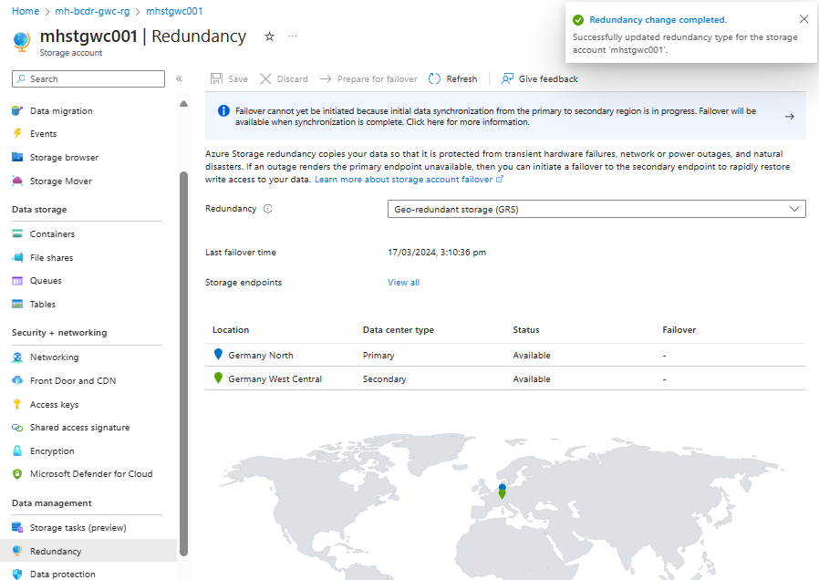
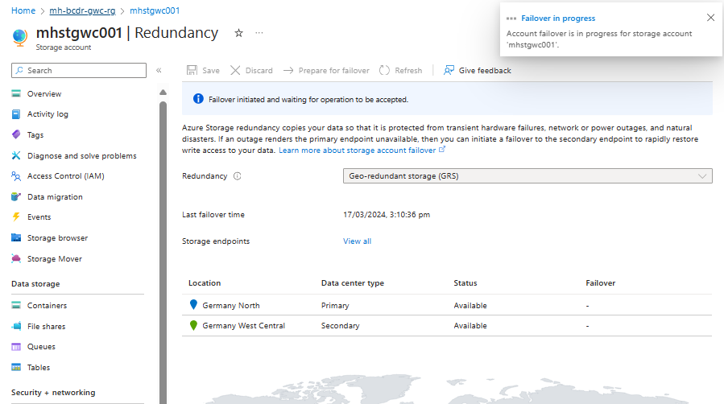

# Walkthrough Challenge 6 - Failback to the primary region (Germany West Central)

[Previous Challenge Solution](../challenge-05/solution-05.md) - **[Home](../../Readme.md)** - [Next Challenge Solution](../challenge-07/solution-07.md)

⏰ Duration: 50 minutes

### Actions
* Task 1: Failback the Web Application from Sweden Central to Germany West Central region (Source environment) and monitor the progress.
* Task 2: Failback Storage Account to Germany West Central.
* Restore a VM in Azure.

# Solution

## Disaster Recovery for Azure Virtual Machines

## Task 1: Failback the VM from Sweden to Germany region (Source environment) and monitor the progress

### Ensure the VM has been  Re-protected (this is done in challenge 3)

* [Azure Site Recovery - How to reprotect](https://learn.microsoft.com/en-us/azure/site-recovery/azure-to-azure-how-to-reprotect)

### Run the failback for the VM from Sweden Central Region to Germany West Central
You can't fail back the VM until the replication has completed, and synchronization is 100% completed. The synchronization process can take several minutes to complete.
After the Synchronization completes, select **Failover**.

Check the Virtual machine list. Server01 is running again in the Germany West Central region.

## Disaster Recovery for Azure Storage Account

## Task 3: Failback Storage Account to Germany West Central

### Navigate to the **Azure Storage Account**

### Open the tab **Redundancy**:

### If not configured, choose Geo-redundant storage (GRS) as redundancy option. This will enable cross-replication of your storage account with the paired region Germany West Central. 

### You can see now Germany West Central as the Secondary Region of the Storage Account:

## Perform a failover test for the storage account to validate the disaster recovery setup.

### Run the test failover from Germany North to the Germany West Central Region

### Failover Completed

**You successfully completed challenge 5!** 🚀🚀🚀

### Learning resources
* [Azure Site Recovery - How to reprotect](https://learn.microsoft.com/en-us/azure/site-recovery/azure-to-azure-how-to-reprotect)
* [Azure Site Recovery - Failback](https://learn.microsoft.com/en-us/azure/site-recovery/azure-to-azure-tutorial-failback)
* [Azure Site Recovery - Enable Replication](https://learn.microsoft.com/en-us/azure/site-recovery/azure-to-azure-tutorial-enable-replication)
* [Testing for disaster recovery](https://learn.microsoft.com/en-us/azure/site-recovery/site-recovery-test-failover-to-azure)

[➡️ Next Challenge 6 Instructions](../../challenges/06_challenge.md)