# Step-by-Step Deployment Guide

This guide will help you deploy the lab environment using the provided ARM templates.

## Prerequisites

- Azure subscription
- Access to the ARM templates: `deploy.json` and `main.parameters.json`

## Steps

### Step 1: Navigate to Azure Portal

1. Open your web browser and go to the [Azure Portal](https://portal.azure.com).

### Step 2: Deploy from a Template

1. In the Azure Portal, search for "Deploy a custom template" in the search bar and select it.
    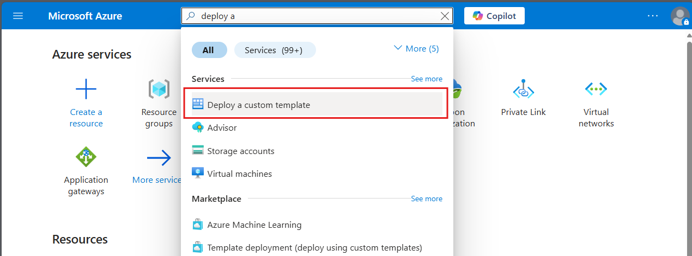

2. Click on the "Build your own template in the editor" button.
    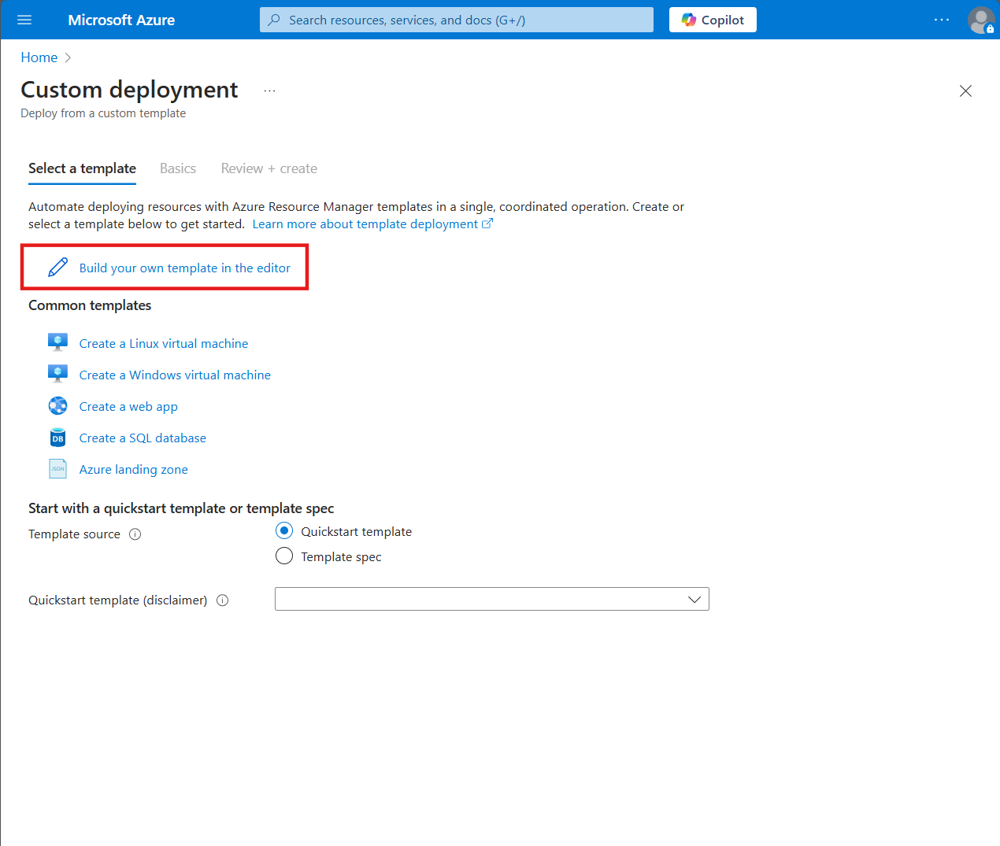

### Step 3: Upload the ARM Template

1. Click on the "Load file" button.
    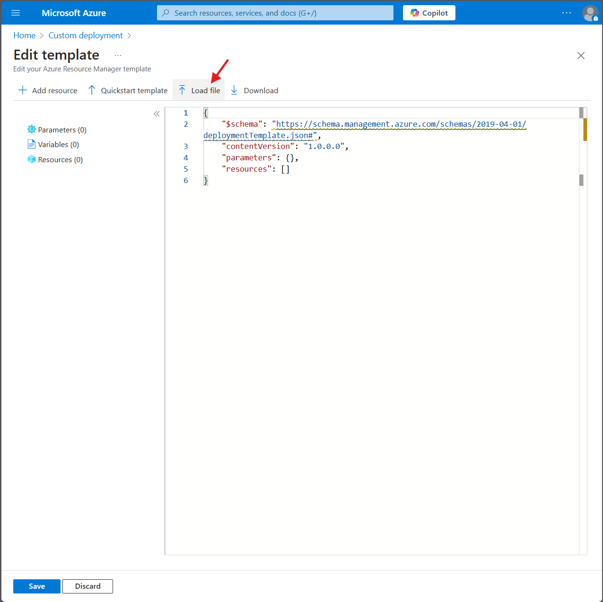

2. Select the `deploy.json` file from your local machine and upload it.
> **Note:** The `deploy.json` file is available in the GitHub repository. You can access it directly via [this link](https://github.com/microsoft/MicroHack/tree/main/03-Azure/01-03-Infrastructure/04_BCDR_Azure_Native) or navigate to the path: `.\04_BCDR_Azure_Native\Infra\App1`. Alternatively, you can download it from the repository.

3. Click on the "Save" button to proceed.
    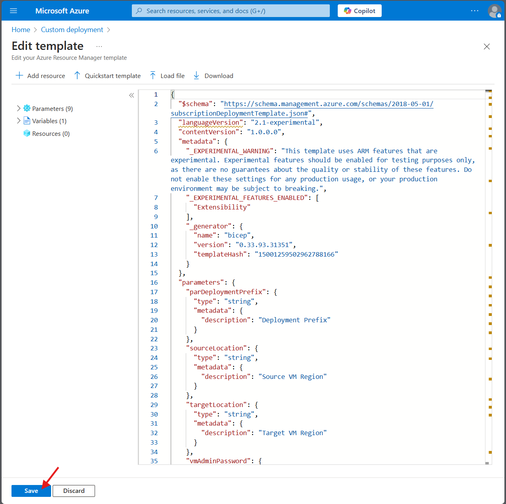

### Step 4: Configure the Deployment

1. Fill in the required fields such as Subscription, Resource Group, and Region.

2. Click on "Edit parameters" to upload the `main.parameters.json` file.
> **Note:** The `main.parameters.json` file is available in the GitHub repository. You can access it directly via [this link](https://github.com/microsoft/MicroHack/tree/main/03-Azure/01-03-Infrastructure/04_BCDR_Azure_Native) or navigate to the path: `.\04_BCDR_Azure_Native\Infra\App1`. Alternatively, you can download it from the repository.
    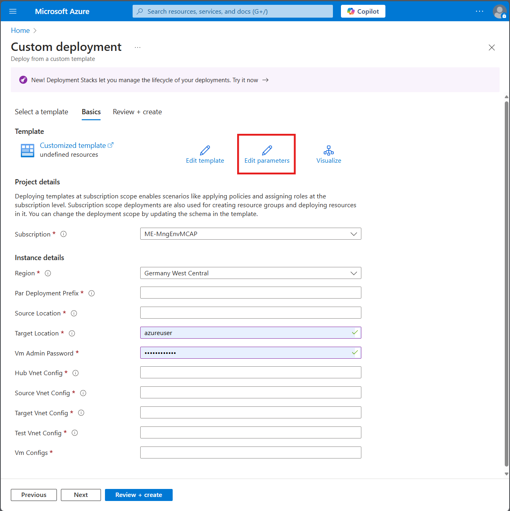

3. Click on the "Load file" button and select the `main.parameters.json` file from your local machine.
    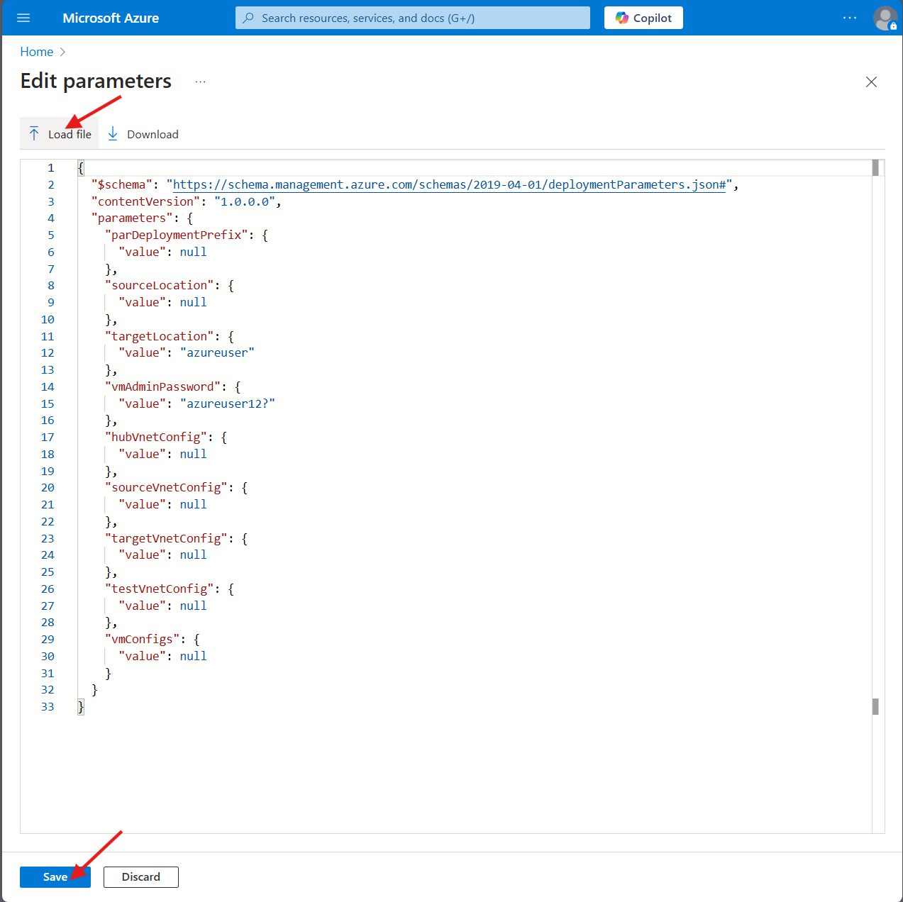

4. Click on the "Save" button to proceed.
    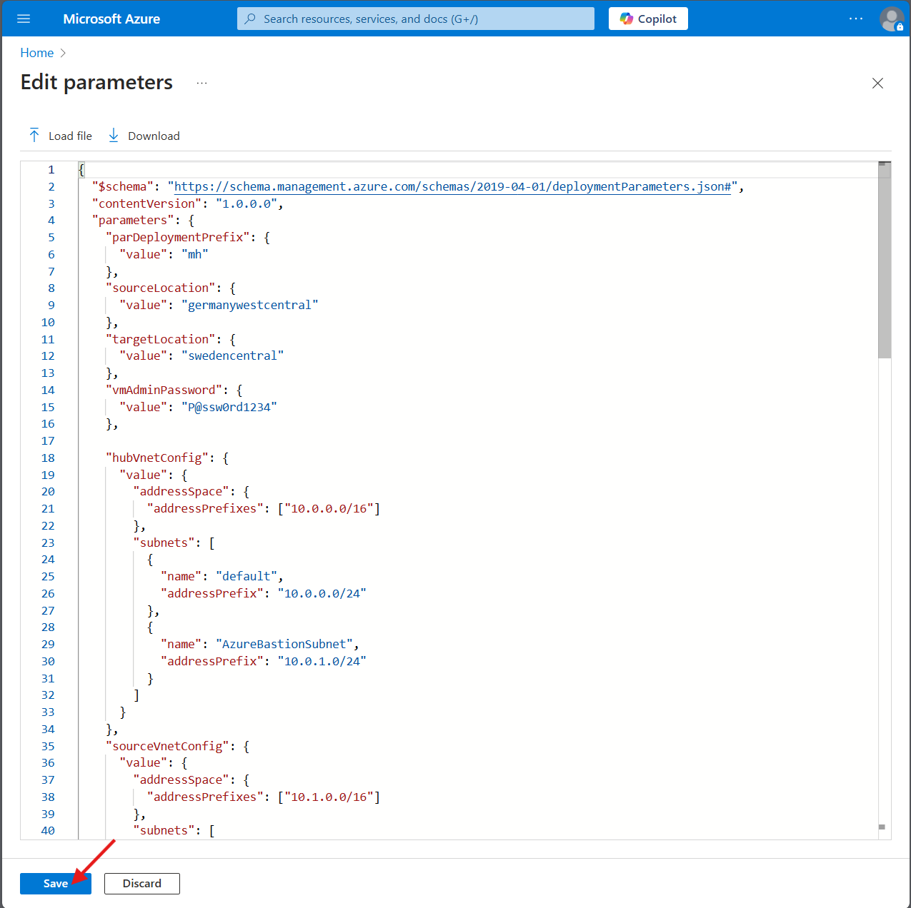

### Step 5: Review and Create

1. Review the settings and ensure everything is correct.
    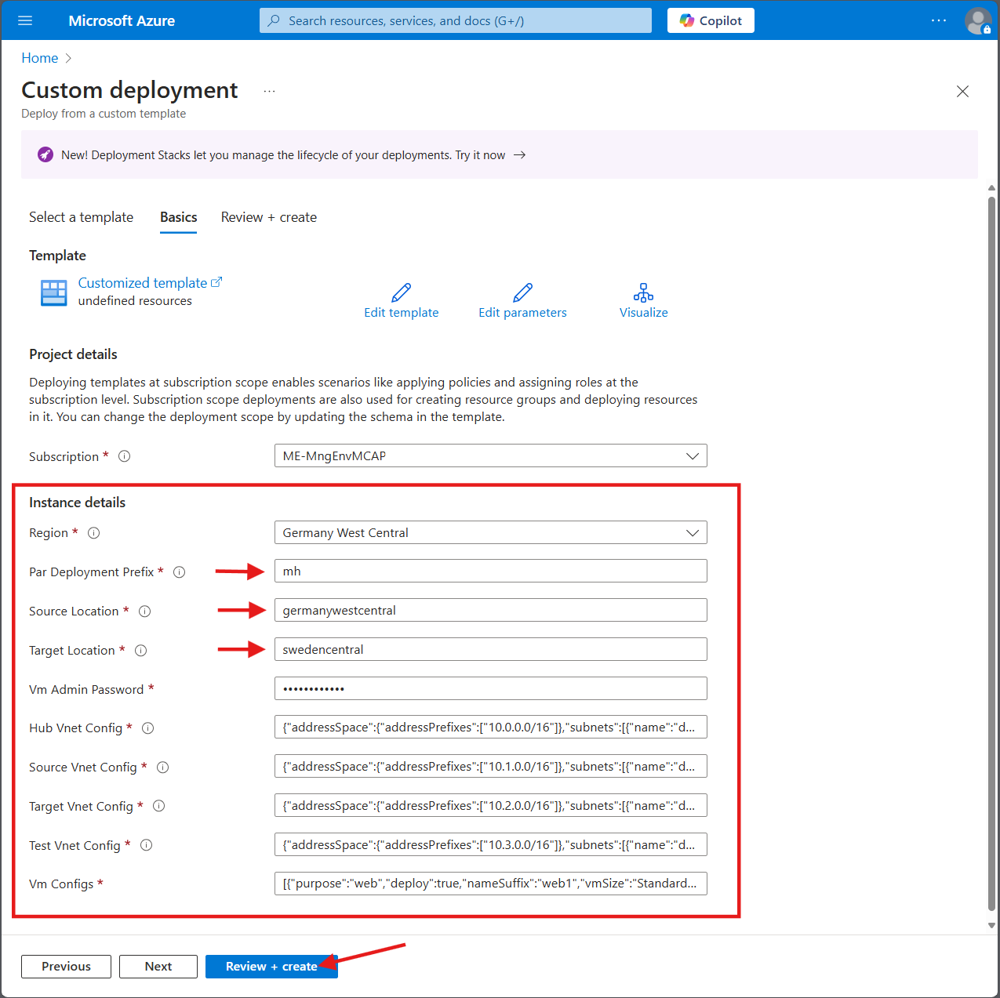

2. Click on the "Review + create" button.

3. Finally, click on the "Create" button to start the deployment.
    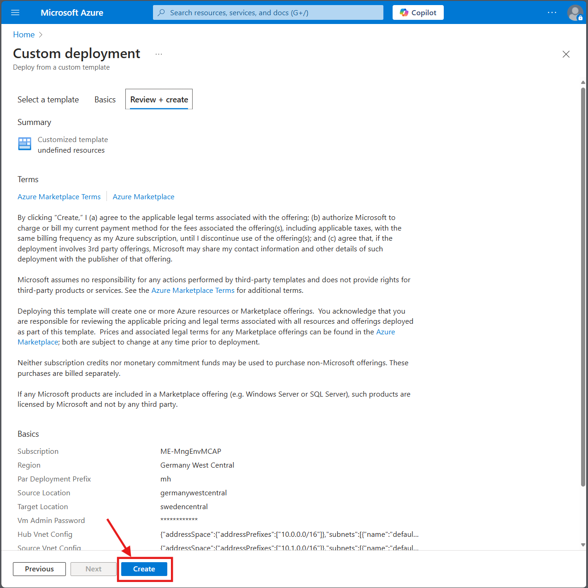

### Step 6: Monitor the Deployment

1. You can monitor the deployment process in the "Notifications" section of the Azure Portal.
    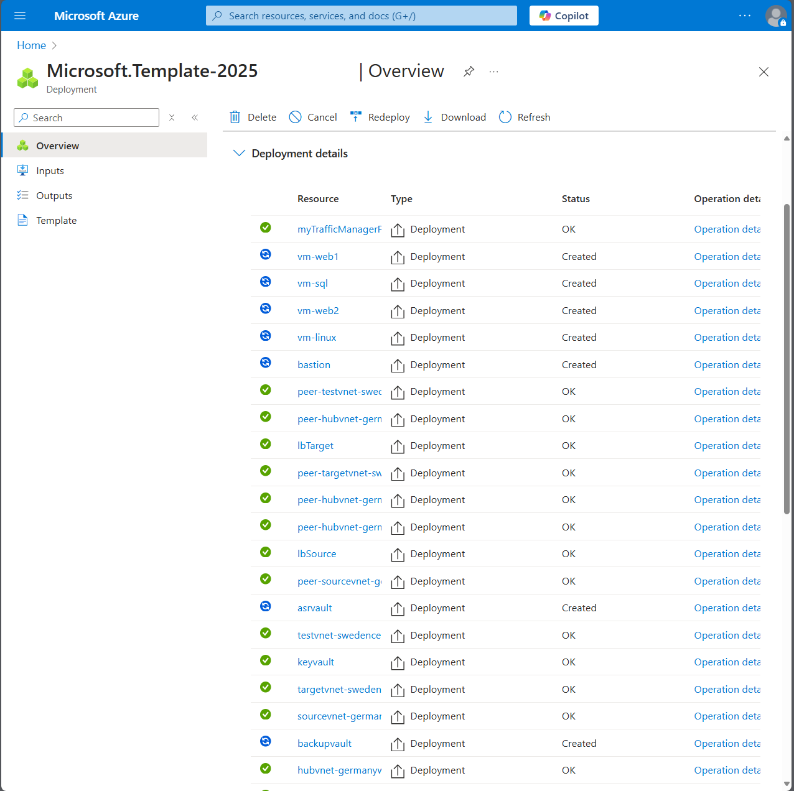

2. Once the deployment is complete, you will see a notification indicating the success of the deployment.
    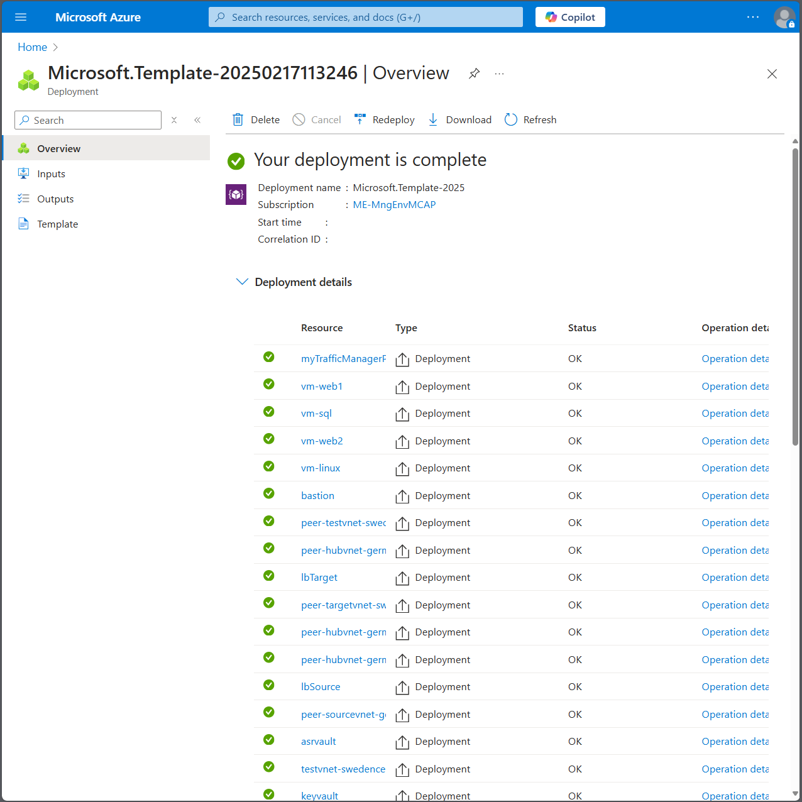

Congratulations! You have successfully deployed the lab environment using the ARM templates.
