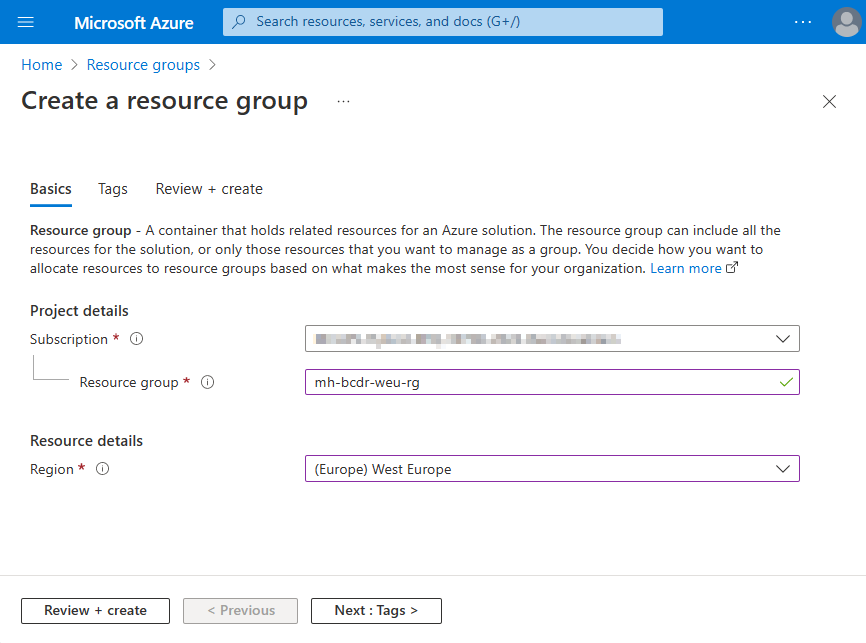
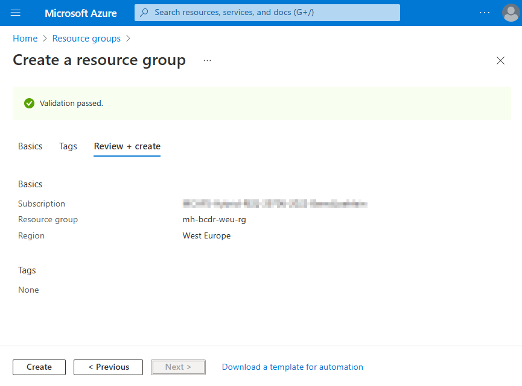
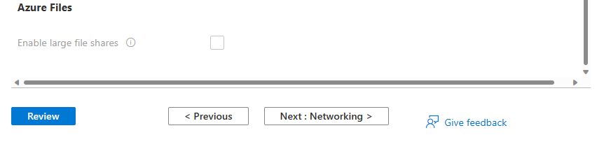
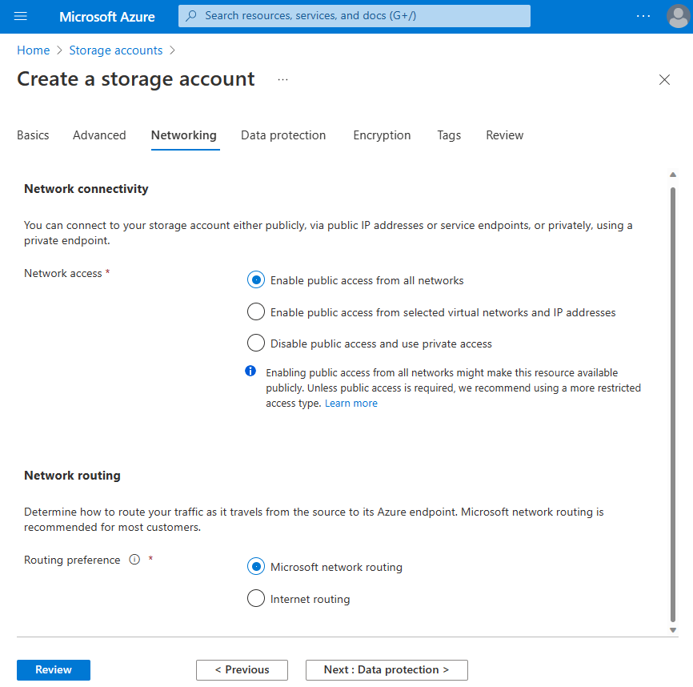
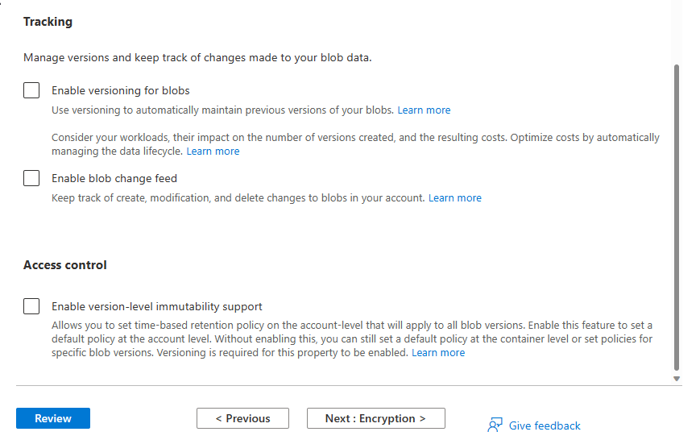
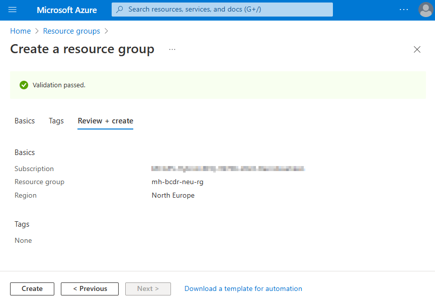
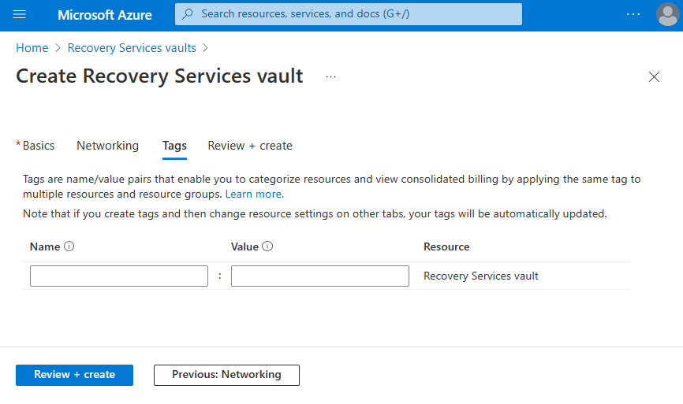

# Walkthrough Challenge 1 - Prerequisites and landing zone preparation

⏰ Duration: 20 minutes

📋  [Challenge 1 Instructions](../../challenges/01_challenge.md)

**[Home](../../Readme.md)** - [Next Challenge Solution](../challenge-2/solution.md) ➡️

## Prerequisites

Please ensure that you successfully verified the [General prerequisits](../../Readme.md#general-prerequisites) before continuing with this challenge.

### Task 1: Create Azure Resources in region Germany West Central

Sign in to the [Azure Portal](https://portal.azure.com/).

#### Create Resource Group
[Create Resource Group | Microsoft Learn](https://learn.microsoft.com/en-us/azure/azure-resource-manager/management/manage-resource-groups-portal#create-resource-groups)

#### Create Recovery Services Vault
[Create Recovery Services vault | Microsoft Learn](https://learn.microsoft.com/azure/backup/backup-create-recovery-services-vault)

###### Basics

###### Redundancy

###### Encryption

###### Vault properties

###### Networking

###### Tags

###### Review + Create

#### Create Storage Account
[Create Storage Account | Microsoft Learn](https://learn.microsoft.com/azure/storage/common/storage-account-create)

###### Basics
Storage Account Names need to be unique in a region, so please add a suffix to the generic name mhstweu

###### Advanced
Advanced settings don't need to be modified for this Micro Hack

###### Networking

###### Data protection

###### Encryption

###### Tags

###### Review

### Task 2: Create Azure Resources in region Sweden Central
#### Create Resource Group
[Create Resource Group | Microsoft Learn](https://learn.microsoft.com/en-us/azure/azure-resource-manager/management/manage-resource-groups-portal#create-resource-groups)

#### Create Recovery Services Vault

###### Basics

###### Redundancy

###### Encryption

###### Vault properties

###### Networking

###### Tags

###### Review + Create

## You successfully completed challenge 1! 🚀🚀🚀
###### Resources in region 1

###### Resources in region 2

