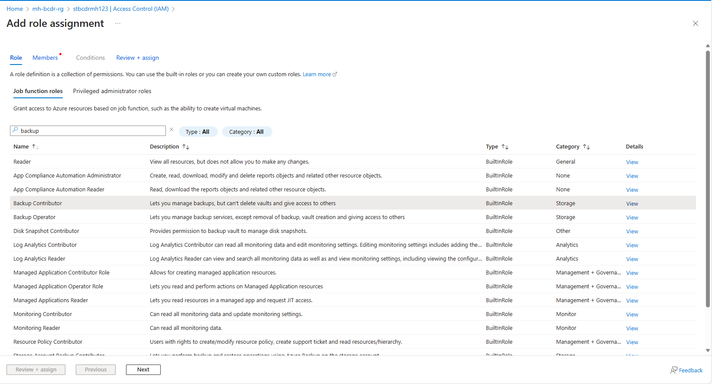
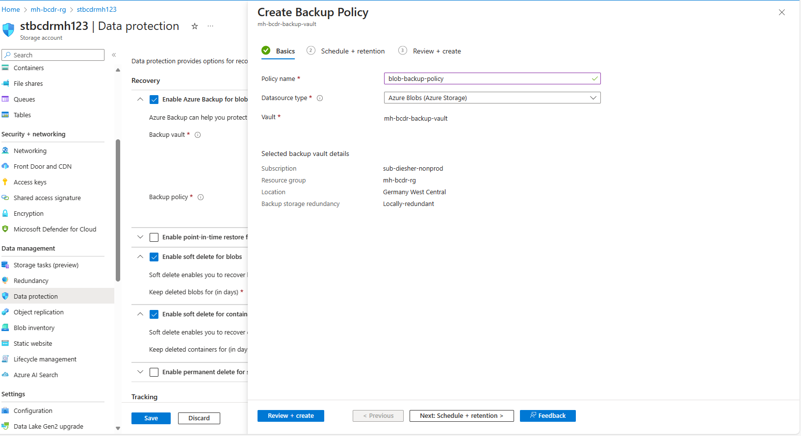
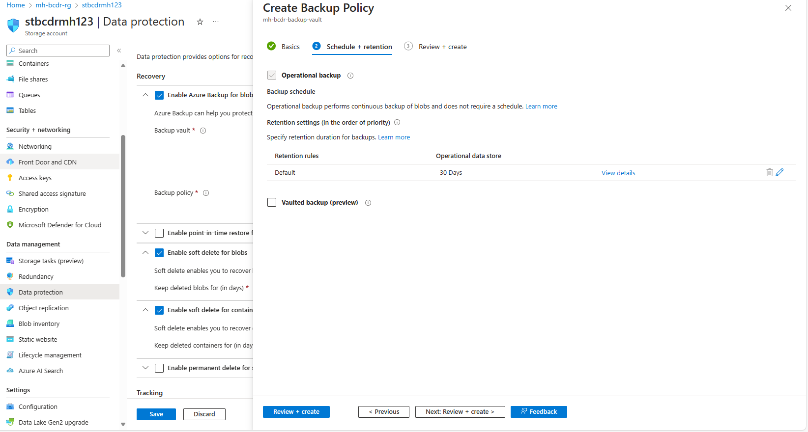

# Walkthrough Challenge 2 - Regional Protection and Disaster Recovery (DR)

⏰ Duration: 1 Hour

📋  [Challenge 2 Instructions](../../challenges/02_challenge.md)

⬅️ [Previous Challenge Solution](../challenge-1/solution.md) - **[Home](../../Readme.md)** - [Next Challenge Solution](../challenge-3/solution.md) ➡️

## Prerequisites

Please ensure that you successfully passed [challenge 1](../../Readme.md#challenge-1) before continuing with this challenge.

In this challenge, you will successfully onboard your Linux Virtual Machine to a centralized Recovery Services Vault and leverage Azure Backup Center to Protect with Backup in Azure. 

* Task 1: Enable Azure Backup for Linux VM.
* Task 2: Enable Azure Backup for Blobs
* Task 3: Restore a VM in Azure.

If you have not created the Linux Machine Successfully follow this guide to create it on the portal

💡 How-to: Deploy a Ubuntu Server VM in Azure Region Sweden Central

 

### Choose OS

> **Note:** choose the source resource group

### Configure Details - Basics

> **Note:** choose the source resource group

### Configure Details - Basics (option 2)

Please don't forget to put the VM into the public network and open up Port 3389 to connect to it (or alternatively use Azure Bastion to access it). 
### Enable RDP Port

### Configure Details - Networking (option 2)

### Review deployed VM

### Task 1: Enable Azure Backup for Linux VM

### Enable Azure Backup

### Create a new Custom Policy

### Review additional Deployment Options

### Wait for intial Backup of the VM

The steps for the Ubuntu Server VM are similar to this and will not be included here.

### Task 2: Enable Azure backup for blobs

### Create a backup vault (not a recovery service vault)

### Enable system managed Identity for the backup vault and clipboard the MI object ID

### Assign the "Backup Contributor" role to Backup vault managed identity

### Enable Azure Backup for Blobs. This will require to create a new backup policy.

### Task 3: Restore a VM in Azure

### Start Restore Procedure

### Select restore Point

### Set Restore Properties

You successfully completed challenge 2! 🚀🚀🚀
