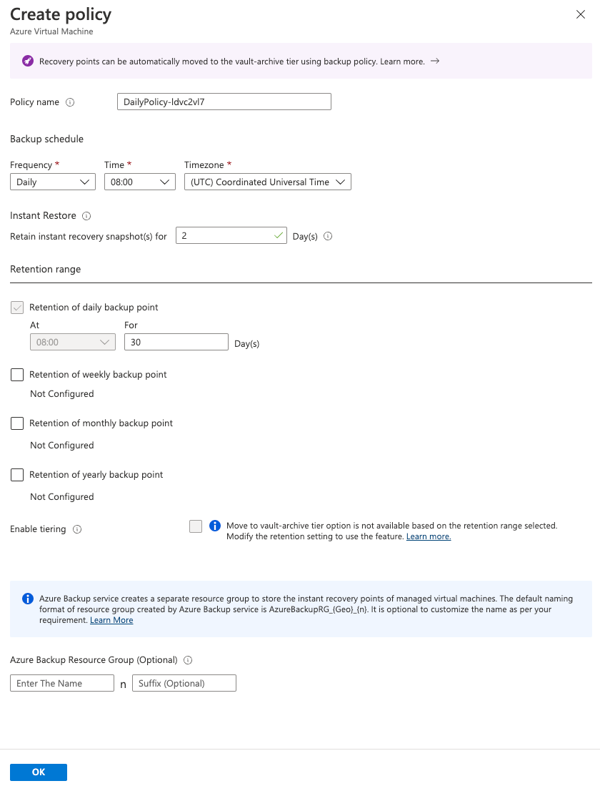

# Walkthrough Challenge 2 - Protect in Azure - Backup/Restore

Duration: 30 minutes

[Previous Challenge Solution](../challenge-1/solution.md) - **[Home](../../Readme.md)** - [Next Challenge Solution](../challenge-3/solution.md)

## Prerequisites

Please ensure that you successfully passed [challenge 1](../../Readme.md#challenge-1) before continuing with this challenge.

In this challenge you will learn how to setup Azure Backup to Protect a Virtual Machine in Azure. In addition we will have a look on the configuration and necessary Backup Policies that are available.

Actions:

- Deploy a Windows Server 2022 VM in West Europe Resource Group
- Deploy a Ubuntu Server VM in North Europe Resource Group
- Enable Azure Backup for both VMs
- Restore a VM in Azure

### Task 1: Create a new Virtual Machine in Azure Region Western Europe

As a first step, we will create a VM (Name: server01) in Azure in the resource group "mh-bcdr-weu-rg" that we created in the last challenge. This should be a Windows Server 2022 (Azure Edition) using a VM Type of Standard DS1v2. 

### Choose OS

### Configure Details

### Configure Details (part 2)

Please don't forget to put the VM into the public network and open up Port 3389 to connect to it (or alternatively use Azure Bastion to access it). 
### Enable RDP Port

### Review deployed VM

### Task 2: Deploy a Ubuntu Server VM in Norh Europe Resource Group
The steps for the Ubunutu Server VM are similar to this and will not be included here.

### Task 3: Enable Azure Backup for both VMs

### Enable Azure Backup

### Create a new Custom Policy

### Review additional Deployment Options

### Review additional Deployment Options

### Wait for intial Backup of the VM

The steps for the Ubuntu Server VM are similar to this and will not be included here.

### Task 4: Restore a VM in Azure

### Start Restore Procedure

### Select restore Point

### Set Restore Properties

You successfully completed challenge 3! 🚀🚀🚀
