# Walkthrough Challenge 2 - Protect in Azure - Backup/Restore

Duration: 30 minutes

[Previous Challenge Solution](../challenge-1/solution.md) - **[Home](../../Readme.md)** - [Next Challenge Solution](../challenge-3/solution.md)

## Prerequisites

Please ensure that you successfully passed [challenge 1](../../Readme.md#challenge-1) before continuing with this challenge.

In this challenge, you will successfully onboard your Windows and Linux Virtual Machines to a centralized Recovery Services Vault and leverage Azure Backup Center to Protect with Backup in Azure. 

### Actions

* Task 1: Deploy a Windows Server 2022 VM in Germany West Central Resource Group. Please use the "Data Science Virtual Machine - Windows 2022" image from the market place.
> **Note:** The 'Data Science Virtual Machine (DSVM)' is a 'Windows Server 2022 with Containers' VM that has several popular tools for data exploration, analysis, modeling & development pre installed.
> You will to use Microsoft SQL Server Management Studio to connect to the database and Storage Explorer to the storage Account.
* Task 2: Deploy a Ubuntu Server VM in Sweden Central Resource Group.
* Task 3: Deploy a azure sql database server with a database containing the sample data of AdventureWorksLT.
* Task 4: From the Data Science Windows Server VM, connect to the database  and to the storage account.
* Task 5: Create a blob container and upload a sample file to it.
* Task 6: Enable Azure Backup for both VMs.
* Task 7: Enable Azure Backup for Blobs
* Task 8: Restore a VM in Azure.

### Task 1: Create a new Virtual Machine in Azure Region Germany West Central

As a first step, we will create a VM (Name: ds-vm-win-serverl) in Azure in the resource group "mh-bcdr-gwc-rg" that we created in the last challenge. This should be a Data Science Virtual Machine - Windows 2022 using a VM Type of Standard DS3v2. 

### Choose OS
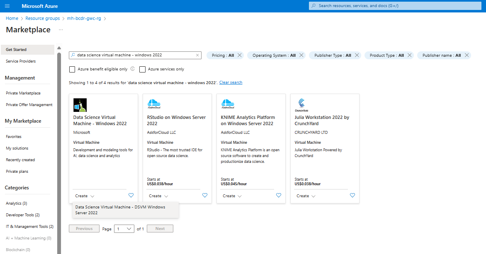

### Configure Details - Basics

### Configure Details - Basics (option 2)

Please don't forget to put the VM into the public network and open up Port 3389 to connect to it (or alternatively use Azure Bastion to access it). 
### Enable RDP Port

### Review deployed VM
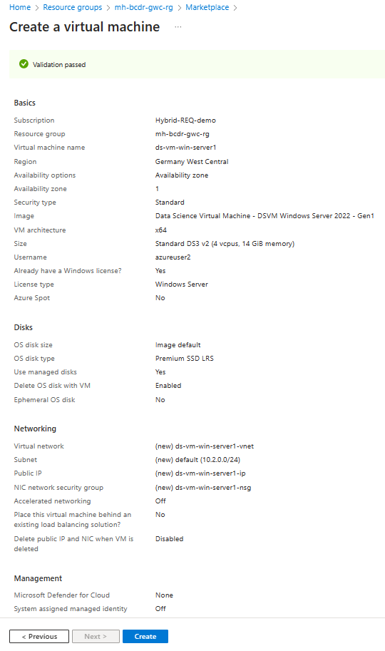
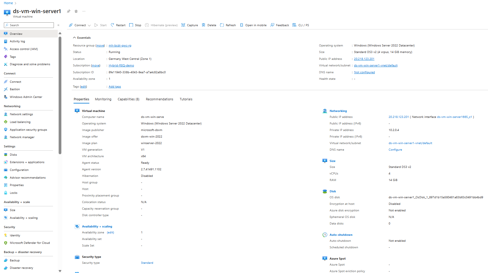

### Task 2: Deploy a Ubuntu Server VM in Azure Region Sweden Central

### Choose OS

### Configure Details - Basics

### Configure Details - Basics (option 2)

Please don't forget to put the VM into the public network and open up Port 3389 to connect to it (or alternatively use Azure Bastion to access it). 
### Enable RDP Port

### Configure Details - Networking (option 2)

### Review deployed VM

### Task 3: Deploy a Azure SQL Database Server with a database containing the sample data of AdventureWorksLT in Azure Region Germany West Central

### Choose SQL Database

### Configure Details - Basics
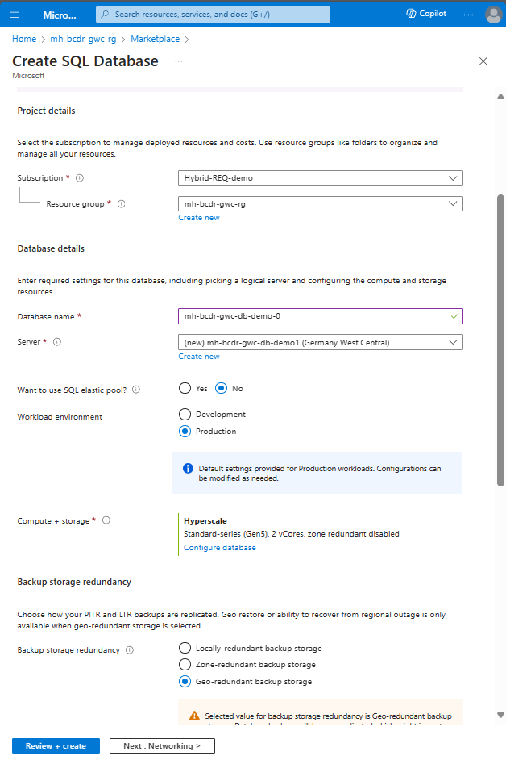

### Configure Details - Basics: Create SQL Database Server

### Configure Details - Networking
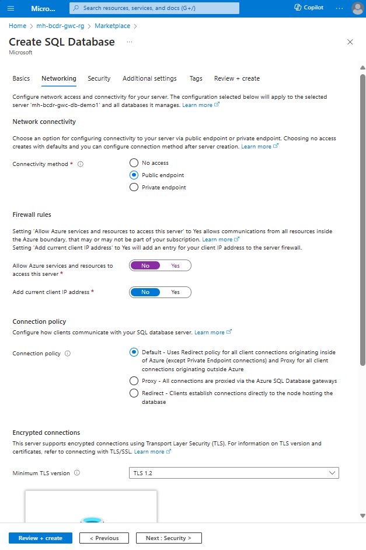

### Configure Details - Additional settings
Use existing data -> select the sample data of AdventureWorksLT

### Review + Create

### Task 4: From the Data Science Windows Server VM, connect to the database and to the storage account.

### Connect to deployed "Data Science Windows Server VM"
wait until the pre-configured VM to be installed.
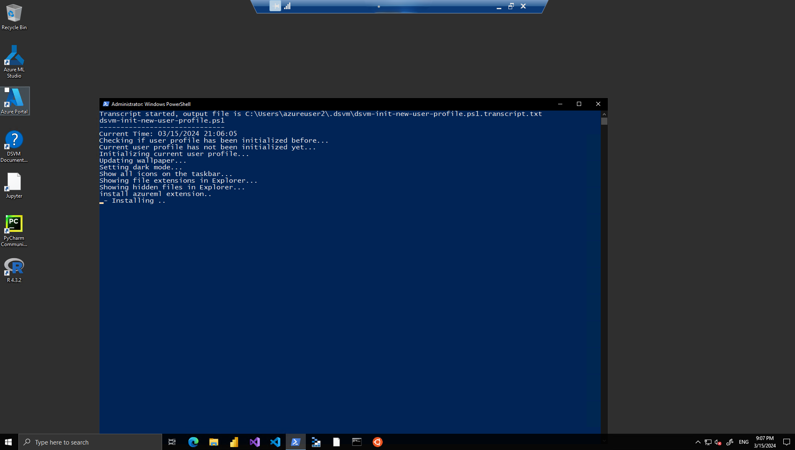

### Open SQL Server Management Studio
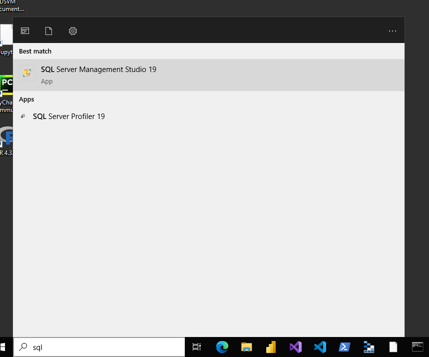

### Put your DB Server name and connect to your Database Server via the preferred Authentication method.

### The Database Server is connected!
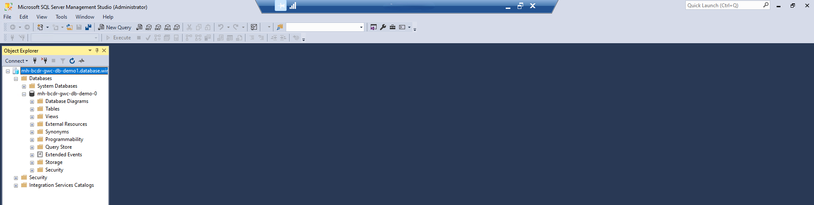

### Task 5: Create a blob container and upload a sample file to it
### Go to the storage account in mh-bcdr-gwc-rg Resource Group.
Under the tab Containers:

### Create a Shared access signature (SAS).

### Connect to the "Data Science Windows Server VM" and open "Microsoft Azure Storage Explorer"
Choose Storage account or service

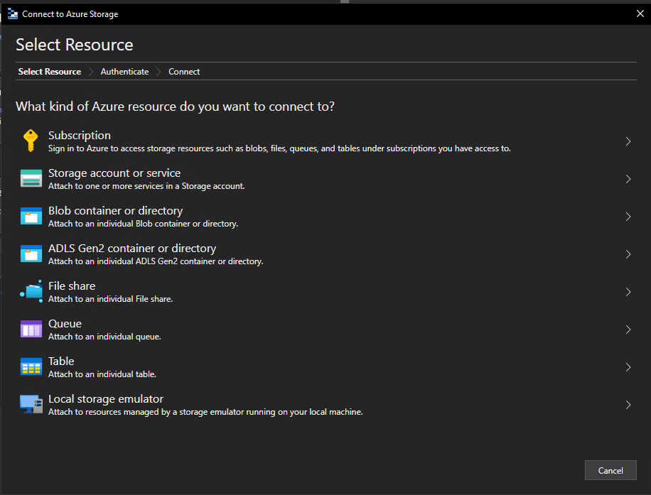

### Select Shared access signature URL (SAS) as connection method.

### Put the Shared access signature (SAS), which we created in the previous task.

### Review Summary + Connect

### Your storage account is connected!

### Now, search for the container that you created in the previous task
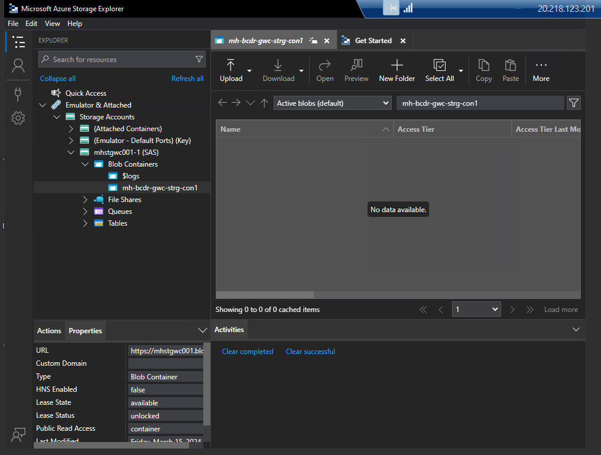

### Upload a sample file
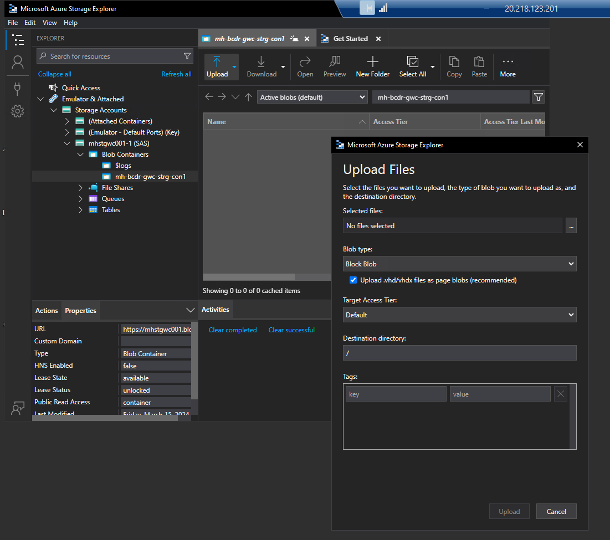
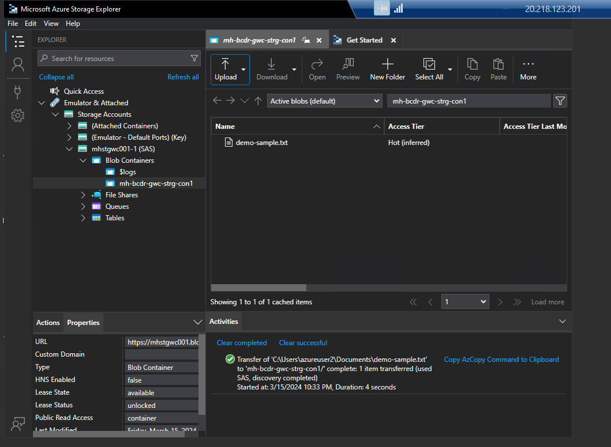

### Task 6: Enable Azure Backup for both VMs

### Enable Azure Backup

### Create a new Custom Policy

### Review additional Deployment Options

### Wait for intial Backup of the VM

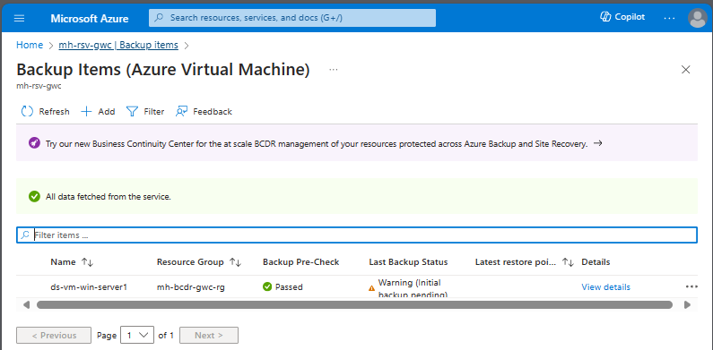

The steps for the Ubuntu Server VM are similar to this and will not be included here.

### Task 7: Enable Azure backup for blobs

### Task 8: Restore a VM in Azure

### Start Restore Procedure

### Select restore Point

### Set Restore Properties

You successfully completed challenge 2! 🚀🚀🚀
