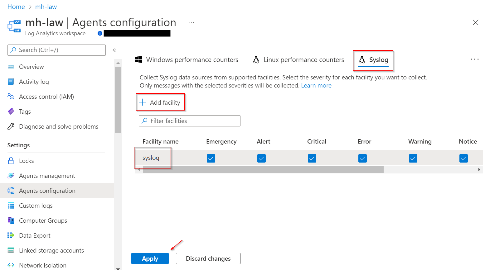
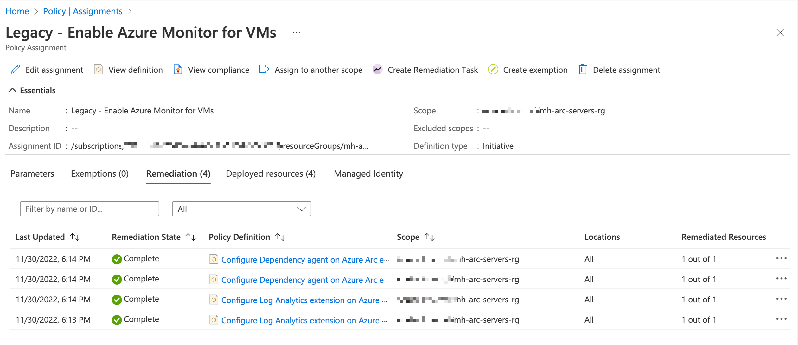
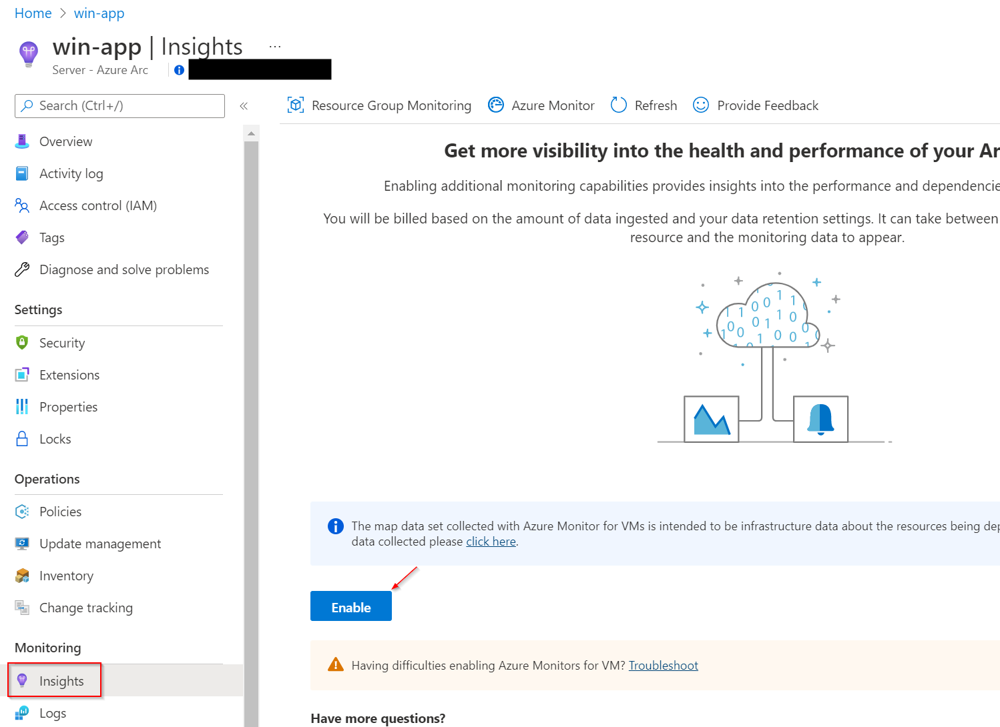

# Walkthrough Challenge 2 - Use Azure Monitor, Azure Update Management and Inventory for your Azure Arc enabled Servers

Duration: 30 minutes

[Previous Challenge Solution](../challenge-1/solution.md) - **[Home](../../Readme.md)** - [Next Challenge Solution](../challenge-3/solution.md)

## Prerequisites

Please ensure that you successfully passed [challenge 1](../../Readme.md#challenge-1) before continuing with this challenge.

### Task 1: Create necessary Azure resources

1. Sign in to the [Azure Portal](https://portal.azure.com/).

2. Create a new Azure Automation Account called *mh-arc-servers-automation* with default settings in the Resource Group *mh-arc-servers-rg*.


3. Create a new Log Analytics Workspace called *mh-arc-servers-automation-law* with default settings in the same Resource Group.


### Task 2: Configure Log Analytics

1. Navigate to the Log Analytics Workspace and open *Agents configuration* in the left navigation pane.

    > **Note**  
    >  The screenshots still show the old name *Agents configuration*. Please look for the rebranded item *Legacy agents management*. The screenshots and MicroHack will be updated once the transition from Log Analytics Client to Azure Monitor Agent is complete.


2. Select *Add windows event log* and add the *System* logs to the workspace. Hit apply.


3. Navigate to Syslog in the top navigation pane, select *Add facility* and add *syslog* logs to the workspace. Hit apply.



### Task 3: Assign Azure Policy Initiative to your Azure Arc resource group

1. Navigate to *Policy* using the top search bar and select *Assignments* in the left navigation pane.


2. Select *Assignments* in the left navigation pane and go to *Assign initiative*


3. In this section you can now configure the assignment with the following settings and create the assignment:

- Scope: Please select the resource group called *mh-arc-servers-rg*
- Basics: Please search for *Legacy - Enable Azure Monitor for VMs* and select the initiative.
- Parameters: Please select your Log Analytics workspace. 
- Remediation: Please select the System assigned identity location according to your resources, e.g. West Europe. 


Please note: The Azure Monitor agent is the successor of the legacy Log Analytics agent and usually the recommended agent. There are still some scenarios that are not yet supported with the new agent. As a result, the MicroHack will leverage the Log Analytics agent for demo purposes. Please verify the latest information in the [Azure Monitor agent overview](https://learn.microsoft.com/en-us/azure/azure-monitor/agents/agents-overview).

4. Please wait a few seconds until the creation of the assignment is complete. You should see that the initiative is assigned. Every new Azure Arc Server will now automatically install the necessary agents. 

5. Important: Both machines were already onboarded earlier. As a result, you need to create a remediation task to apply the policy to your Azure Arc Servers. Please select the Policy Assignment and select *Create Remediation Task*.


6. Accept the default values, check *Re-evaluate resource compliance before remediating* and repeat the remediation for the following policies:
 - LogAnalyticsExtension_Windows_HybridVM_Deploy
 - LogAnalyticsExtension_Linux_HybridVM_Deploy
 - DependencyAgentExtension_Windows_HybridVM_Deploy
 - DependencyAgentExtension_Linux_HybridVM_Deploy


7. Verify that all remediation were successful.



### Task 4: Enable Update Management for Azure Arc enabled Servers

1. Sign in to the [Azure Portal](https://portal.azure.com/).

2. Navigate to your Azure Automation Account *mh-arc-servers-automation*

3. Select *Update Management* in the left navigation pane and enable the Update Management. Please make sure to select the Log Analytics workspace that was created earlier. 


4. Once the deployment of Update Management is complete, you can onboard existing and future machines by hitting *Manage machines* and selecting *Enable on all available machines and future machines*.


Coffee Break of 10 minutes to let Azure Update Management propagate the configuration changes to the Log Analytics Workspace. 

5. Now, it's time to create a schedule for each OS platforms. First, go to your Log Analytics Workspace *mh-arc-servers-automation-law* and select *Logs* in the left navigation pane. Now create the following Kusto query:

```
Update | distinct Computer
```

6. Select *Save as..* and name the function *GetAllArcVMs*. Please make sure to check *Save as computer group* and hit *Save*


7. Go back to *Update Management* in the automation account and select *Schedule update deployment*. Please create an update schedule for Windows with the following settings:

- Name: Update Windows
- Groups to update: Non-Azure -> add *GetAllArcVMs*
- Schedule Settings: Your local time plus 7 minutes; Recurring


8. Repeat step 7 for Linux.

### Task 4: Enable Inventory for Azure Arc enabled Servers

1. Navigate to your Azure Automation Account, select *Inventory* in the left navigation pane and enable *Inventory*.


2. Select *Manage Machines* and select *Enable on all available and future machines* to onboard existing and new machines to the inventory feature. 


### Task 5: Analyze data in VM Insights

1. Navigate to your Virtual Machines, select VM Insights in the left navigation pane and enable Insights. Please use the *Log Analytics agent*.




### Coffee Break of 10 minutes to let the data flow between your Virtual Machines and Azure

After your coffee break you should see that the Virtual Machines are reporting their status. You can now check the Update Management for pending updates, verify what software is installed on the machines and get deep insights of the utilization of your Virtual Machines.

You successfully completed challenge 2! 🚀🚀🚀
