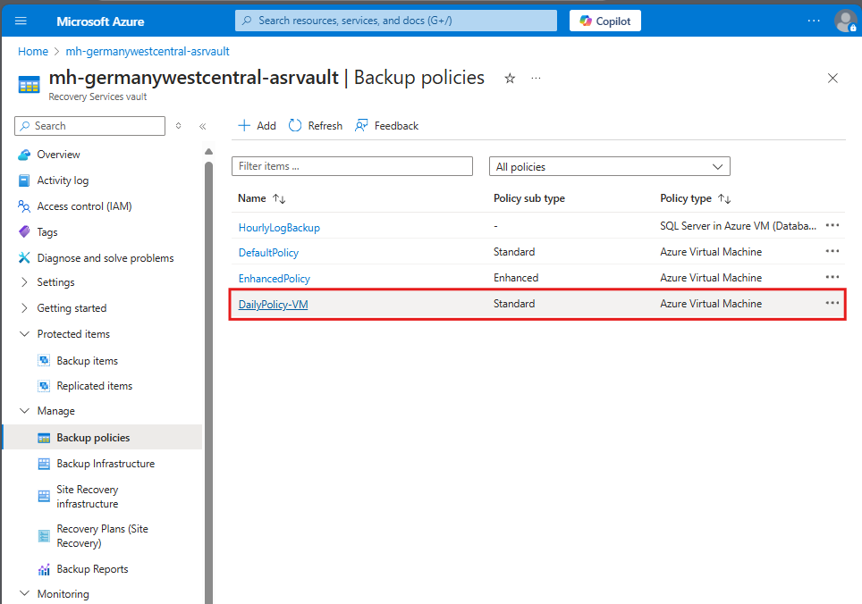
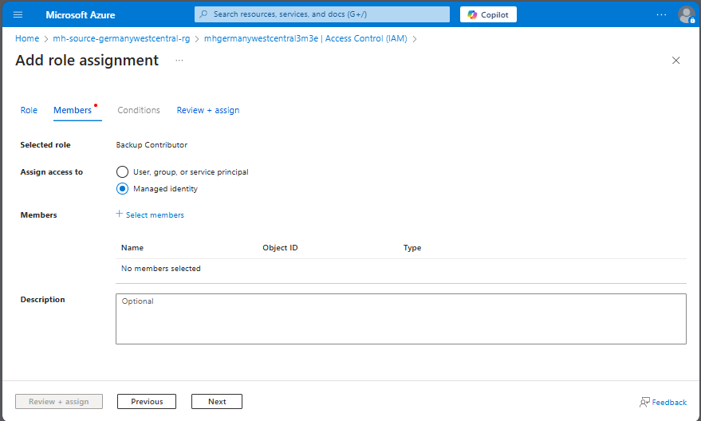
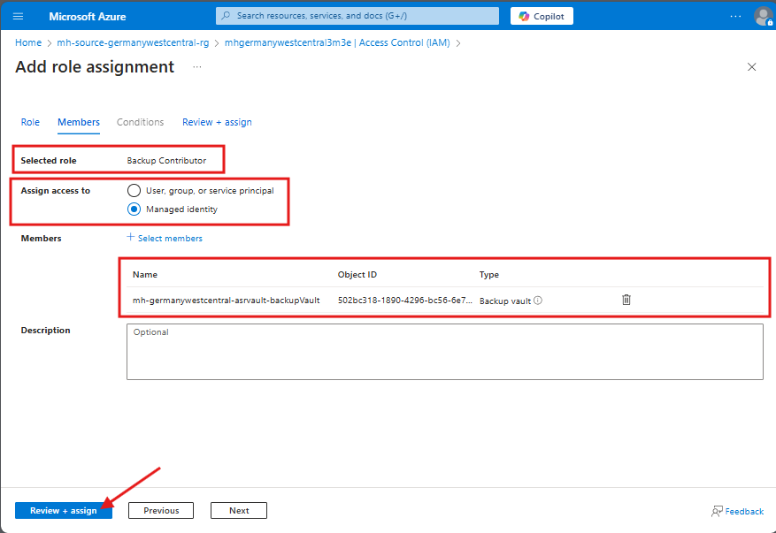
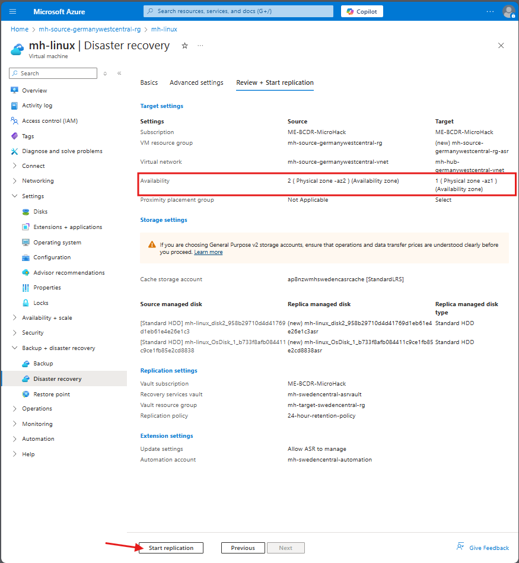
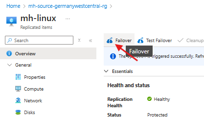

# Walkthrough Challenge 2 - Regional Protection and Disaster Recovery (DR)

⏰ Duration: 1 Hour

📋 [Challenge 2 Instructions](../../challenges/02_challenge.md)

## Prerequisites

Ensure you have successfully completed [challenge 1](../../challenges/01_challenge.md) before proceeding.

## Solution Walkthrough

- [**Challenge 2.1 - Protect in Azure - Backup / Restore**](#challenge-21---protect-in-azure---backup--restore)
  - [Task 1: Enable Azure Backup for Linux VM](#task-1-enable-azure-backup-for-linux-vm)
  - [Task 2: Enable Azure Backup for Blobs](#task-2-enable-azure-backup-for-blobs)
    - [Assign access permissions to perform backup](#enable-system-managed-identity-for-the-backup-vault-and-copy-the-mi-object-id)
  - [Task 3: Restore a VM in Azure](#task-3-restore-a-vm-in-azure)
- [**Challenge 2.2 - Protect in Azure with Disaster Recovery (DR) within an Azure Region**](#challenge-22---protect-in-azure-with-disaster-recover-dr-within-an-azure-region)
  - [Task 4: Set up disaster recovery for the Linux VM in the primary region](#task-4-set-up-disaster-recovery-for-the-linux-vm-in-the-primary-region)
    - [Assign access permissions to perform disaster recovery](#enable-system-managed-identity-for-the-recovery-services-vault)
  - [Task 5: Simulate a failover from one part of the primary region to another part within the same region](#task-5-simulate-a-failover-from-one-part-of-the-primary-region-to-another-part-within-the-same-region)


### Challenge 2.1 - Protect in Azure - Backup / Restore
In this challenge, you will onboard your Linux Virtual Machine to a centralized Recovery Services Vault and use Azure Backup Center to protect it with Azure Backup.

* Task 1: Enable Azure Backup for Linux VM.
* Task 2: Enable Azure Backup for Blobs.
* Task 3: Restore a VM in Azure.

If you have not created the Linux Machine successfully, follow this guide to create it on the portal:

<details>
<summary>💡 How-to: Deploy a Ubuntu Server VM in Azure Region Sweden Central</summary>
<br>

### Choose OS

> **Note:** Choose the source resource group.

### Configure Details - Basics

> **Note:** Choose the source resource group.

### Configure Details - Basics (Option 2)


Ensure the VM is in the public network and open Port 3389 to connect to it (or use Azure Bastion to access it).

### Enable RDP Port


### Configure Details - Networking (Option 2)


### Review Deployed VM


</details>

### Task 1: Enable Azure Backup for Linux VM

#### Enable Azure Backup


Navigate to the **Backup** tab and proceed with **Backup now**.


Backup job is started.


The backup job includes **Take Snapshot** and **Transfer data to vault**.


#### Wait for Initial Backup of the VM

This might take a while.


### Create a New Custom Policy

Go to the Azure Site Recovery **ASR Vault** in the Primary Region (Germany West Central).


Add a new Backup Policy.


Add a new Backup Policy for Azure Virtual Machines.


### Schedule Daily Backups

Configure **daily** backup frequency.


### Review Additional Deployment Options
- **Hourly** Backup Schedule (Optional)


Review the configuration:
* Backup Schedule
* Backup Retention settings

Proceed with **Create**.

Backup Policy is successfully created!



<!-- The steps for the Data Science Virtual Machine are similar and will not be included here. -->

## Task 2: Enable Azure Backup for Blobs

Go to the Storage Account in the Primary Region.


<details>
<summary>💡 Task 2: Enable Azure Backup for Blobs</summary>
<br>

<details>
<summary>💡 How-to: Create a Backup Vault (if not created during lab setup)</summary>
<br>

### Create a Backup Vault (not a Recovery Service Vault)


</details>

<details>
<summary>💡 How-to: Create a Container</summary>
<br>


</details>
<br>

> **Note:** To enable backup for the storage account, you need to grant the Backup Vault appropriate **access permissions**. Please follow the guidance below.

### Enable System Managed Identity for the Backup Vault and Copy the MI Object ID

Go to the Backup Vault in the Primary Region (Germany West Central) and navigate to the **Identity** tab.

Status: **On**


Enable system assigned managed identity: **yes**


Successfully enabled system assigned managed identity!


Successfully enabled system assigned managed identity!
Now you can proceed with one of the two options below.


### Solution Example 1 - **Azure role assignments** through MI Identity

Click **Azure role assignments** to proceed with role assignment.


Select **scope**: you can select the specific Storage account Scope or larger scopes like the resource group or your subscription.

Select Role ["Storage Account Backup Contributor"](https://learn.microsoft.com/en-us/azure/role-based-access-control/built-in-roles/storage#storage-account-backup-contributor).


Role assignment successfully configured


### Solution Example 2 -  Assign the "Storage Account Backup Contributor" Role to the Backup Vault Managed Identity

Go back to the Storage Account in the Primary Region (Germany West Central). Navigate to the **Access Control (IAM)** tab and add a role assignment.


Select Role ["Storage Account Backup Contributor"](https://learn.microsoft.com/en-us/azure/role-based-access-control/built-in-roles/storage#storage-account-backup-contributor).


Under **Assign access to**, select **Managed Identity**.



Click **Select members** and choose the appropriate scope.


Select the Managed Identity of the Backup Vault.


Review + Assign.



The Backup Vault now has the required permissions to perform backup operations on the storage account.
<br>

## Enable Azure Backup for Blobs

This will require creating a new backup policy:


Backup Policy for storage successfully created!


</details>

### Task 3: Restore a VM in Azure
- Backup job from Task 1 should be finished before proceeding here!

#### Start Restore Procedure


#### Select Restore Point


#### Set Restore Properties

Proceed with **Restore**.


A new Virtual Machine `mh-linux-restore` has been created in the resource group, restored from the backup.


You have successfully completed Challenge 2.1! 🚀

## Challenge 2.2 - Protect in Azure with Disaster Recovery (DR) within an Azure Region
* **Task 4:** Set up disaster recovery for the Linux VM in the primary region.
* **Task 5:** Simulate a failover from one part of the primary region to another part within the same region.

### Task 4: Set up disaster recovery for the Linux VM in the primary region.

Enable Disaster Recovery (DR) between **Availability Zones**

> **Note:** To enable disaster recovery (DR) between the regions, you might need to grant the Site Recovery Vault appropriate **access permissions**. If needed follow the instructions below.

<details>
<summary>💡 How-to: Access permissions for Disaster Recovery (DR)</summary>
<br>

### Enable System Managed Identity for the Recovery Services Vault

Navigate to the **Recovery Services Vault** in the Primary Region (Germany West Central) and select the **Identity** tab.

**Status:** On


✅ System-assigned managed identity successfully enabled!

#### Assign Required Azure Roles

Click **Azure role assignments** to begin configuring permissions.


Click **Add role assignment** to add the first required role.


#### Role Assignment 1: Storage Blob Data Contributor

**Select scope:**
- Choose the specific Resource Group or a larger scope (e.g. your subscription) where disaster recovery will operate.

**Select Role:** ["Storage Blob Data Contributor"](https://learn.microsoft.com/en-us/azure/role-based-access-control/built-in-roles/storage#storage-blob-data-contributor)


#### Role Assignment 2: Contributor

Click **Add role assignment** again to add the second required role.


**Select scope:**
- Use the same scope as the previous role assignment.

**Select Role:** ["Contributor"](https://learn.microsoft.com/en-us/azure/role-based-access-control/built-in-roles/privileged#contributor)


✅ Successfully assigned all required permissions for disaster recovery (DR)!


</details>
<br>

Navigate to **mh-linux | Disaster recovery**

Choose a different Availability Zone than the current one as **Target**


Review and Start Replication



Wait until the replication is finished


The Linux Virtual Machine is protected with Azure Site Recovery between Availability Zones.


### Task 5: Simulate a failover from one part of the primary region to another part within the same region.

Conduct an unplanned failover




You have successfully completed Challenge 2! 🚀🚀

[➡️ Next Challenge 3 Instructions](../../challenges/03_challenge.md)

---

## Troubleshooting & FAQ

### Error: Installing Mobility Service and Preparing Target

**Error ID:** `151192`

**Error Message:**  
```
Site recovery configuration failed.
```

**Possible Causes:**  
Connection cannot be established to Office 365 authentication and identity IPv4 endpoints.

**Resolution:**  
Allow outbound access to required Azure Site Recovery endpoints in your **Network Security Group (NSG)**, **firewall**, or **proxy** settings.
- Use service tags like `AzureActiveDirectory` and `Office365` for NSG rules.

**Related Resources:**  
- [Azure Site Recovery - Firewall and Proxy Guidance](https://aka.ms/a2a-firewall-proxy-guidance)
