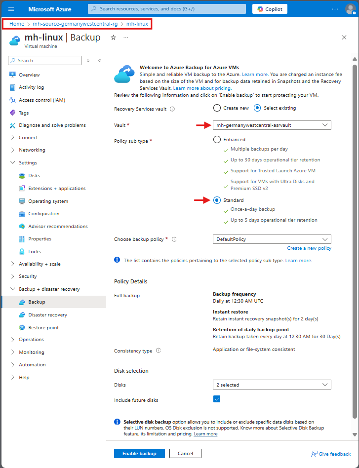
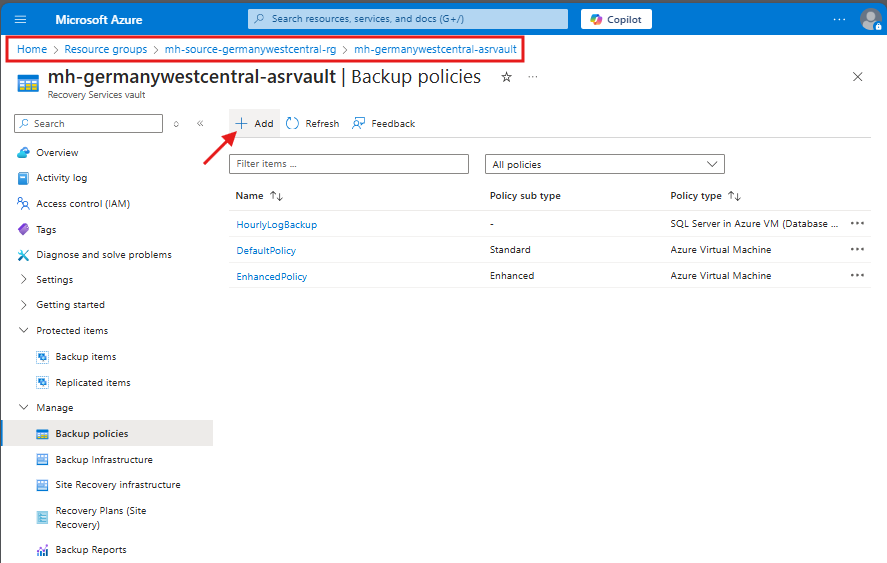
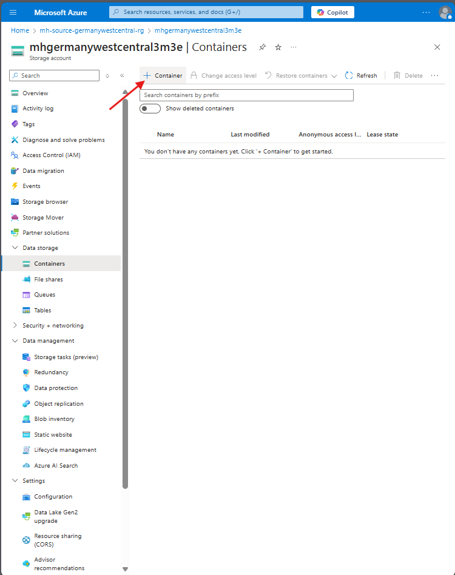
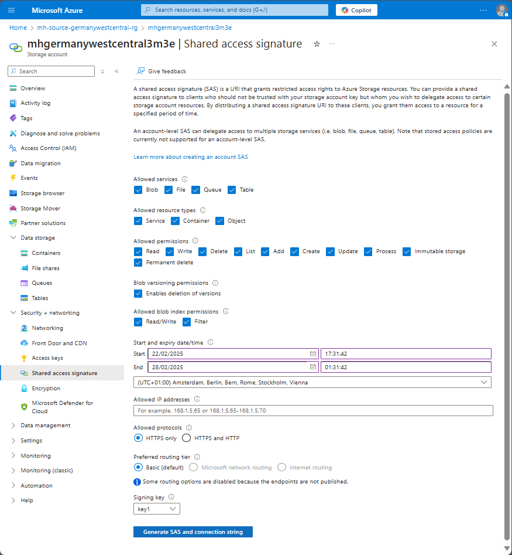
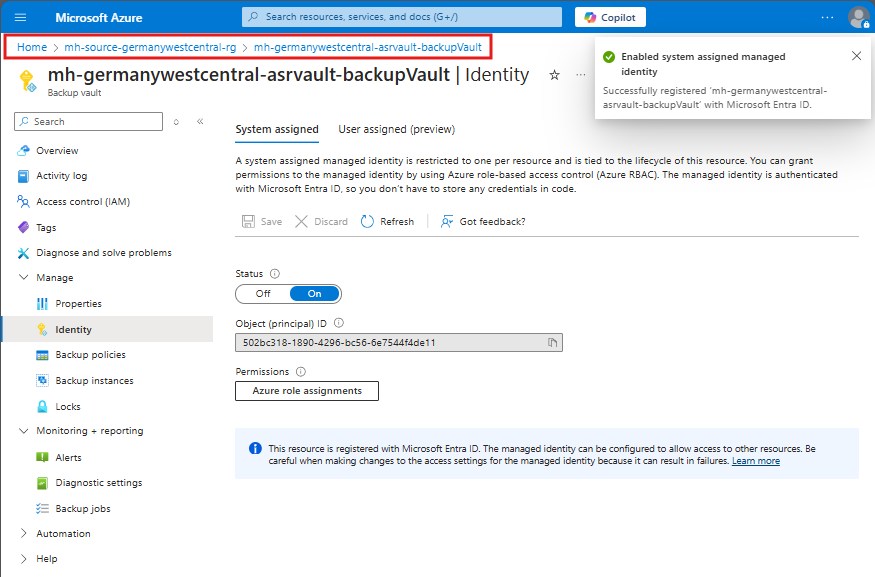
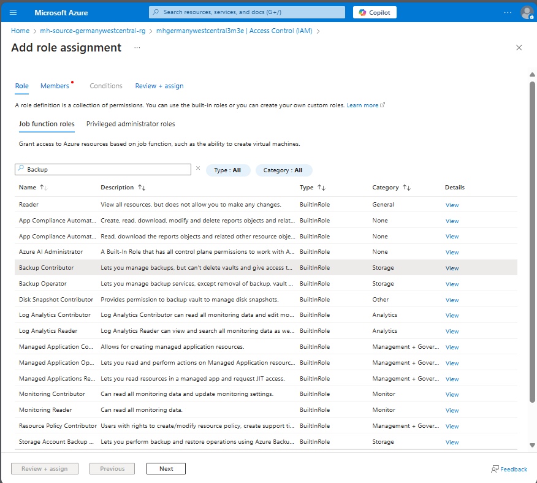

# Walkthrough Challenge 2 - Regional Protection and Disaster Recovery (DR)

⏰ Duration: 1 Hour

📋  [Challenge 2 Instructions](../../challenges/02_challenge.md)

⬅️ [Previous Challenge Solution](../challenge-1/solution.md) - **[Home](../../Readme.md)** - [Next Challenge Solution](../challenge-3/solution.md) ➡️

## Prerequisites

Please ensure that you successfully passed [challenge 1](../../Readme.md#challenge-1) before continuing with this challenge.

In this challenge, you will successfully onboard your Linux Virtual Machine to a centralized Recovery Services Vault and leverage Azure Backup Center to Protect with Backup in Azure. 

* Task 1: Enable Azure Backup for Linux VM.
* Task 2: Enable Azure Backup for Blobs
* Task 3: Restore a VM in Azure.

If you have not created the Linux Machine Successfully follow this guide to create it on the portal

💡 How-to: Deploy a Ubuntu Server VM in Azure Region Sweden Central

 

### Choose OS

> **Note:** choose the source resource group

### Configure Details - Basics

> **Note:** choose the source resource group

### Configure Details - Basics (option 2)

Please don't forget to put the VM into the public network and open up Port 3389 to connect to it (or alternatively use Azure Bastion to access it). 
### Enable RDP Port

### Configure Details - Networking (option 2)

### Review deployed VM

### Task 1: Enable Azure Backup for Linux VM

### Enable Azure Backup

Navigate to the **Backup** Tab and proceed with **Backup now**

Backup Job is started

Here can be seen what has been done by a Backup Job?
**Take Snapshot** and **Transfer data to vault**

### Wait for initial Backup of the VM

This might take a while

## Create a new Custom Policy

Go to the Backup Vault in the Primary Region (Germany West Central)

Add a new Backup Policy

Add a new Backup Policy for Disks

### Schedule daily backups

Configure daily backup frequency

### Review additional Deployment Options
-   Hourly Backup Schedule Optional

Review the configuration 
* Backup Schedule
* Backup Retention settings
and proceed with **Create**

Backup Policy is successfuly created!

The steps for the Data Science Virtual Machine are similar to this and will not be included here.

[Microsoft Learn - Azure Cross-region replication](https://learn.microsoft.com/en-us/azure/reliability/cross-region-replication-azure#cross-region-replication)

### Task 2: Enable Azure backup for blobs
Go to the Storage Account in the Primary Region

💡 Task 2: Enable Azure backup for blobs

 

💡 How-to: Create a backup vault (if could not be create while the lab environment setup)

 

### Create a backup vault (not a recovery service vault)

💡 How-to: Create a container

 

To backup our storage account, we should assign the Backup Vault in Primary Region some access permissions.

### Enable system managed Identity for the backup vault and clipboard the MI object ID
Go to the Backup Vault in the Primary Region (Germany West Central) and navigate to the Identity Tab

Click **Azure role assignments**

### Assign the "Storage Backup Contributor" role to Backup vault managed identity
Go back to the Storage Account the Primary Region (Germany West Central). Navigate to **Access Control (IAM)** Tab and add a role assignment.

Select Role

Select Scope

Select Managed Identity of the Backup Vault

Review + Assign

### Enable Azure Backup for Blobs.

This will require to create a new backup policy:

Backup Policy for storage successfully created!

### Task 3: Restore a VM in Azure

### Start Restore Procedure

### Select restore Point

### Set Restore Properties

Proceed with **Restore**

You successfully completed challenge 2! 🚀🚀🚀

There is a new Virtual Machine `mh-linux-restore` in the resource group, which is restored from the backup.

