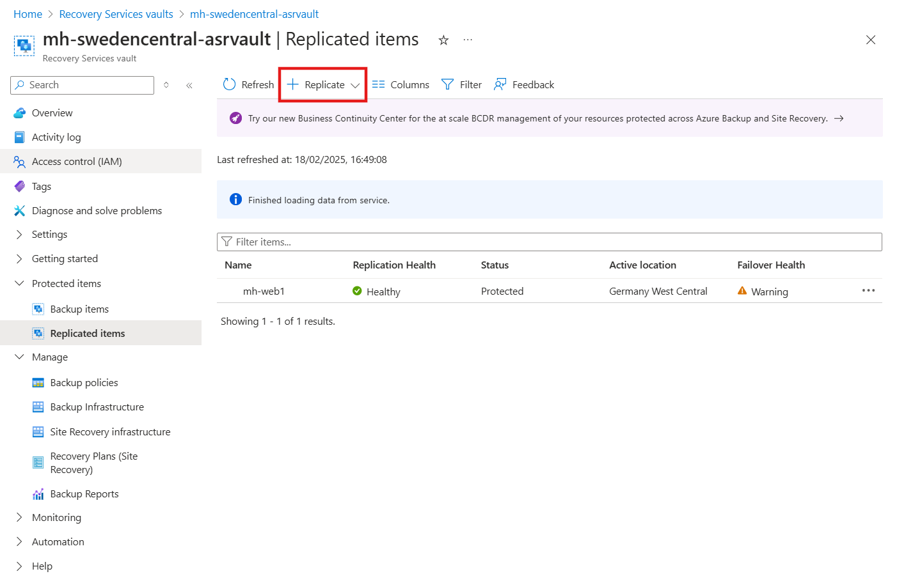
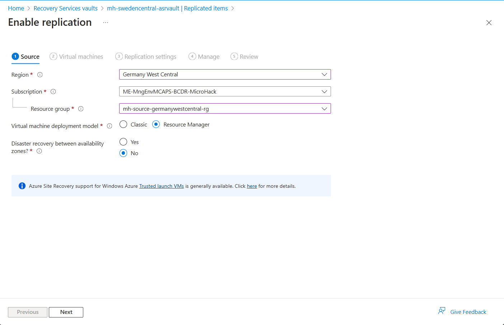
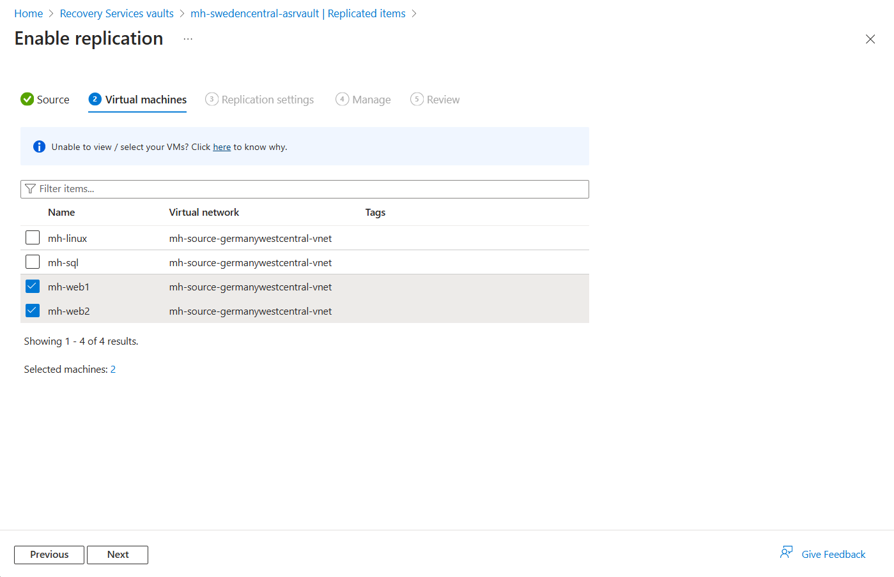
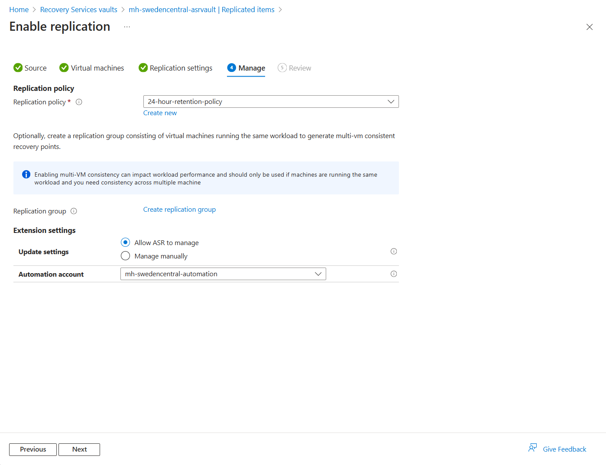
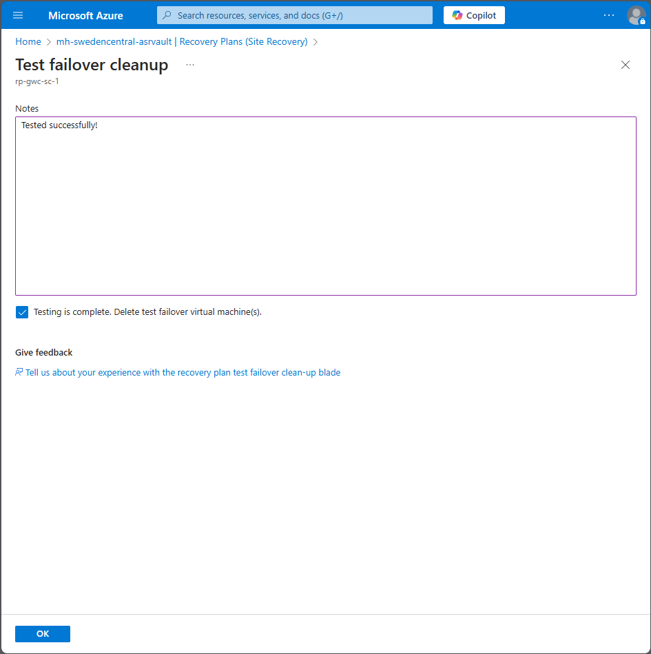

# Walkthrough Challenge 3 - Protect in Azure with Disaster Recovery

Duration: 50 minutes

[Previous Challenge Solution](../challenge-2/solution.md) - **[Home](../../Readme.md)** - [Next Challenge Solution](../challenge-4/solution.md)

## Prerequisites

Please ensure that you successfully passed [challenge 2](../../Readme.md#challenge-2) before continuing with this challenge.

In this challenge, you will learn how to protect Azure VM with Azure Site Recovery, and enable replication to the secondary site. Moreover, you will successfully run the test & production failover and failback between two regions.

### Actions

* Set up and enable disaster recovery with Azure Site Recovery and monitor the progress.
* Perform a disaster recovery drill, create recovery plan and run a test failover.
* Run a production failover from Germany West Central to Sweden Central region and failback again from Sweden to Germany.

## Task 1: Enable replication with Azure Site recovery for the Virtual Machine in the Germany West Central Region to the Sweden Central Region

Navigate to **Recovery Services Vault** in the Germany West Central (mh-rsv-gwc) which we created in the first Challenge. In the **Protected Items**, select **Replicated Items**. Then select **Replicate** and from the dropdown list select **Azure virtual machines**. The following pan will apprear:

In the deployment notification you could navigate to the Site Recovery Jobs which lists all Site Recovery Actions you have created in this task.

You can select in progress jobs to check the status and progress.

This Task can take up to 10 minutes to finish.

## Task 1 Ubuntu VM Version: Enable replication with Azure Site recovery for the Virtual Machine in the Sweden Central Region to the Germany West Central Region

## Task 2: Create a recovery plan and Run a disaster recovery drill

### Create a recovery plan
Navigate to **Recovery Services Vault** in the Sweden Central (mh-rsv-sc). Under **Manage**, select **Recovery Plans (Site Recovery)** and create a recovery plan.

Select `mh-web1` and `mh-web2` as the protected source machine and create the recovery plan.

### Run the test failover from Germany West Central to the Sweden Central Region
Navigate to the recovery plan created in the previous task. 

From the top menu select **Test failover**.

### Monitor the progress
Navigate to **Site Recovery Jobs** and select Test failover job which is in progress.

After all jobs are finished successully, Navigate to the Virtual Machines list. New Virtual Machine has been created in the Sweden Central Region.

### Cleanup test failover

## Task 3: Run a production failover from Germany West Central to Sweden Central and failback again from Sweden to Germany region (Source environment) and monitor the progress
### Run the production failover for server01 from Germany West Central to Sweden Central

Check the virtual machine list. There is a new virtual machine running in Sweden Central region.

### Reprotect the virtual machine

**You successfully completed challenge 3!** 🚀🚀🚀
