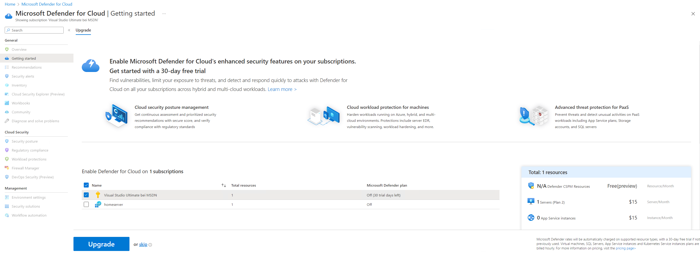
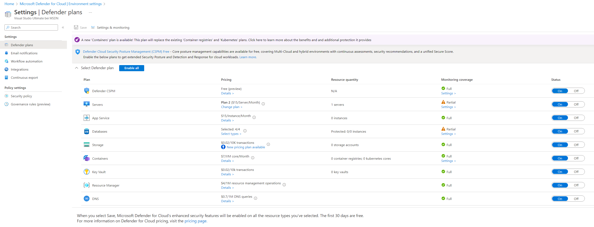
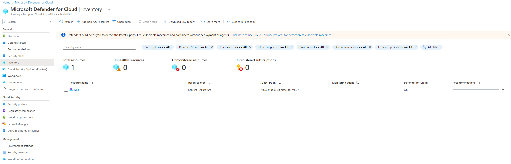

# Walkthrough Challenge 4 - Microsoft Defender for Cloud integration with Azure Arc

Duration: 30 minutes

[Previous Challenge Solution](../challenge-3/solution.md) - **[Home](../../Readme.md)** - [Next Challenge Solution](../challenge-5/solution.md)

## Prerequisites

Please ensure that you successfully passed [challenge 3](../../Readme.md#challenge-3) before continuing with this challenge.

### Task 1: Check and collect the Log Analytics workspace from [Challenge 2](../challenge-2/solution.md)

### Task 2: Configure Defender for Cloud
* Enable Defender for Server
* Click on Upgrade 

* Verify

* Check that the Defender for Servers Plan 2 is enabled

* Configure autodeployment of the AMA agent

### Task 3: Check that the server is visible in the inventory with all checks green.

Congratulations! You secured any server which is outside of Azure and onboarded via Azure Arc.

You successfully completed challenge 4! 🚀🚀🚀

