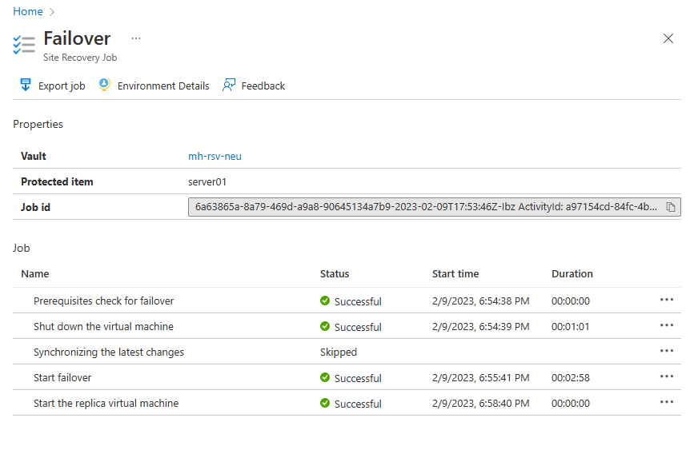
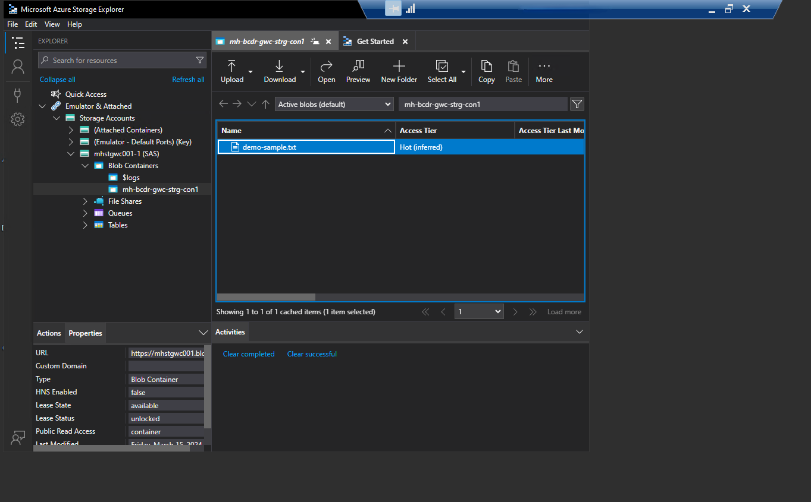

# Walkthrough Challenge 5 - Failback to the primary region (Germany West Central)

Duration: 50 minutes

[Previous Challenge Solution](../challenge-4/solution.md) - **[Home](../../Readme.md)**

## Prerequisites

Please ensure that you successfully passed [challenge 4](../../Readme.md#challenge-4) before continuing with this challenge.

In this challenge, you will have failback again the VM, SQL DB from Sweden central to Germany West Central. The storage account should be failed back to Germany West Central as well.

### Actions
* Task 1: Failback the VM from Sweden Central to Germany West Central region (Source environment) and monitor the progress.
* Task 2: Failback Storage Account to Germany West Central.

# Solution

## Disaster Recovery for Azure Virtual Machines

## Task 1: Failback the VM from Sweden to Germany region (Source environment) and monitor the progress

### Ensure the VM has been  Re-protected (this is done in challenge 3)

* [Azure Site Recovery - How to reprotect](https://learn.microsoft.com/en-us/azure/site-recovery/azure-to-azure-how-to-reprotect)

### Run the failback for the VM from Sweden Central Region to Germany West Central
You can't fail back the VM until the replication has completed, and synchronization is 100% completed. The synchronization process can take several minutes to complete.
After the Synchronization completes, select **Failover**.

Check the Virtual machine list. Server01 is running again in the Germany West Central region.

## Connect to the Virtual Machine in order to test connection to SQL Database and storage container in the upcoming tasks.

Reader can refer to the [Previous Challenge Solution](../challenge-3/solution.md) to remember how to failover.

## Disaster Recovery for Azure SQL Database

## Task 2: Failback to Germany West Central Region

### Navigate to the **SQL Server**. Open the created **Failover group**:

### Failback to Germany West Central Region

### **SQL Server** in Germany West Central is now the Primary server.

### Open the Data Science Virtual Machine, and test the connection to the Server using the **fail over group listener endpoint**:

### Connection secured! 

## Disaster Recovery for Azure Storage Account

## Task 3: Failback Storage Account to Germany West Central

### Navigate to the **Azure Storage Account**

### Open the tab **Redundancy**:

### If not configured, choose Geo-redundant storage (GRS) as redundancy option. This will enable cross-replication of your storage account with the paired region Germany West Central. 

### You can see now Germany West Central as the Secondary Region of the Storage Account:

## Perform a failover test for the storage account to validate the disaster recovery setup.

### Run the test failover from Germany North to the Germany West Central Region

### Failover Completed

## Check connection and restore your sample file.

### From the Data Science Virtual Machine, use **Microsoft Azure Storage Explorer** to restore your file:

**You successfully completed challenge 5!** 🚀🚀🚀

### Learning resources
* [Azure Site Recovery - How to reprotect](https://learn.microsoft.com/en-us/azure/site-recovery/azure-to-azure-how-to-reprotect)
* [Azure Site Recovery - Failback](https://learn.microsoft.com/en-us/azure/site-recovery/azure-to-azure-tutorial-failback)
* [Azure Site Recovery - Enable Replication](https://learn.microsoft.com/en-us/azure/site-recovery/azure-to-azure-tutorial-enable-replication)
* [Testing for disaster recovery](https://learn.microsoft.com/en-us/azure/site-recovery/site-recovery-test-failover-to-azure)

