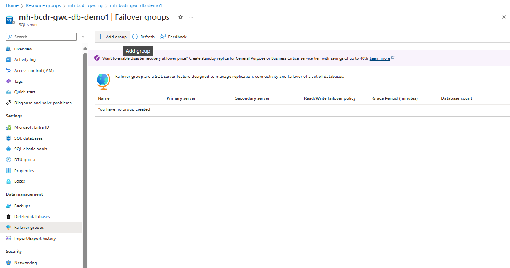
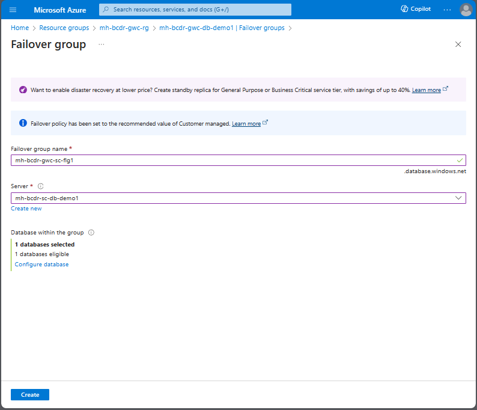
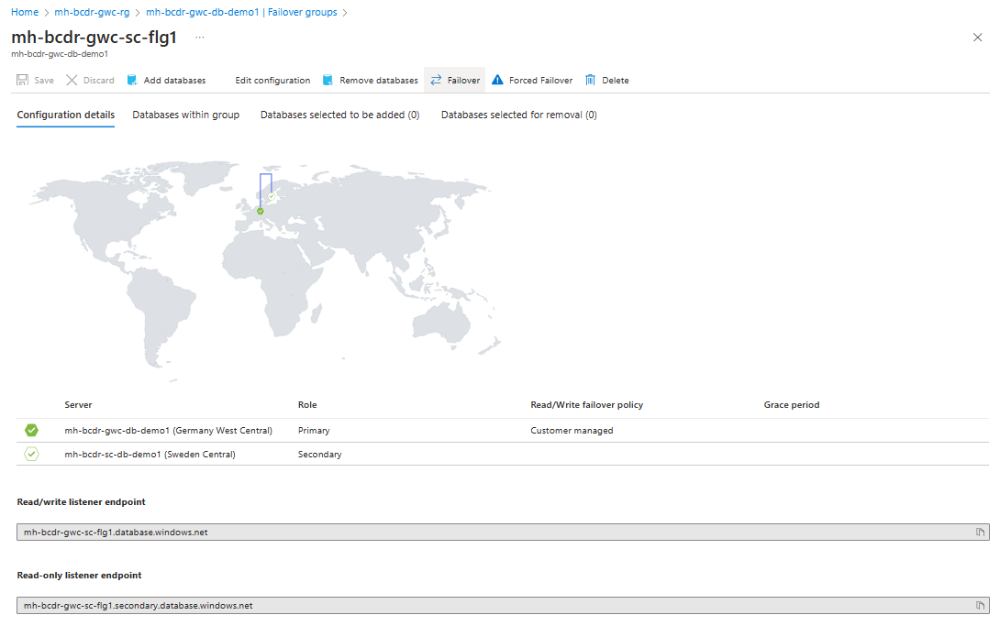
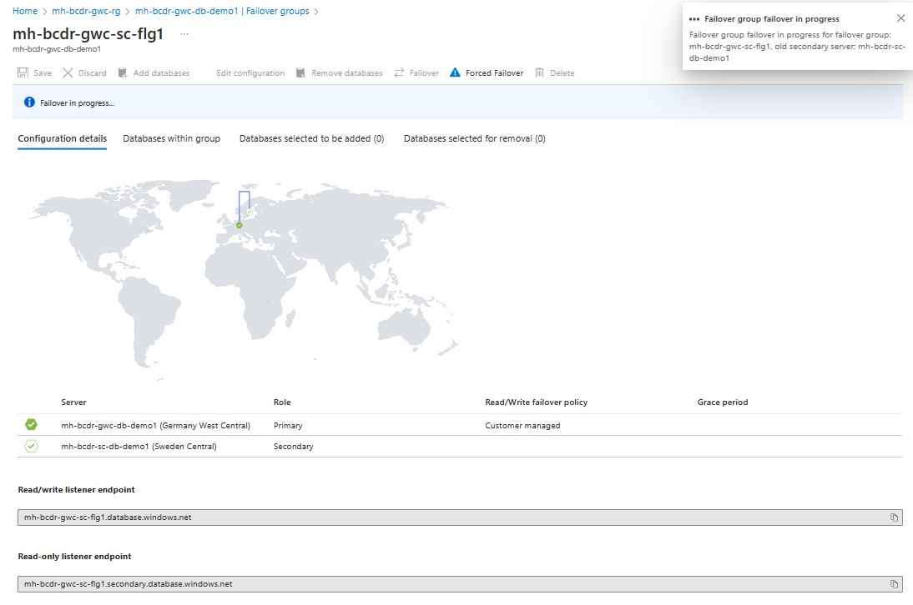
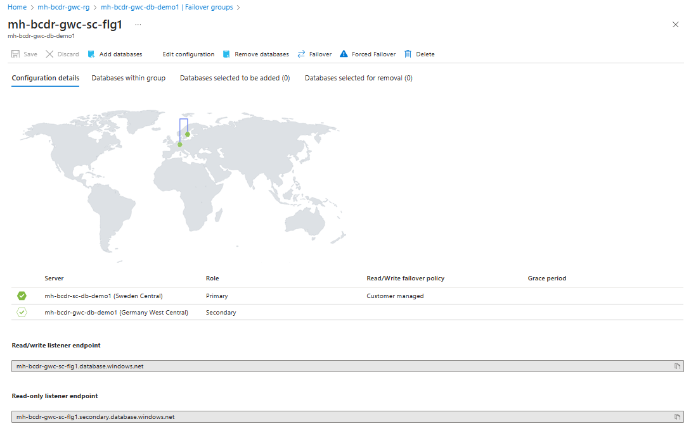
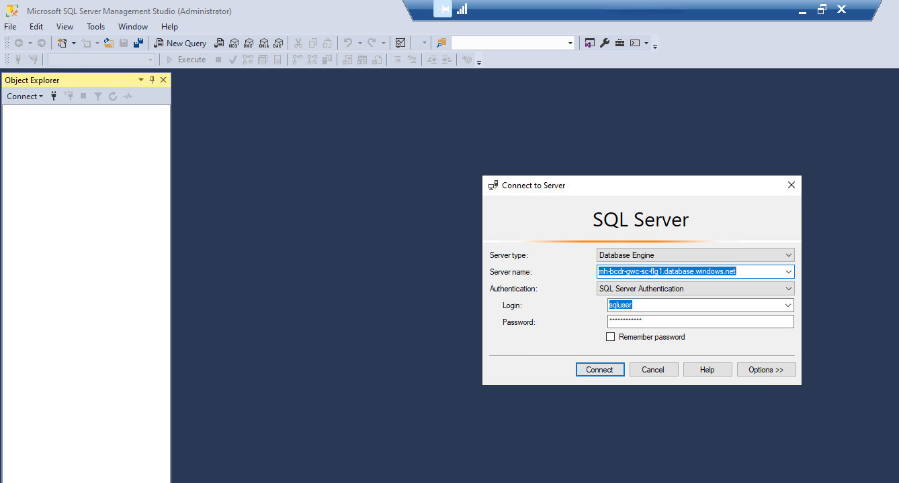
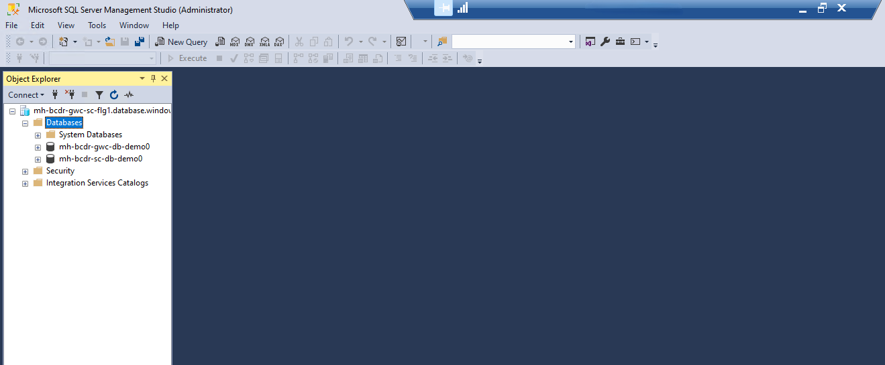

# Walkthrough Extra Challenge 6 - Protect to Azure with Azure Backup & Restore

## Implement Failover Groups for Azure SQL Database

## Task 1: Create a Failover Group between two Azure SQL databases located in different Azure regions (Germany West central and Sweden Central)

Navigate to the **SQL Server** in the Germany West Central Region. Open the tab **Failover groups**:

### Create a Failover Group and select your **SQL Server** in the Sweden Central Region

## Task 2: Configure automatic failover policies and test the failover mechanism to ensure seamless transition in case of a disaster.
Open the created **Failover group**

### Test failover

### When the failover is complete, you should see **SQL Server** in Sweden Central as the Primary server.

### Open the Data Science Virtual Machine, and test the connection to the Server using the new **fail over group listener endpoint**:

### Connection established! 
