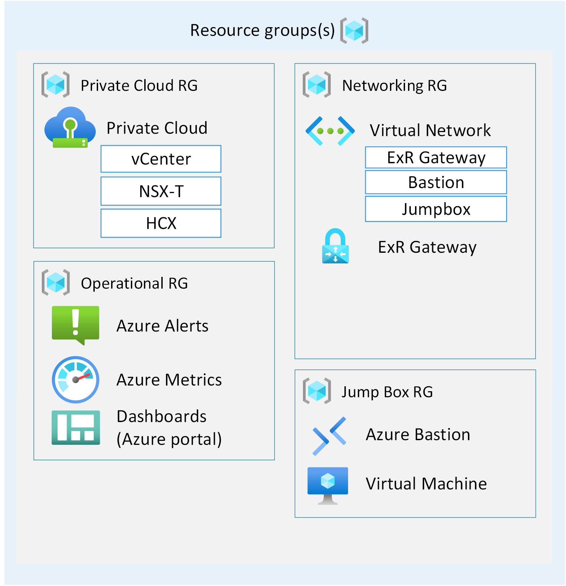

# AVS LAB Creation for the Microhack

## Introduction

This deployment scripts are based on the AVSLAB by @husamhilal and the can be found in its original form here: [AVS Lab](https://github.com/Azure/avslabs).

## Lab Architecture

The Microhack is geared towards 3 or 4 groups with around 4 people each working together in their environment. The lab is designed to be deployed in a single Azure region and each group will get a full AVS Landing Zone Accelator Greenfield like deployment. The architecture for each team looks the following:



Additional to the AVS Landing Zone each team will have a nested ESXi environment running inside their respective AVS SDDC.

During the deployment the Jumpbox will have a System Assigned Managed Identity enabled and given the Contributor Role on the AVS SDDC. This is needed for the deployment of the nested ESXi environment.

## Instructions

### Pre-Requisites

- Azure CLI (You can download it from [here](https://aka.ms/azurecli)
- Quota for AVS (3 Nodes per Group)

### Before you deploy

  1) Decide if you want to deploy a [single](./bicep/ESLZDeploy.Single.LAB.deploy.bicep) AVS Private Cloud (SDDC) , or [multiple](./bicep/ESLZDeploy.LAB.deploy.bicep) AVS Private Clouds.
  2) Review the parameters file, that corresponds to your deployment, to make sure you have the right parameters for the deployment. In other words, this depends if you are just deploying a single AVS Private Cloud (SDDC) or multiple ones.
  3) Based on your choice, you can use the instructions in the section below to kick-off the deployment.

### Deployment

Here are the steps you need to take to deploy AVS Lab with nested VMware lab environments.

1. [Clone](https://docs.github.com/en/repositories/creating-and-managing-repositories/cloning-a-repository) this repository.

   ```powershell
   git clone https://github.com/Azure/avslabs.git
   ```

2. Change directory to 'bicep' directory.

   ```powershell
   cd .\bicep\
   ```

3. Update Parameters File

   > Make sure to update the the parameter file with the right values, such as: **NumberOfAVSInstances**, **NumberOfNestedLabsInAVS**, **Prefix**, **Location**, **AlertEmails**, etc...

4. Execute the Deployment

   **From Azure CLI run the deployment command as in the following examples.**

   >Make sure to provide the a unique **name** for the deployment, the right **location**, your deployment choice **bicep file** and the corresponding **parameter file**.

   ```azurecli
   az deployment sub create -n "<deployment-unique-name" -l "<location>" -f "<bicep-template-file-name>" -p "<corresponding-parameter-file>" --no-wait
   ```

   As an example for **single lab** deployment:

   ```azurecli
   az deployment sub create -n "AVS-LAB-2023-02-15" -l "brazilsouth" -f "ESLZDeploy.Single.LAB.deploy.bicep" -p "ESLZDeploy.Single.LAB.deploy.bicep.parameters.json" --no-wait
   ```

   As an example for **multiple lab** deployment:

   ```azurecli
   az deployment sub create -n "AVS-LAB-2023-02-15" -l "brazilsouth" -f "ESLZDeploy.LAB.deploy.bicep" -p "ESLZDeploy.LAB.deploy.bicep.parameters.json" --no-wait
   ```

For a reference to az deployment command, see [this](https://learn.microsoft.com/en-us/cli/azure/deployment/sub?view=azure-cli-latest#az-deployment-sub-create)