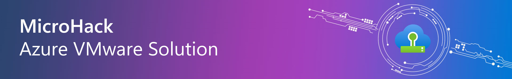

# **Azure VMware Solution - Micro Hack**

## MicroHack introduction and context

This hack is designed to get you hands-on experience with Azure VMWare Solution (AVS). This MicroHack is designed to be completed in a single day and is focused on the core concepts of AVS. 

AVS is a first-party Azure service that enables you to run your VMware workloads natively on Azure. AVS is a fully managed service from Microsoft that includes the VMware software-defined data center (SDDC) stack. This includes vSphere, vCenter, vSAN, NSX-T, and HCX. AVS is delivered on dedicated bare-metal Azure infrastructure that is not shared with other Azure services. AVS is a first-party Azure service that is owned, operated, and supported by Microsoft. 

This MicroHack scenario walks through the use of AVS with a focus on the best practices and the design principles. It covers the basic hybrid backup and enables you to migrate workloads from on-premises to Azure.

## Learning Objectives

After completing this MicroHack you will:

- Know how to build an AVS environment.
- Understand settings for NSX, HCX and the features AVS offers.
- Understand how to migrate workloads from on-premises to Azure.

## Content and Challenges

- Challenge 0: **[Pre-Requisites](Challenges/00-Pre-Reqs.md)**
- Challenge 1: **[NSX DHCP](Challenges/01-NSX-DHCP.md)**
- Challenge 2: **[NSX Add Segment](Challenges/02-NSX-Add-Segment.md)**
- Challenge 3: **[NSX Add DNS Forwarder](Challenges/03-NSX-Add-DNS-Forwarder.md)**
- Challenge 4: **[HCX Manager Appliance](Challenges/04-HCX-Manager-Appliance.md)**
- Challenge 5: **[HCX Site Pair](Challenges/05-HCX-Site-Pair.md)**
- Challenge 6: **[HCX Network Profile](Challenges/06-HCX-Network-Profiles.md)**
- Challenge 7: **[HCX Compute Profile](Challenges/07-HCX-Compute-Profile.md)**
- Challenge 8: **[HCX Service Mesh](Challenges/08-HCX-Service-Mesh.md)**
- Challenge 9: **[HCX Network Extension](Challenges/09-HCX-Network-Extension.md)**
- Challenge 10: **[AVS Migrate VM](Challenges/10-AVS-Migrate-VM.md)**
- Challenge 11: **[NSX Firewall](Challenges/11-NSX-Firewall.md)**

### Optional Challenges
- Challenge 12: **[AVS ANF Datastores](Challenges/12-AVS-ANF-Datastores.md)**
- Challenge 13: **[AVS Storage Policy](Challenges/13-AVS-Storage-Policy.md)**
- Challenge 14: **[AVS Placement Policy](Challenges/14-AVS-Placement-Policy.md)**
- Challenge 15: **[AVS Managed SNAT](Challenges/15-AVS-Managed-SNAT.md)**

## Prerequisites

In order to use the MicroHack time most effectively, the following tasks should be completed prior to starting the session.

With these pre-requisites in place, we can focus on building the differentiated knowledge in Azure VMware Solution that is required when working with the product, rather than spending hours repeating relatively simple tasks such as setting up the lab environment.

In summary:

To setup the lab needed for this Microhack you will need to have the following in place:

- Azure Subscription 

Permissions for the deployment: 
- Contributor on the subscription

The automated script to setup the lab environment can be found under the following link: [AVS Lab Setup](./Lab/Readme.md).

**Note: To best benefit from this Microhack, prior VMware knowledge and basic AVS knowledge are preferred.**

## Solution Guide

- General Overview: **[Overview](Solutionguide/00-Overview.md)**
- Challenge 1: **[NSX DHCP](Solutionguide/01-NSX-DHCP.md)**
- Challenge 2: **[NSX Add Segment](Solutionguide/02-NSX-Add-Segment.md)**
- Challenge 3: **[NSX Add DNS Forwarder](Solutionguide/03-NSX-Add-DNS-Forwarder.md)**
- Challenge 4: **[HCX Manager Appliance](Solutionguide/04-HCX-Manager-Appliance.md)**
- Challenge 5: **[HCX Site Pair](Solutionguide/05-HCX-Site-Pair.md)**
- Challenge 6: **[HCX Network Profile](Solutionguide/06-HCX-Network-Profiles.md)**
- Challenge 7: **[HCX Compute Profile](Solutionguide/07-HCX-Compute-Profiles.md)**
- Challenge 8: **[HCX Service Mesh](Solutionguide/08-HCX-Service-Mesh.md)**
- Challenge 9: **[HCX Network Extension](Solutionguide/09-HCX-Network-Extension.md)**
- Challenge 10: **[AVS Migrate VM](Solutionguide/10-AVS-Migrate-VM.md)**
- Challenge 11: **[NSX Firewall](Solutionguide/11-NSX-Firewall.md)**

### Optional Challenges
- Challenge 12: **[AVS ANF Datastores](Solutionguide/12-AVS-ANF-Datastores.md)**
- Challenge 13: **[AVS Storage Policy](Solutionguide/13-AVS-Storage-Policy.md)**
- Challenge 14: **[AVS Placement Policy](Solutionguide/14-AVS-Placement-Policy.md)**
- Challenge 15: **[AVS Managed SNAT](Solutionguide/15-AVS-Managed-SNAT.md)**

## Contributors
- [Frank Oltmanns-Mack]()
- [Bernd Loehlein]()
- [Andreas Schwarz]()
- [Sven Forstreuter]()
- [Sarah Tabet]()

Thank you for participating in this MicroHack!
