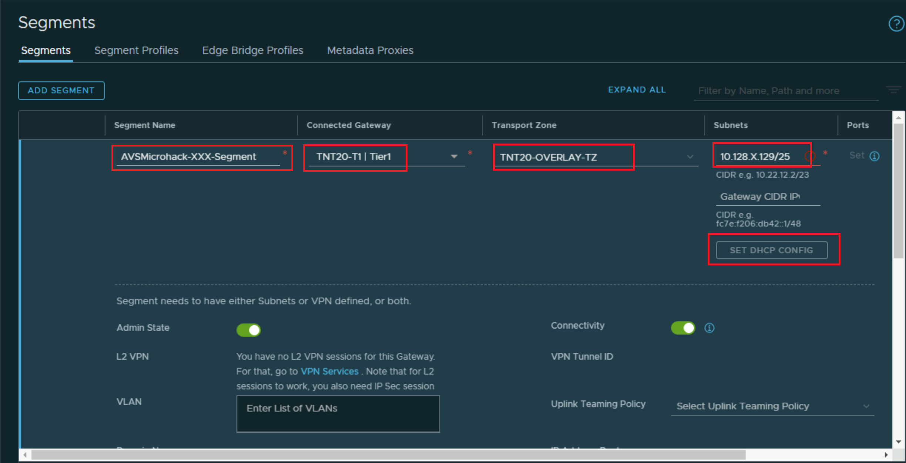
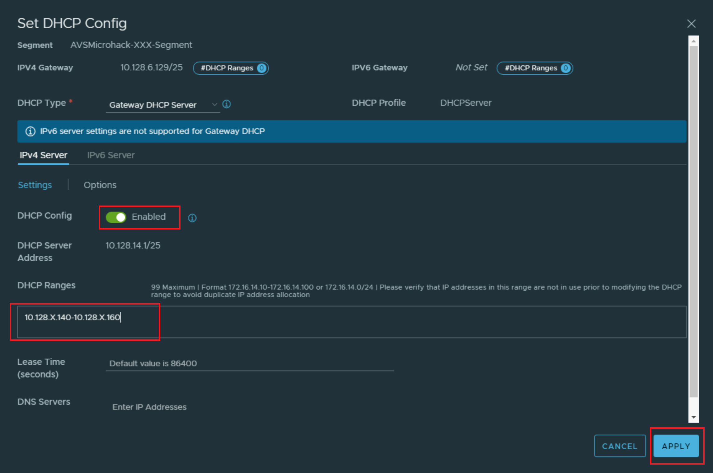

# Exercise 2: Add a NSX-T Segment

[Previous Challenge Solution](./01-NSX-DHCP.md) - **[Home](../Readme.md)** - [Next Challenge Solution](./03-NSX-Add-DNS-Forwarder.md)

### Note

 All the data needed is in the excel file: [AVSMicroHackData](../Lab/info/datos_Microhack_300925.xlsx). Prefixes, credentials .. 

## Add a Network Segment
1.	In NSX-T Manager, select Networking > Segments, and then select Add Segment.

 
2.	Enter a name for the segment.

3.	Select the Tier-1 Gateway (TNTxx-T1) as the Connected Gateway 

4.	Select the pre-configured overlay Transport Zone (TNTxx-OVERLAY-TZ) and then select Set Subnets in gateway/prefix length format.

5. Add DHCP range to your segment such that the VM's attached to this segment can receive IP address dynamically

6.	Select Apply and then Save.

### Note
The IP address needs to be on a non-overlapping RFC1918 address block, which ensures connection to the VMs on the new segment.

7. Test the DHCP Server
   Enter into the nested vCenter, change the network settings of the virtual machine named server01 to the network adapter belonging to the segment. Check that the virtual machine gets the IP of the created segment.

### Hint

The segment needs to attach to the virtual machine by right clicking the VM > Edit Settings > Network Adaptor 1 
