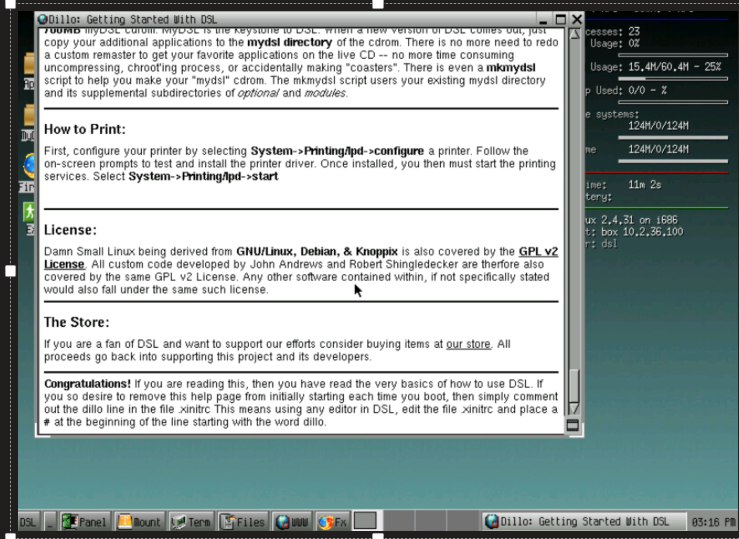

# Exercise 2: Add a NSX-T Segment

[Previous Challenge Solution](./01-NSX-DHCP.md) - **[Home](../Readme.md)** - [Next Challenge Solution](./03-NSX-Add-DNS-Forwarder.md)

### Note

 All the data needed is the excel file: [AVSMicroHackData](../Lab/info/datos_Microhack_300925.xlsx)

## Add a Network Segment
1.	In NSX-T Manager, select Networking > Segments, and then select Add Segment.

 
2.	Enter a name for the segment.

3.	Select the Tier-1 Gateway (TNTxx-T1) as the Connected Gateway 

4.	Select the pre-configured overlay Transport Zone (TNTxx-OVERLAY-TZ) and then select Set Subnets in gateway/prefix length format.

5. Add DHCP range to your segment such that the VM's attached to this segment can recieve IP address dynamically

6.	Select Apply and then Save.

### Note
The IP address needs to be on a non-overlapping RFC1918 address block, which ensures connection to the VMs on the new segment.

7. Create a VM from the ISO file (you need to rename it to .ova first) located at: [Buid a small Vmware VM for testing purposes](https://virtuallymikebrown.com/wp-content/uploads/2012/02/dsl-4-4-10.doc) and attach it to the segment you just created.
   
8. Power on the VM. See credentials at: [AVSMicroHackData](../Lab/info/datos_Microhack_300925.xlsx). Verify that it has received an IP address from the DHCP server.

    

### Hint

The segment needs to attach to the virtual machine by right clicking the VM > Edit Settings > Network Adaptor 1 
