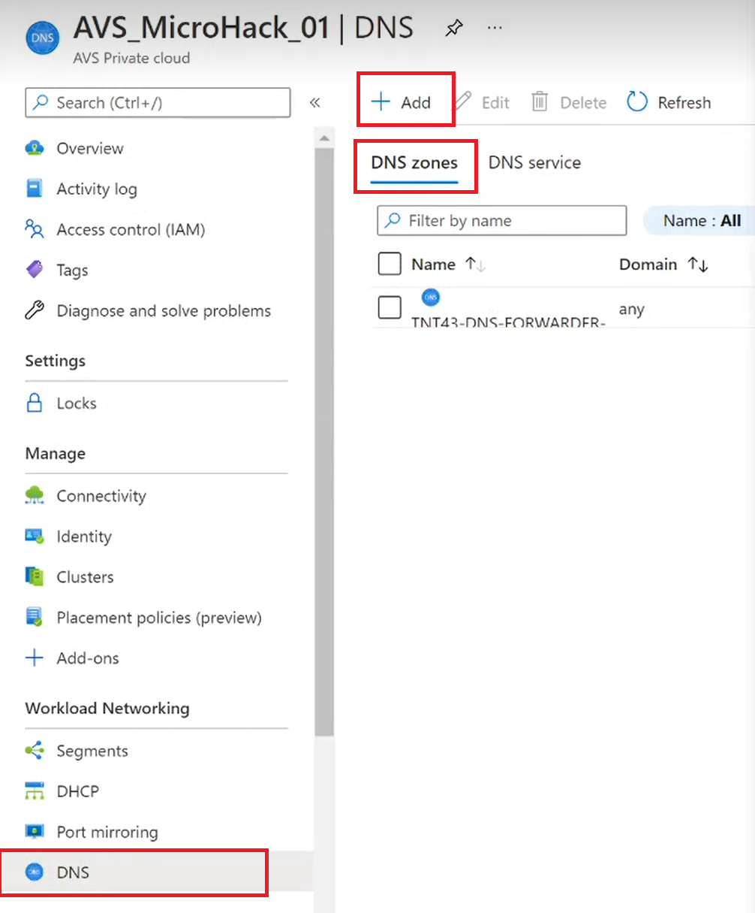
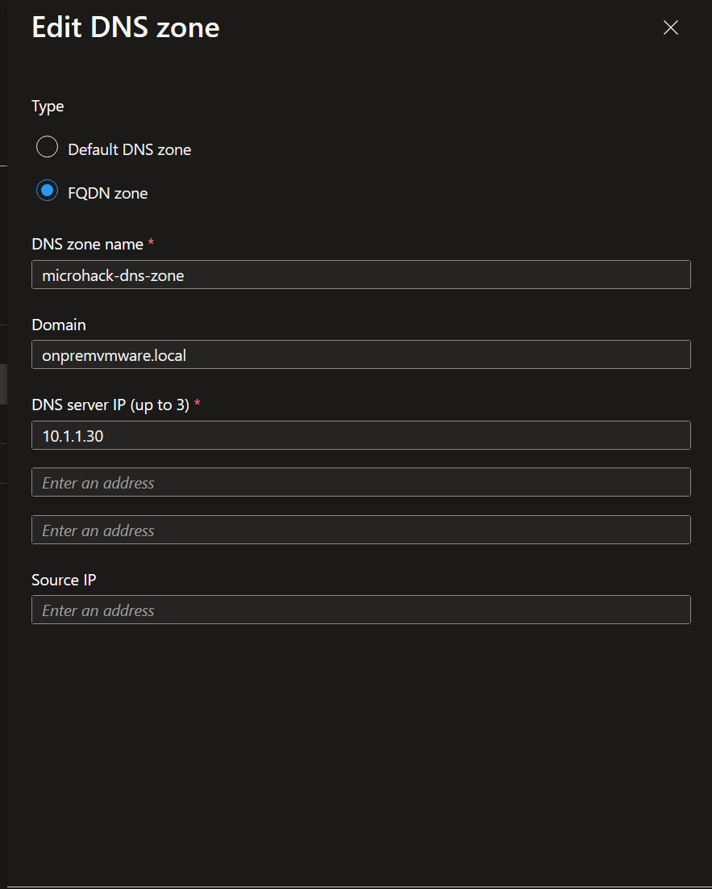
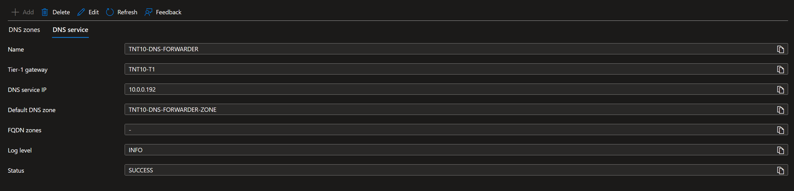
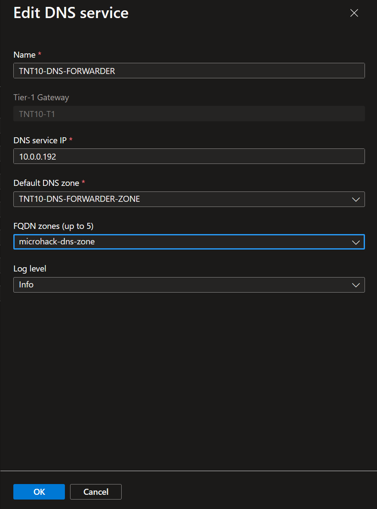
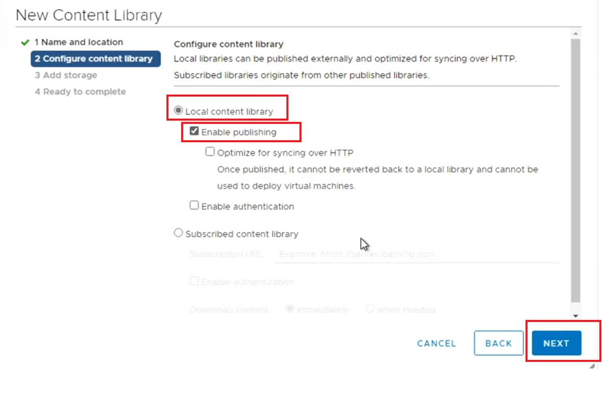
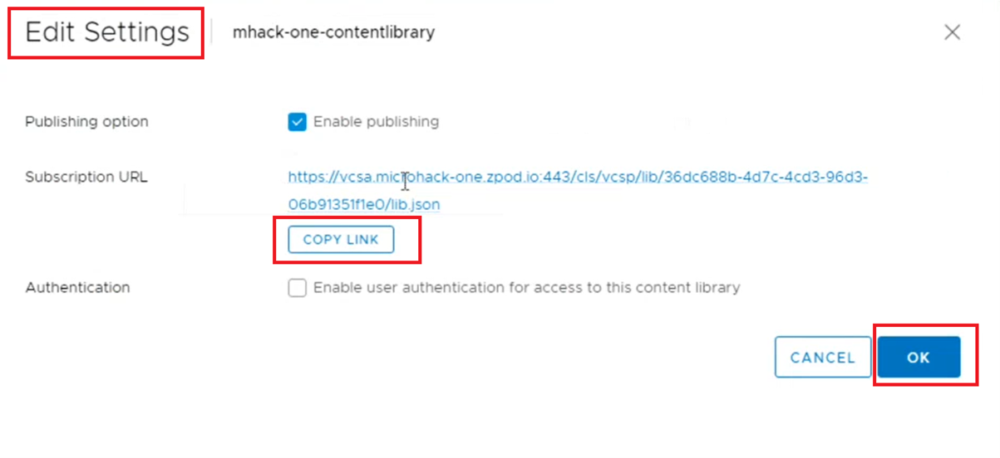
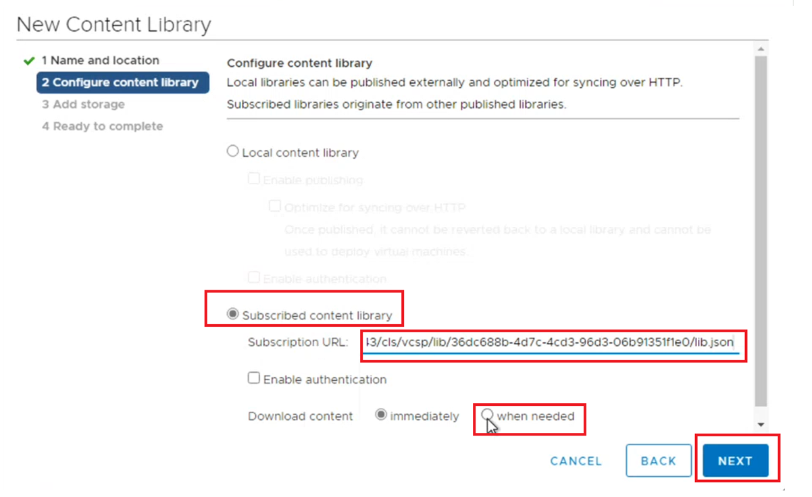

# Exercise 3: Lets explore NSX - So we need to add a DNS Forwarder

[Previous Challenge Solution](./02-NSX-Add-Segment.md) - **[Home](../Readme.md)** - [Next Challenge Solution](./04-NSX-Firewall.md)

## Configure a DNS forwarder

1.  In your Azure VMware Solution private cloud, under Workload Networking, select DNS > DNS zones. Then select Add.

2.  Add the On-Prem FQDN zone by inputting details regarding the DNS Zone Name, Domain Name and DNS Seever IP from the Credentials&IP document and press save 

3.  Attach the configured DNS Zone name to Default DNS Zone and press save

4.  Now create a content library within the On Prem vCenter Server by providing the relavant details on the content library

5.  For the new content library, select local content library and enable publishing

6.  In order to obtain the link of the content library, right click the newly created content library and copy link

5.  Now proceed to the AVS side and create a new content library and select subscribed content library and paste the content library link from On-Prem side.  

It important to note if AVS didnt have the ON-Prem FQDN configured within the DNS zones of AVS, you wouldnt add the content library from On-Prem to AVS.

### Note : 

These DNS zones are a prerequisite for LDAP configuration for NSX. 