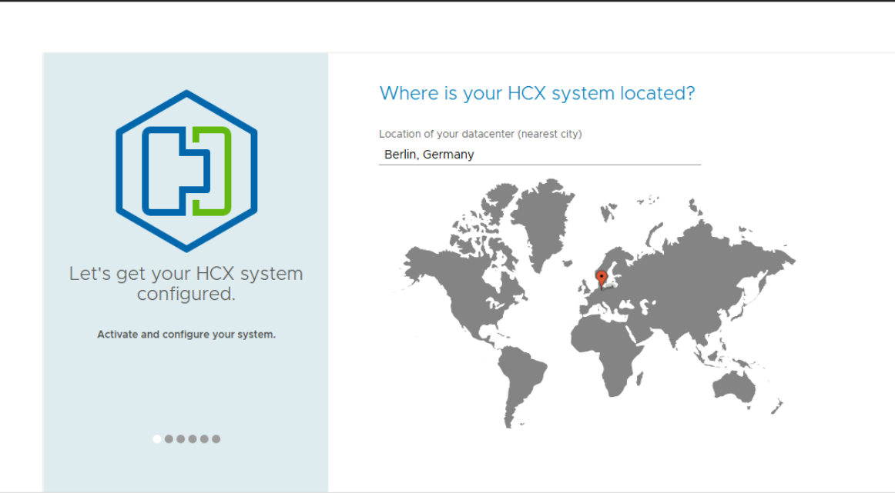

# Exercise 4: Prepare the On Prem environment - Configure HCX Appliance

[Previous Challenge Solution](./03-NSX-Add-DNS-Forwarder.md) - **[Home](../Readme.md)** - [Next Challenge Solution](./05-HCX-Site-Pair.md)

## Deploy  HCX Manager Appliance On-Prem

1.	Log in to the On Prem SDDC by login to your Azure jumpbox and by navigating to portal.azure.com. Log on to the jumpbox using the Bastion host and key in the username and password provided  in the excel file: [AVSMicroHackData](../Lab/info/datos_Microhack_300925.xlsx)

2. Log into the portal and create a License Key for HCX Manager.

    

    

    

3. Log into the vcenter and download the ova for the HCX Manager Appliance from the DataStore as shown in the image

    

4. Deploy the HCX Manager OVA into the On-Prem vCenter

    

    

    

    

    

    Make sure to select the correct network for the HCX Manager Appliance:

    OnPrem-management-1-1
 
    

    Set the password for the HCX Manager Appliance

    

    Make sure to set the correct IP for the HCX Manager Appliance: 10.1.1.9

    Prefix Length: 27

    Set the correct DNS and Gateway for the HCX Manager Appliance: 

    Gateway: 10.1.1.1

    

    DNS: 1.1.1.1

    

    Finish the wizard

    

5. Power on the HCX Manager Appliance
 
    

## Configure HCX Manager Appliance On-Prem

6.	Log on to the AVS private Cloud for your team in Azure Portal from where you will need to get a activation key for the HCX manager On-Prem

    

7.	In the Azure VMware Solution portal, go to Manage > Add-ons > Migration using HCX > Connect with on-premise using HCX keys > Add > , specify the HCX Key Name (example as shown in the screenshot), and then select Add.

    

7.	Use the admin credentials to sign in to the on-premises VMware HCX Manager at https://10.1.1.9:9443. 

    

    ### TIP
The admin user password is set during the VMware HCX Manager OVA file deployment.

8.	A wizard will be run for configuring:

    Region

    

    ### TIP
    Use the same region where AVS was deployed for this MicroHack

    System Name

    

    Vcenter Link
    

    ### TIP
    Configure the URL for the On-Prem Vcenter

    It will ask you to Install the Root Certificate from On-Prem vCenter
    

    Configure SSO/PSC

    

    ### TIP
    It´s the same URL than the On-Prem vCenter

    Activate HCX

    
    
    ## TIP
    For that, copy and paste the key from:

    

    Restart the Appliance
    

### Note
You'll experience a delay after restarting before being prompted for the next step.

After the services restart, you'll see vCenter showing as green on the screen that appears. Both vCenter and SSO must have the appropriate configuration parameters, which should be the same as the previous screen.

10.	Once HCX Appliance is restarted, log on to the HCX Manager UI – https://10.1.1.9:9443

11.	Go to Configuration -> HCX Role Mapping -> replace System Administrator and Enterprise Administrator user groups with the following custom domain (instead of vsphere.local). 

Replace the domain name with **avs.lab\administrators**

