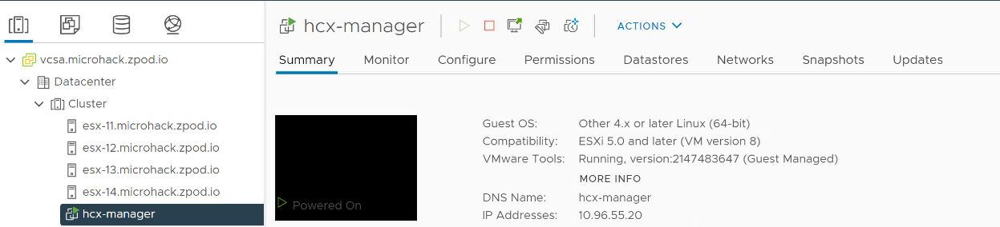
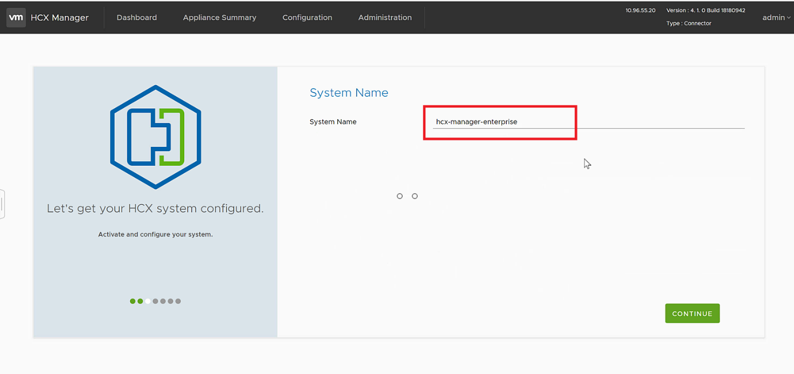
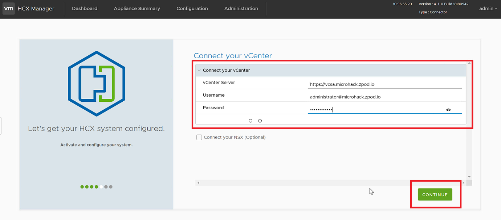
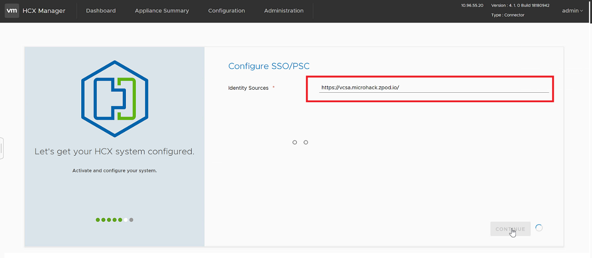
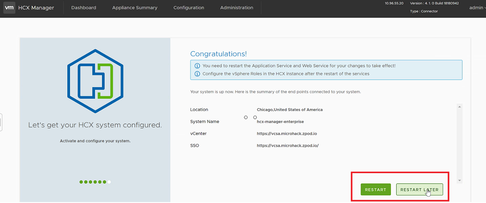
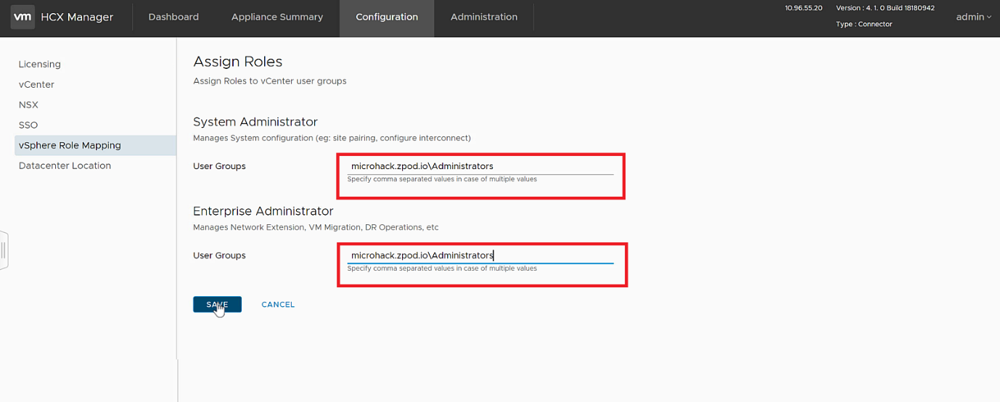

# Exercise 5: Prepare the On Prem environment - Configure HCX Appliance

[Previous Challenge Solution](./04-NSX-Firewall.md) - **[Home](../Readme.md)** - [Next Challenge Solution](./06-HCX-Site-Pair.md)

## Configure HCX Manager Appliance On-Prem

1.	Log in to the On Prem SDDC by login to your Azure jumpbox and by navigating to portal.azure.com. Log on to the jumpbox using the Bastian host and key in the username and password provided  within the AVS "Credentials&IP" document identified for your team

2.	Log on to your On-Prem vCenter using the "Credentials&IP" document

 

3.	Confirm that the vCenter server has hcx-manager deployed and powered on.

  

4.	Log on to the AVS private Cloud for your team in Azure Portal from where you will need to get a activation key for the HCX manager On-Prem

5.	In the Azure VMware Solution portal, go to Manage > Add-ons > Migration using HCX > Connect with on-premise using HCX keys > Add > , specify the HCX Key Name (example as shown in the screenshot), and then select Add.

 

6.	Use the admin credentials to sign in to the on-premises VMware HCX Manager at https://HCXManagerIP:9443. Use the "Credentials&IP" doc for this

### TIP
The admin user password is set during the VMware HCX Manager OVA file deployment.

7.	In Licensing, enter your key for HCX Advanced Key and select Activate.

### Important TIP
VMware HCX Manager must have open internet access or a proxy configured.

8.	In Datacentre Location, specify Chicago, Unted States of America and press continue

9.	In System Name, modify the name or accept the default and select Continue.

 

10.	Select Yes, Continue.

 

11.	In Connect your vCenter, provide the FQDN or IP address of your vCenter server and the appropriate credentials, and then select Continue. Use the "Credentials&IP" document for this

12. In Configure SSO/PSC, provide the FQDN or IP address of your Platform Services Controller (PSC), and then select Continue. In this case the the PSC is the same as the On-Prem vCenter server. Use the "Credentials&IP" document for the same

 

13. Verify that the information entered is correct and select Restart.

### Note
You'll experience a delay after restarting before being prompted for the next step.

After the services restart, you'll see vCenter showing as green on the screen that appears. Both vCenter and SSO must have the appropriate configuration parameters, which should be the same as the previous screen.

14.	Once HCX Appliance is restarted, log on to the HCX Manager UI – https://hcxmanagerIP:9443

15.	Go to Configuration -> vSphere Role Mapping -> replace System Administrator and Enterprise Administrator user groups with the following custom domain (instead of vsphere.local). 

Replace the domain name according to the group you have been assigned- microhack-one.zpod.io, Microhack-two.zpod.io or Microhack-three.zpod.io

 