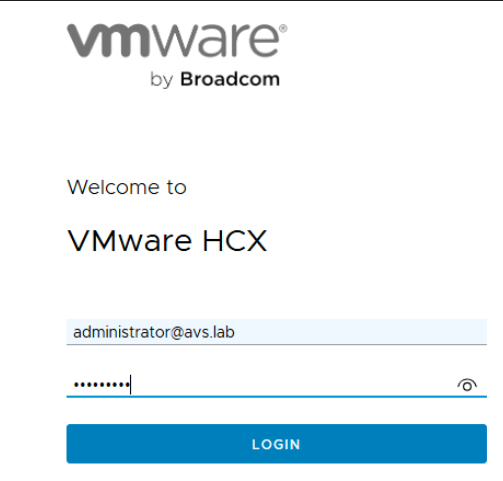
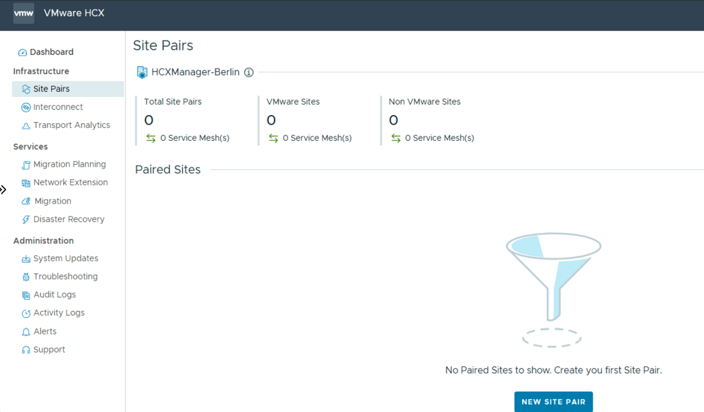
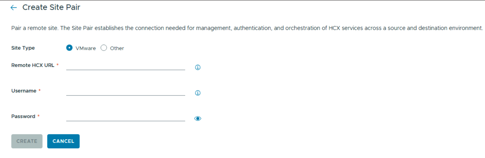
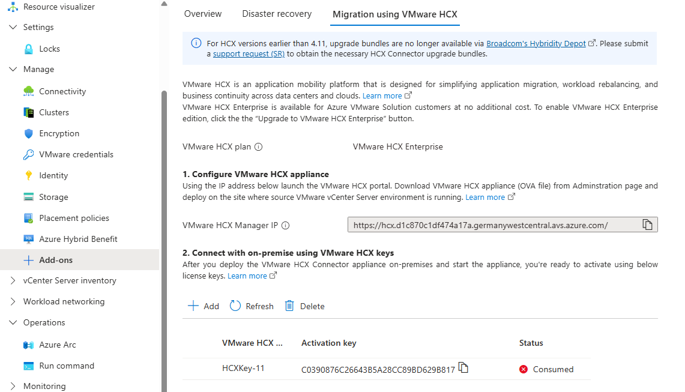
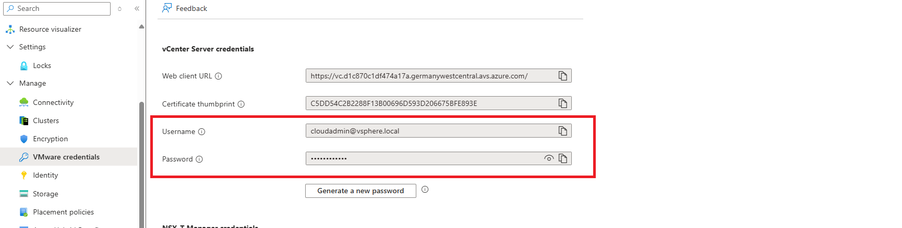
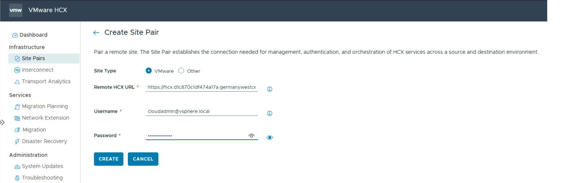
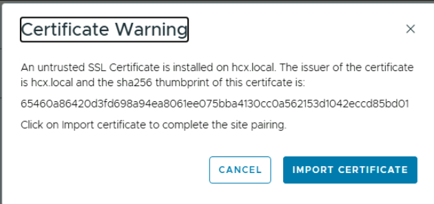
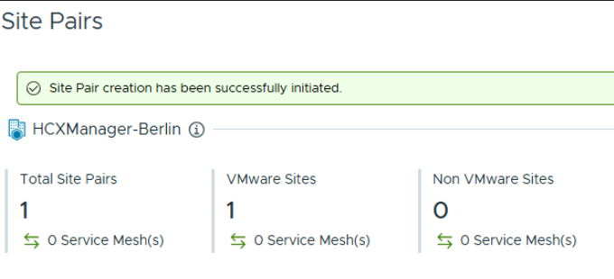
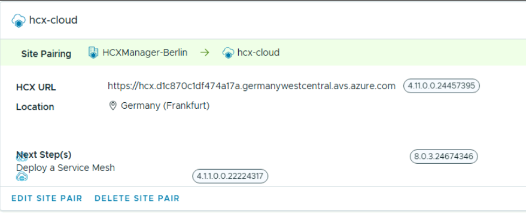

# Exercise 5: So how do we connect On Prem to AVS? - Configure Site Pairing

[Previous Challenge Solution](./04-HCX-Manager-Appliance.md) - **[Home](../Readme.md)** - [Next Challenge Solution](./06-HCX-Network-Profiles.md)

## Add a site pairing
You can connect or pair the VMware HCX Cloud Manager in AVS with the VMware HCX Connector in your On-Prem datacenter.

1.	Go to you onprem SDDC and login to your HCX Connector under https://10.1.1.9 

    

2.	Under Infrastructure, select Site Pairing, and then select the New Site Pair option

    

    

3.	Enter the Azure VMware Solution HCX Cloud Manager URL or IP address, username and password to initiate the site pairing. 

    The URL will be the one of the current HHX of the Azure VMware Solution:

    

    and the username and password can be found in the Azure Portal.

    

    Once you have fill out the data create the site pair

    

    Accept the Certificate Warning
    
    

     ### Note

    To successfully establish a site pair:
    Your VMware HCX Connector must be able to route to your HCX Cloud Manager IP over port 443.

    You'll see a screen showing that your VMware HCX Cloud Manager in Azure VMware Solution and your on-premises VMware HCX Connector are connected (paired).

    

    