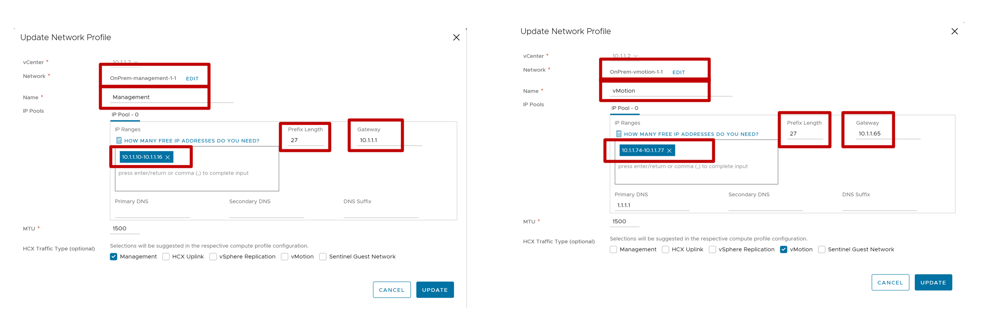

# Exercise 7: What Network will be used by Interconnect Appliances? - Configure Network Profile

[Previous Challenge Solution](./05-HCX-Site-Pair.md) - **[Home](../Readme.md)** - [Next Challenge Solution](./07-HCX-Compute-Profiles.md)

## Create Network Profile

VMware HCX Connector deploys a subset of virtual appliances (automated) that require multiple IP segments. When you create your network profiles, you use the IP segments that have been identified during the VMware HCX Network Segments pre-deployment preparation and planning stage.

### Note

Generally in a customer scenario we create multiple network profiles for the networks below

- Management	
- vMotion
- Replication
- Uplink

1.	Under Infrastructure, select Interconnect > Multi-Site Service Mesh > Network Profiles > Create Network Profile.

2.	For each network profile, select the network and port group, provide a name, and create the segment's IP pool. Then select Create.
 

### Management Network Profile

Management Profile IP: 10.1.1.10-10.1.1.16

Prefix Length: 27

Management Network Gateway: 10.1.1.1

### Uplink Network Profile

Uplink Profile IP: 10.1.1.34-10.1.1.40

Prefix Length: 28

Uplink Network Gateway: 10.1.1.33

DNS: 1.1.1.1

### vMotion Network Profile

vMotion Profile IP: 10.1.1.74-10.1.1.77

Prefix Length: 27

vMotion Network Gateway: 10.1.1.65

DNS: 1.1.1.1

### Replication Network Profile

Replication Profile IP: 10.1.1.106-10.1.1.109

Prefix Length: 27

Replication Network Gateway: 10.1.1.97

DNS: 1.1.1.1

3.	Once done, the network profile created by you will be available to be used by the Interconnect and Network Extension appliances within the Service Mesh