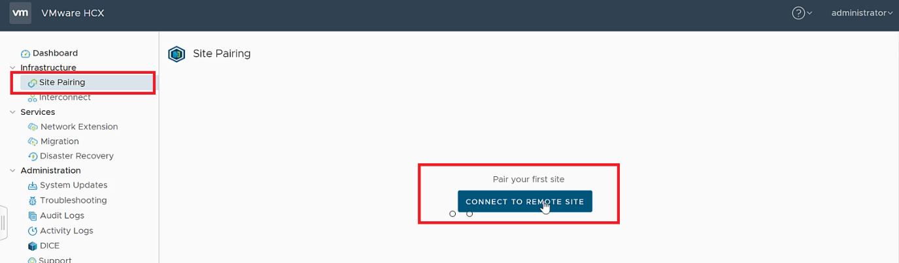

# Exercise 6: So how do we connect On Prem to AVS? - Configure Site Pairing

[Previous Challenge Solution](./05-HCX-Manager-Appliance.md) - **[Home](../Readme.md)** - [Next Challenge Solution](./07-HCX-Network-Profiles.md)

## Add a site pairing
You can connect or pair the VMware HCX Cloud Manager in AVS with the VMware HCX Connector in your On-Prem datacenter.

1.	Sign in to your on-premises vCenter, and under Home, select HCX.

2.	Under Infrastructure, select Site Pairing, and then select the Connect To Remote Site option (in the middle of the screen).

 

3.	Enter the Azure VMware Solution HCX Cloud Manager URL or IP address, username and password to intiate the site pairing. Use the "Credentials&IP" doc for the same

 

 ### Note

To successfully establish a site pair:
Your VMware HCX Connector must be able to route to your HCX Cloud Manager IP over port 443.

You'll see a screen showing that your VMware HCX Cloud Manager in Azure VMware Solution and your on-premises VMware HCX Connector are connected (paired).

