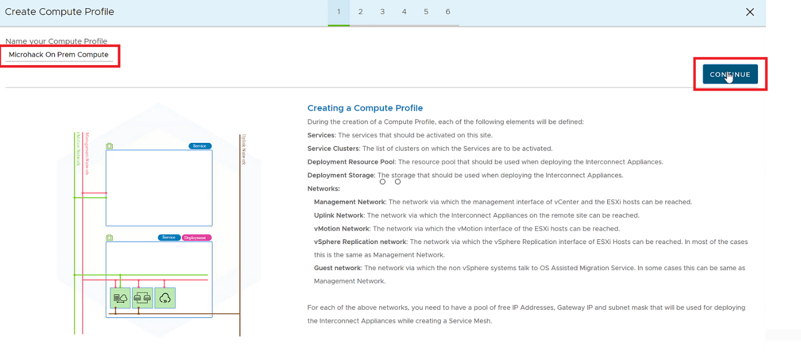
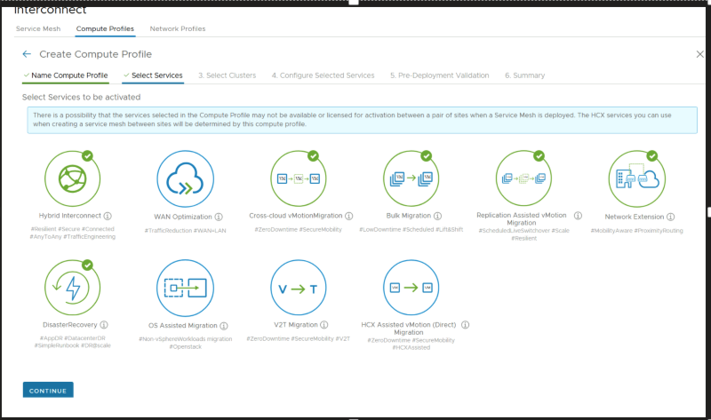
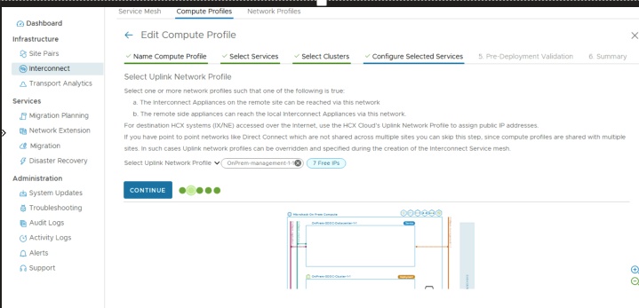
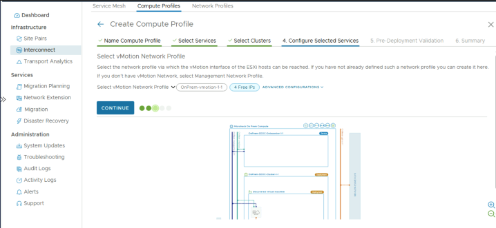
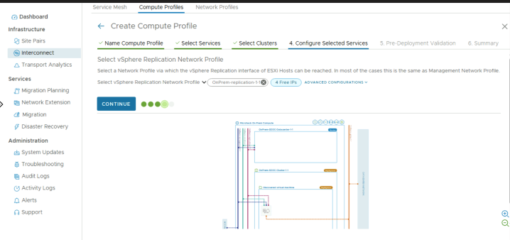
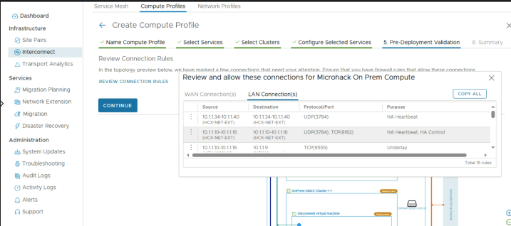
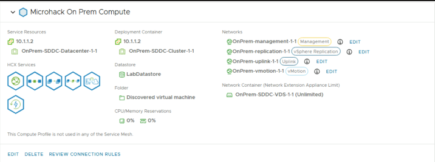

# Exercise 7: What Network will be used by Interconnect Appliances? - Configure Compute Profile

[Previous Challenge Solution](./06-HCX-Network-Profiles.md) - **[Home](../Readme.md)** - [Next Challenge Solution](./08-HCX-Service-Mesh.md)

## Create a Compute Profile

1.	Under Infrastructure, select Interconnect > Compute Profiles > Create Compute Profile.

    

2.	Enter a name for the profile and select Continue.

    

3.	Select the services to enable, such as migration, network extension, or disaster recovery, and uncheck the WAN Optimization, SRM and OS Assisted Migration and then select Continue.

    

### Note 
Generally the type of services greyed out will depend on the type of HCX licensing type used.

4.	When you see the clusters in your on-premises datacenter, select Continue.

    

5.	From Select Datastore and the VM Folder, select the datastore storage resource and VM Folder for deploying the VMware HCX Interconnect appliances. Then select Continue.

    

6.	From Select Management Network Profile, select the management network profile that you created in previous steps. Then select Continue.

    

7.	From Select Uplink Network Profile, use the Management Network Profile as well due to the On-Prem SDCC configuration. Then select Continue.
    > [!NOTE]
    > Selecting the wrong Uplink Network Profile will prevent the lab from proceeding correctly.

    

8.	From Select vMotion Network Profile, select the vMotion network profile that you created in prior steps. Then select Continue.

    

9.	From Select vSphere Replication Network Profile, select the replication network profile that you created in prior steps. Then select Continue.

    

13.	From Select Distributed Switches for Network Extensions, select the switches that contain the virtual machines to be migrated to Azure VMware Solution on a layer-2 extended network. Then select Continue.

    

14.	Review the connection rules and select Continue.

    

15.	Select Finish to create the compute profile.
 
16.	One the On Prem Compute profile has been created the Compute profile will be listed as below

    
