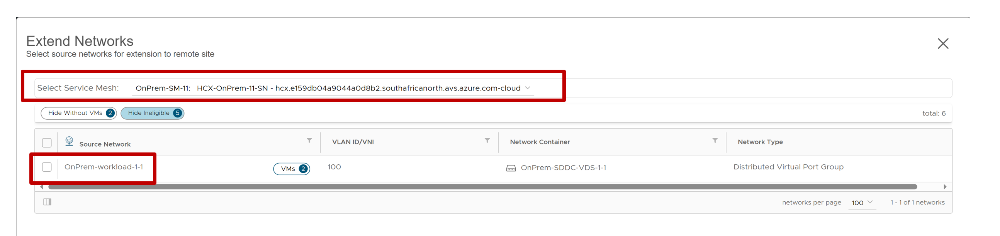
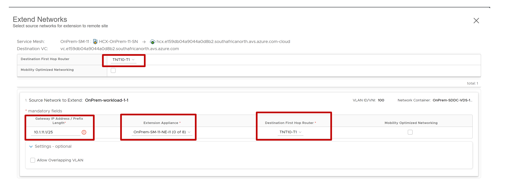

# Exercise 10: Want to retain your VM's IP address? - Lets Extend the On-Prem Network

[Previous Challenge Solution](./08-HCX-Service-Mesh.md) - **[Home](../Readme.md)** - [Next Challenge Solution](./10-AVS-Migrate-VM.md)

## Extend Network
In this step you will extend any the on-premises environment to Azure VMware Solution.

1.	Under Services, select Network Extension > Create a Network Extension.

2.	Select each of the networks you want to extend to Azure VMware Solution, and then select Next

3.	Enter the on-premises gateway IP for each of the networks you're extending, and then select Submit.

The information for this Microhack will be as follows:

Gateway IP: 10.1.11.1/25

It takes a few minutes for the network extension to finish. When it does, you see the status change to Extension complete.

## Next steps
If the HCX interconnect tunnel status is UP and green, you can migrate and protect Azure VMware Solution VMs by using VMware HCX. Azure VMware Solution supports workload migrations (with or without a network extension). You can still migrate workloads in your vSphere environment, along with on-premises creation of networks and deployment of VMs onto those networks.