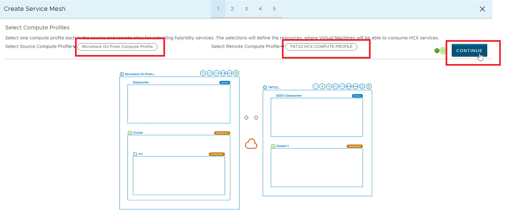
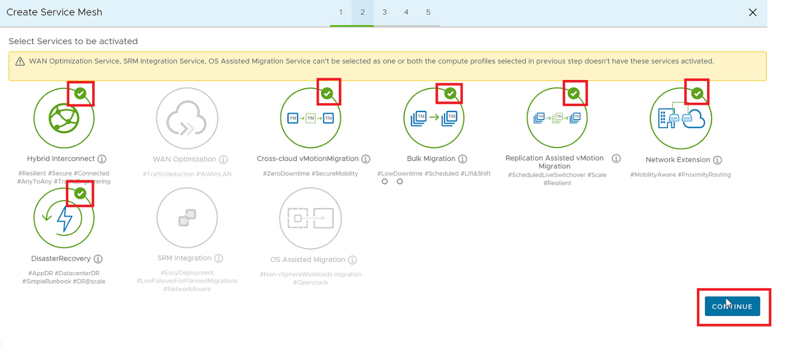
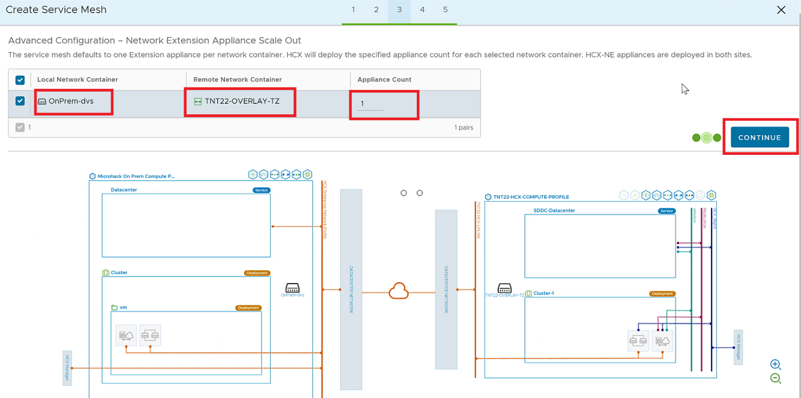

# Exercise 9: Deployment of Interconnect Appliances? Create a Service Mesh

[Previous Challenge Solution](./08-HCX-Compute-Profiles.md) - **[Home](../Readme.md)** - [Next Challenge Solution](./10-HCX-Network-Extension.md)

## Create a Service Mesh

Now it's time to configure a service mesh between on-premises and Azure VMware Solution private cloud.

### Note
To successfully establish a service mesh with Azure VMware Solution:
Ports UDP 500/4500 are open between your on-premises VMware HCX Connector 'uplink' network profile addresses and the Azure VMware Solution HCX Cloud 'uplink' network profile addresses.
Be sure to review the VMware HCX required ports.

1.	Under Infrastructure, select Interconnect > Service Mesh > Create Service Mesh.

2.	Review the sites that are pre-populated, and then select Continue.

### Note
If this is your first service mesh configuration, you won't need to modify this screen

3.	Select the source and remote compute profiles from the drop-down lists, and then select Continue.

The selections define the resources where VMs can consume VMware HCX services.

4.	Review services that will be enabled, and then select Continue.

5.	In Advanced Configuration - Override Uplink Network profiles, select Continue.

### Note
Uplink network profiles connect to the network through which the remote site's interconnect appliances can be reached

6.	In Advanced Configuration - Network Extension Appliance Scale Out, review and select Continue.

### Note 
You can have up to eight VLANs per appliance, but you can deploy another appliance to add another eight VLANs. You must also have IP space to account for the more appliances, and it's one IP per appliance. For more information, see VMware HCX Configuration Limits.

7. In Advanced Configuration - Traffic Engineering, do not select the Application Path Resiliency and Traffic Flow Conditioning, and then select Continue.

8.	Review the topology preview and select Continue.

9.	Enter the name for this HCX-Microhack-ServiceMesh and select Finish to complete.

10.	Select View Tasks to monitor the deployment.
 
When the service mesh deployment finishes successfully, you'll see the services as green.

11.	Verify the service mesh's health by checking the appliance status.

12.	Select Interconnect > Appliances.

