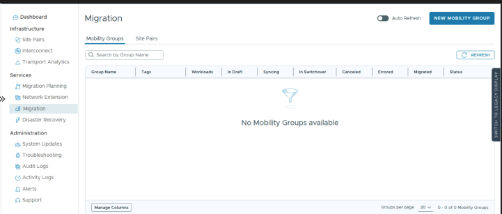
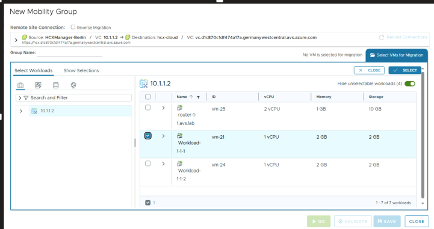
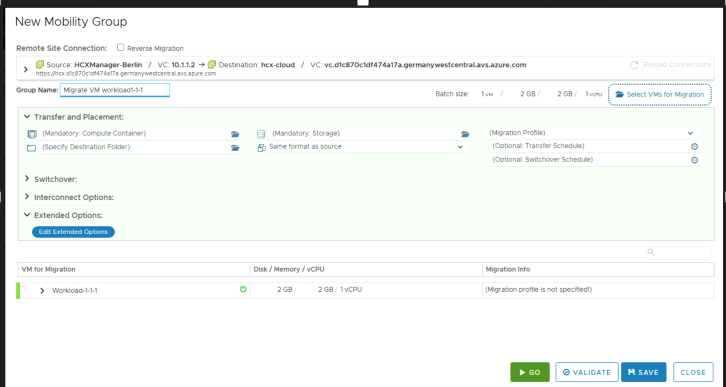
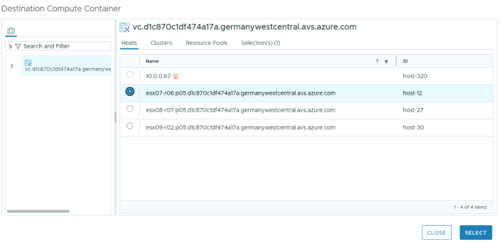
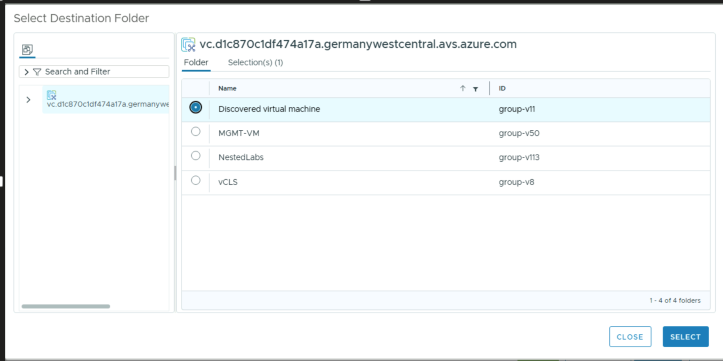
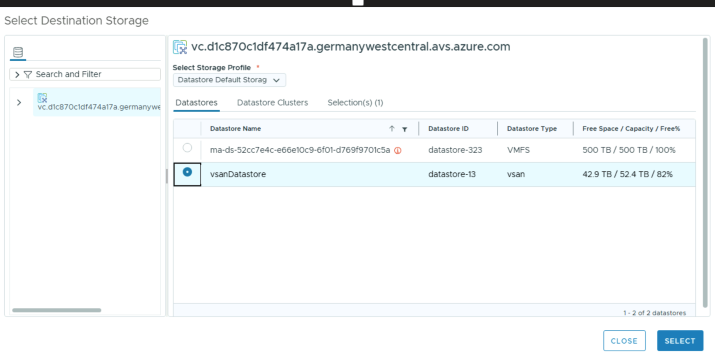
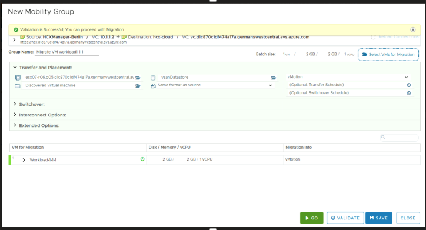
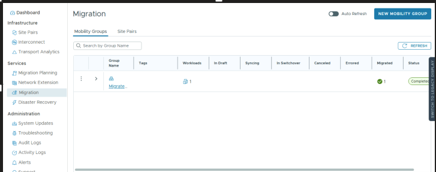
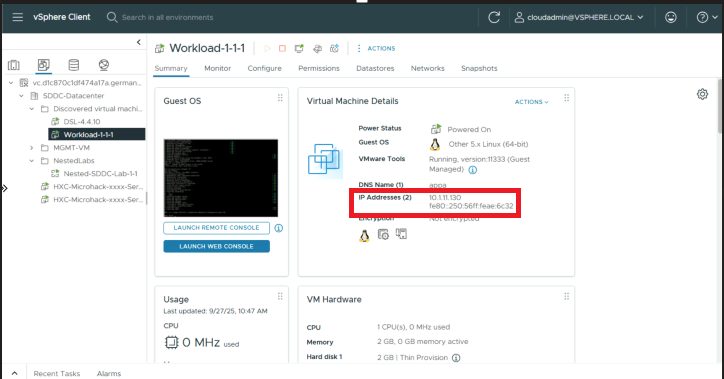

# Exercise 10: YAY - Its Migration Time - Finally!!!

[Previous Challenge Solution](./09-HCX-Network-Extension.md) - **[Home](../Readme.md)** - [Next Challenge Solution](./11-NSX-Firewall.md)

## Migrate a VM

1.	To migrate a virtual machine from and On Prem Environment to AVS, sign in to your on-premises HCX.

2.	Under Services, select Migration, and then select Create Mobility Group

3.	Once the Mobility Group screen is opened: click the checkbox and select the vm workload-1-1-1

5.	Give it a name to the mobility group (optional), select Compute Container, Destination Folder, Storage and Migration Profile as  shown in the picture.
    
    

    

    

    

6. Select validate
   
   
   
7. If validate OK, select GO.

    

8. Check the progression until the migration is done (hit refresh to update the status)

    
 
7.	Once the VM is migrated into AVS, check the IP address of the VM.

     

Note : 

As the VM that was migrated was on a extended network, the IP address of the VM has not changed; however if the VM that was migrated was not on an extended network, then the IP address of the VM would have changed. 

8. Optionally if time permits please also try out the reverse migration.

9. Try to ping Workload-1-1-1 from Workload-1-1-2.
> [!NOTE]
> The vcenter login details can be found in the Excel File or [MicroHack Data](/Lab/info/datos_Microhack_300925.xlsx) for VM Credentials

10. Move the second VM (Workload-1-1-2) accordingly (steps 2-7) to AVS.
