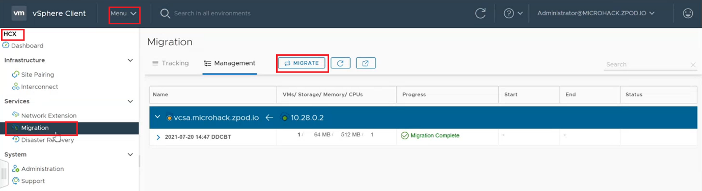
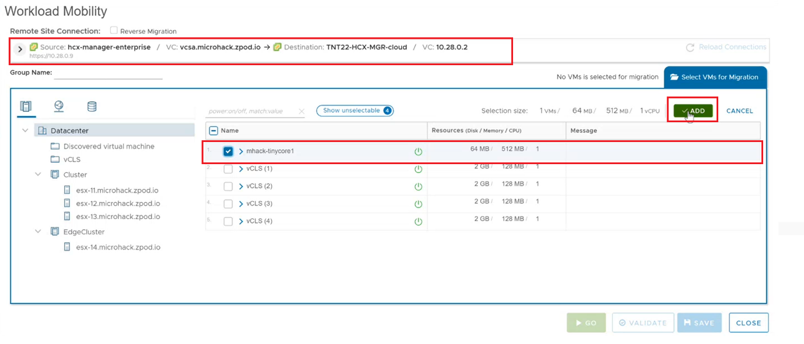
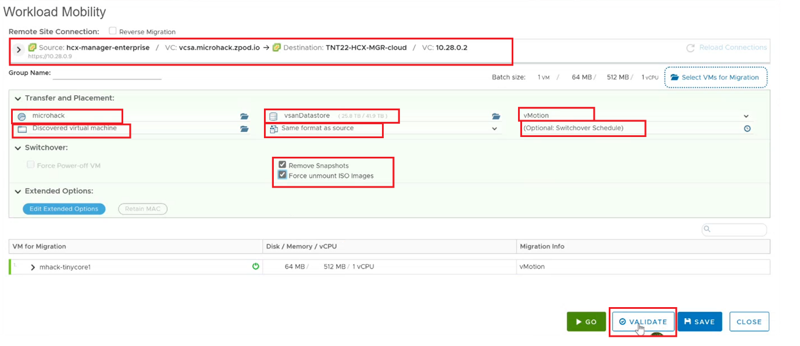
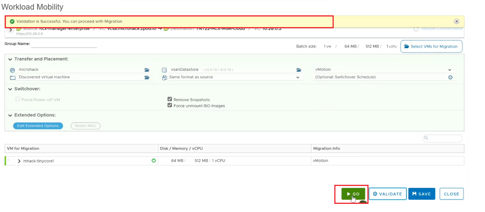

# Exercise 11: YAY - Its Migration Time - Finally!!!

[Previous Challenge Solution](./10-HCX-Network-Extension.md) - **[Home](../Readme.md)** - [Next Challenge Solution](./12-AVS-ANF-Datastores.md)

## Migrate a VM

1.	To migrate a virtual machine from and On Prem Environment to AVS, sign in to your on-premises vCenter, and under Home, select HCX.

2.	Under Services, select Migration, and then select the Migrate

3.	Once the Workload Mobility window is opened, ensure your site pairing is available from On Prem to AVS. 

4.	Select workload-xx-1 as a VM that will be migrated from On-Prem to AVS and press Add 

5.	Once the virtual machine is added, select the transfer and placement parameters for the virtual machine post migration to AVS and then press validate
 

6.	Once the transfer and placement validation of the virtual machine has gone through, press go for the migration of the virtual machine

 
7.	Once the VM is migrated into AVS, check the IP address of the VM. 

Note : 

As the VM that was migrated was on a extended network, the IP address of the VM has not changed; however if the VM that was migrated was not on an extended network, then the IP address of the VM would have changed. 