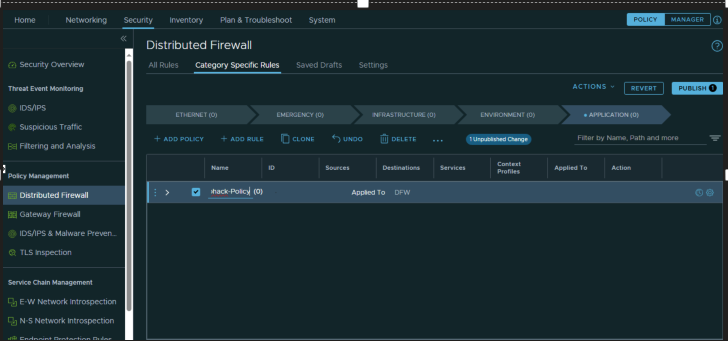

# Exercise 11: Lets explore NSX - Stepping stone to Microsegmentation

[Previous Challenge Solution](./10-AVS-Migrate-VM.md) - **[Home](../Readme.md)** - [Next Challenge Solution](./12-AVS-ANF-Datastores.md)

## Create a Distributed firewall

Use the VMs that you migrated in the last step to create a distributed firewall rule between the 2 VMs.

Workload-1-1-1 & Workload-1-1-2

1.	From your browser, log in to an NSX Manager at the URL and credentials indicated here:

    

    

    

2.	Go to Inventory > Groups > Add Group

    
 
3.	Add a group name as Application1 and then press Set Compute Members

    
 
4.	Add the IP of Workload-1-1-1 VM IP to this group and the press Apply

    
 
5.	Then press save button

    

6.	Now create a second Application group and click set members

    
 
7.	Click the IP addresses and then provide the IP address of the AVS Workload-1-1-2 VM and then press apply

    

8.  Then press save button
 
9.	Select Security > Distributed Firewall from the navigation panel and click Add Policy

    
 
10.	Enter a Name for the new policy section. Example: AVS-Microhack-Policy

    
 
11.	Click Add Rule and name it. Example: AVS-Microhack-Policy
 
    

12.	Set source for the rule by selecting the first Application group and then press apply

    
 
13.	Set destination for the rule by selecting the first Application group and then press apply

    
 
14.	Keep the action as Allow and then press publish

    

15.	One you firewall rule has been published, ping the Workload-1-1-2 VM from Workload-1-1-2 VM. We should notice that the ping is going through

     

16.	Now come back to the distributed firewall and set the action to reject

     

17.	Now ping the Workload-1-1-2 VM from Workload-1-1-1 VM. We should notice that the ping is blocked.

     
     
> [!NOTE]
> Please [Visit AVS Hub](https://www.avshub.io/workshop-guide/#credentials-for-the-workload-vms) for VM Credentials

This proves the distributed firewall rule between the 2 application groups
