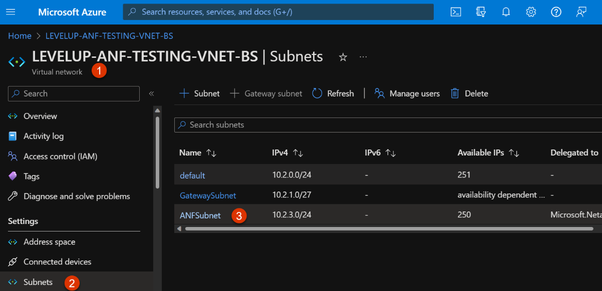
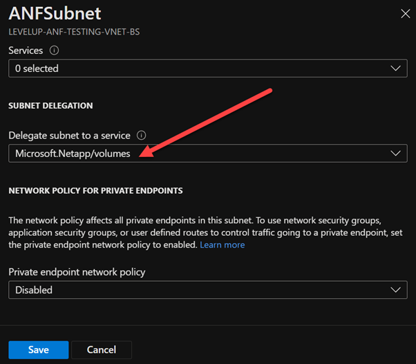
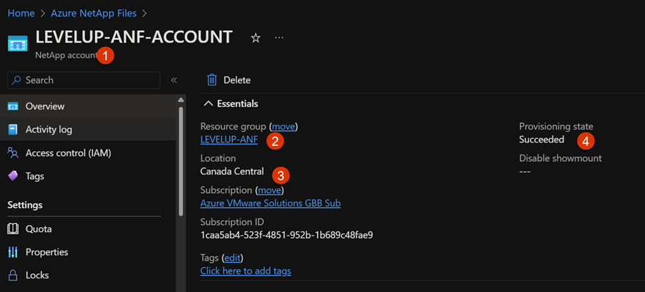
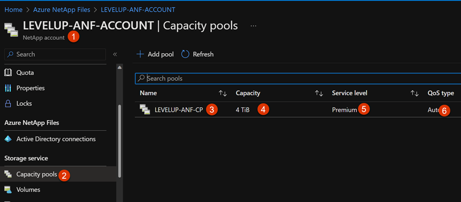
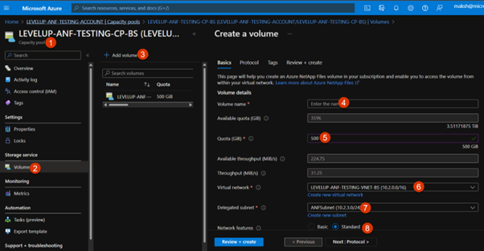
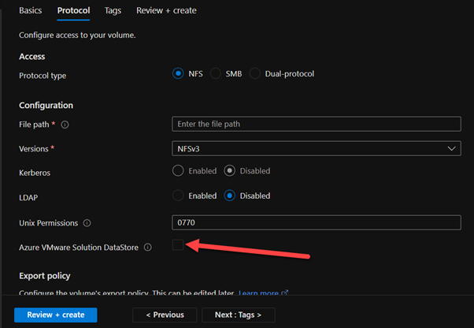
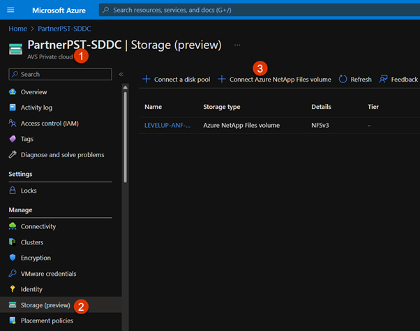
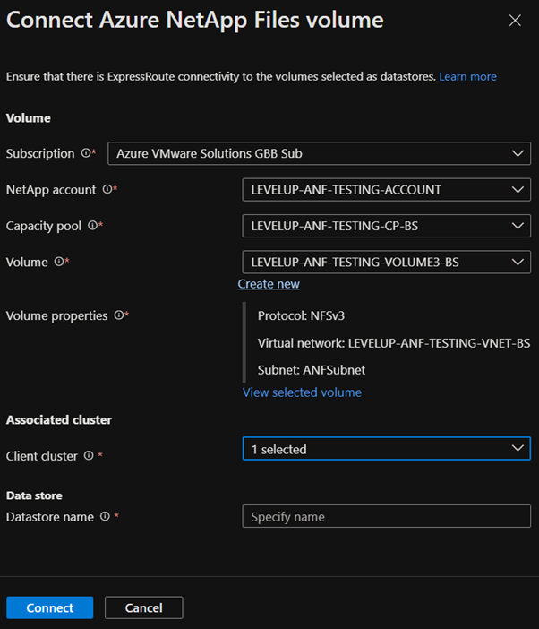

# Exercise 12: Attach ANF Datastores to AVS hosts copy

[Previous Challenge Solution](./11-AVS-Migrate-VM.md) - **[Home](../Readme.md)** - [Next Challenge SOlution](./13-AVS-Storage-Policy.md)

## Register the Microsoft.NetApp Resource Provider with your Azure subscription. 

Enable specific Azure region within your Azure subscription for being able to create NetApp Account by raising a specific type of support incident as below. (Already Done) 

Issue Type: Service and subscription limits (quotas) 

Quota Type: Storage: Azure NetApp Files limits 

Request Details 

Quota Type: Region Access 

Region Requested: <YOUR FAVOURITE AZURE REGION THAT SUPPORTS ANF> 

Identify the VNet which hosts the ER Gateway used for terminating AVS D-MSEE circuit from Workshop Pre-requisites section (Mhack00X-vnet). Create a delegated subnet in this VNet. This subnet should be delegated to service Microsoft.Netapp/volumes. (Already Done) 

## Verify ANF Delegated Subnet

Identify the VNet assigned to your AVS SDDC. This is available from Workshop Pre-requisites section. 

Navigate to the subnets under that VNet and ensure that ANFSubnet exists. 

Ensure that ANFSubnet has subnet delegation configured for Microsoft.Netapp/volumes.  
 
This step should already be done, If it is not configured, configure subnet delegation for Microsoft.Netapp/volumes as shown below 

## Verify ANF Account

Identify the ANF Account that has already been provisioned, you should see a resource group called MhackANF, with an ANF Account called MhackANF 

## Verify ANF Capacity Pool

Navigate to ANF Account identified/created in Step 3. 

Select "Capacity pools" from the left hand side menu. 

Ensure that LEVELUP-ANF-CP is listed as capacity pool. It should have "Premium" as service level, 4TB as Size and QoS type of Auto.

 

## Create ANF Volume
 
Creation of first volume takes around 5 minutes. Subsequent creation of volumes is quicker (< 1 mins) 

Select the Capacity Pool identified in Step 4. 

Select "Volumes" option from left hand side menu. 

On the right hand side pane, click "Add volume" button. 

On the "Basics" tab, provide - 

Name your volume

Select the VNet assigned to your group

Select the delegated subnet called ANFSubnet 

Select "Standard" as networking features

On the "Protocol" tab, provide – 

File path: Name of the volume. 

Azure VMware Solution Datastore: Checked 

Keep default options for rest of the fields. 

Click "Review + create" button

## Connect AVS with ANF Volume

Navigate to AVS SDDC assigned to your group. This is documented at Workshop Pre-requisites section. 

Click "Storage (preview)" option from the left-hand menu. 

Click "Connect Azure NetApp Files Volume"

On the flyout menu that appears, provide - 

Azure subscription, ANF Account, Capacity Pool and Volume you created in Step 5.  

AVS SDDC cluster 

Datastore name which is recommended to be same as volume name. 

Click "Connect"

## Verify the ANF volume as a datastore in AVS

Connect to AVS SDDC vCenter assigned to your group via jumpbox. This is documented at Workshop Pre-requisites section. 

Click on "Storage" menu on the vCenter portal. ANF Volume should appear as part of the datastores under SDDC. 

Verify the size of volume set up appears correctly on AVS SDDC vCenter. 