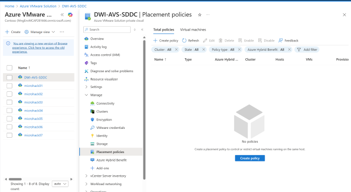
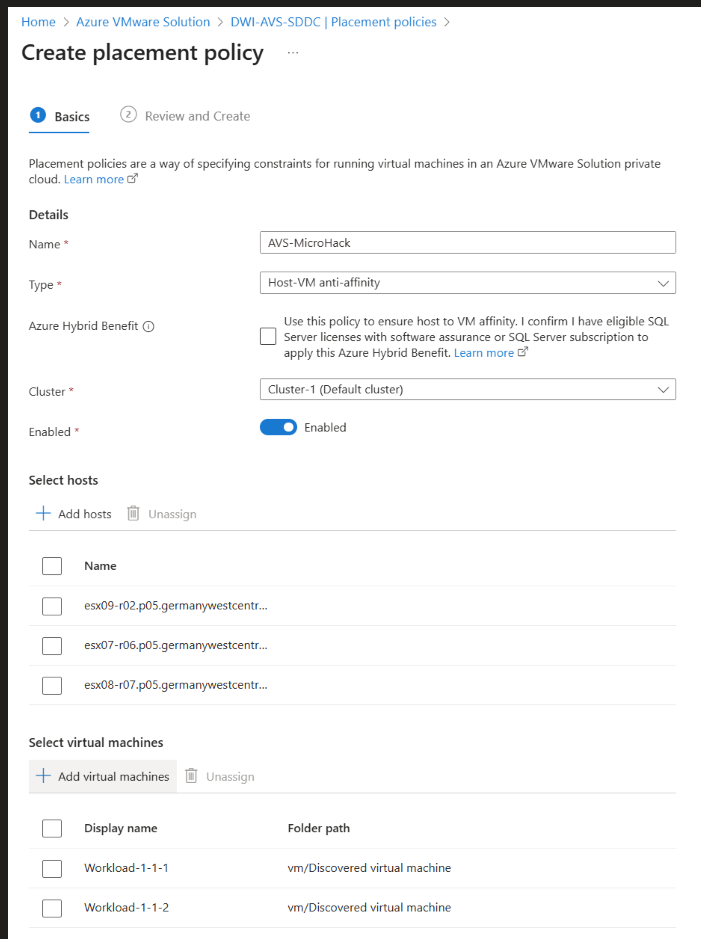
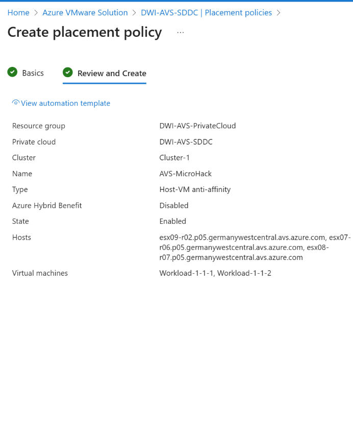

# AVS Placement Policies

[Previous Challenge Solution](./13-AVS-Storage-Policy.md) - **[Home](../Readme.md)** - [Next Challenge Solution](./15-AVS-Managed-SNAT.md)

## Create a placement policy
There is no defined limit to the number of policies that you create. However, the more placement constraints you create, the more challenging it is for vSphere DRS to effectively move virtual machines within the cluster and provide the resources needed by the workloads.

Make sure to review the requirements for the policy type.

In your Azure VMware Solution private cloud, under Manage, select Placement policies > + Create Policy.

### Tip

You may also select the Cluster from the Placement Policy overview pane and then select Create.

Provide a descriptive name, select the policy type, and select the cluster where the policy is created. Then select Enabled.

### Warning

If you disable the policy, then the policy and the underlying DRS rule are created, but the policy actions are ignored until you enable the policy.

If you selected VM-Host affinity or VM-Host anti-affinity as the type, select + Add hosts and the hosts to include in the policy. You can select multiple hosts.

### Note

The select hosts pane shows how many VM-Host policies are associated with the host and the total number of VMs contained in those associated policies. And then select the affected VM. In our case they will be the usual suspects.

### Note

The select hosts pane shows how many VM-Host policies are associated with the host and the total number of VMs contained in those associated policies.

Once you've finished adding the VMs you want, select Add virtual machines.

Select Next: Review and create to review your policy.

Select Create policy. If you want to make changes, select Back: Basics.

After the placement policy gets created, select Refresh to see it in the list.

Screenshot showing the placement policy as Enabled after it's created.

Edit a placement policy
You can change the state of a policy, add a new resource, or unassign an existing resource.

Change the policy state
You can change the state of a policy to Enabled or Disabled.

In your Azure VMware Solution private cloud, under Manage, select Placement policies.

For the policy you want to edit, select More (...) and then select Edit.

### Tip

You can disable a policy from the Placement policy overview by selecting Disable from the Settings drop-down. You can't enable a policy from the Settings drop-down.

If the policy is enabled but you want to disable it, select Disabled and then select Disabled on the confirmation message. Otherwise, if the policy is disabled and you want to enable it, select Enable.

Select Review + update.

Review the changes and select Update policy. If you want to make changes, select Back: Basics.

Update the resources in a policy