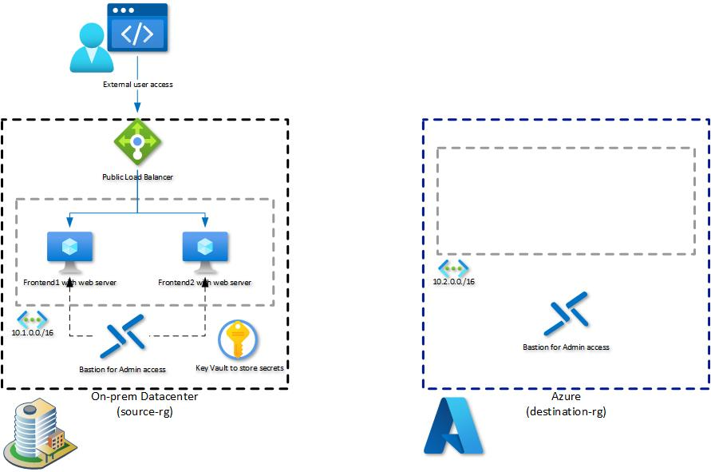

# Walkthrough Challenge 1 - Prerequisites and Landing Zone

Duration: 30 minutes

## Prerequisites

- Please ensure that you successfully verified the [General prerequisits](../../Readme.md#general-prerequisites) before continuing with this challenge.
- The Azure CLI is required to deploy the Bicep configuration of the Micro Hack.
- Download the *.bicep files from the [Resources](../../resources) to your local PC.

### **Task 1: Deploy the Landing Zone for the Micro Hack**

- Install the [Azure CLI](https://learn.microsoft.com/en-us/cli/azure/install-azure-cli) on your local PC
- Open a PowerShell (Windows) or Bash (Linux and macOS) terminal window
- Execute `az login` and sign in with your Azure AD account
- Execute `az ad signed-in-user show --query id `
- Copy the value to the clipboard
- Execute `az deployment sub create --location westeurope --template-file .\main.bicep`
- Paste the previously copied value as *currentUserObjectId*
- Select a region
- Wait for the deployment to finish

💡 Please note that the deployment may take up to 10 minutes

### **Task 2: Verify the deployed resources**
The bicep deployment should have created the following resources

- source-rg Resource Group containing the follwing resources
    + Virtual Network *source-vnet*
    + Virtual Machine *frontend1* with installed web server
    + Virtual Machine *frontend2* with installed web server
    + Public Load Balancer *plb-frontend* with configured backend pool containing *frontend1* and *frontend2* VM
    + Azure Bastion *source-bastion*
    + Azure Key Vault *source-kv-* containing username and password for VM login
   
- source-rg Resource Group containing the follwing resources
    + Virtual Network *destination-vnet*
    + Azure Bastion *destination-bastion*
    
The deployed architecture looks like following diagram:

### **Task 3: Verify Web Server availability**

- Open *source-rg* Resource Group
- Select *plb-frontend* Load Balancer
- Navigate to *Frontend IP configuration* under *Settings* section on the left
- Note and copy public IP address of *LoadBalancerFrontEnd*
- Open web browser and navigate to http://LoadBalancerFrontEnd-IP-Address
- A simple website containing the server name of the frontend1 or frontend2 VM should be displayed

You successfully completed challenge 1! 🚀🚀🚀

 **[Home](../../Readme.md)** - [Next Challenge Solution](../challenge-2/solution.md)
