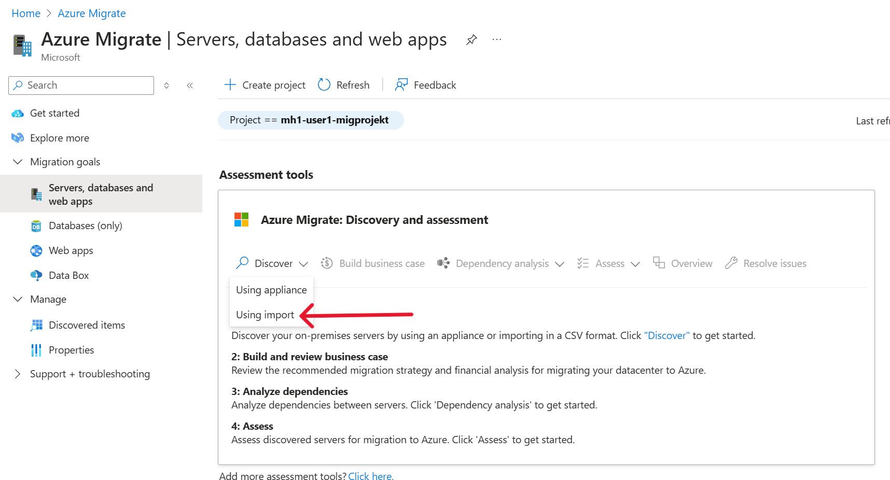
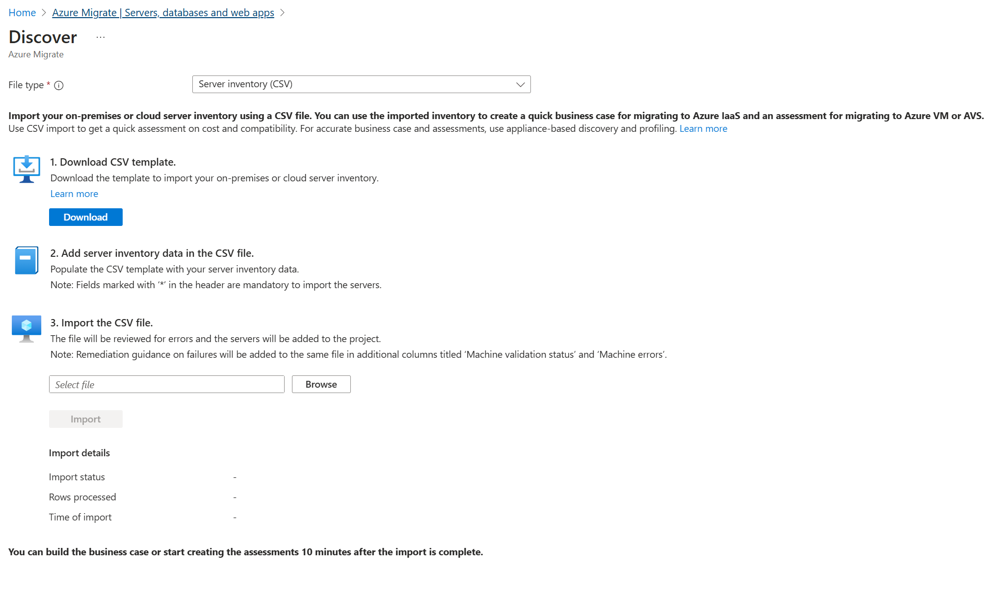

# Walkthrough Challenge 2 - Discover physical servers for the migration

Duration: 60 minutes

## Prerequisites

Please make sure thet you successfully completed [Challenge 1](../challenge-1/solution.md) before continuing with this challenge.

### **Task 1: Create a Azure Migrate Project**

> [!IMPORTANT]
> To be able to create a Business Case, make sure to select **Europe** as the Geography for the Azure Migrate Project

Open the [Azure Portal](https://portal.azure.com) and login using a user account with at least Contributor permissions on a Azure Subscription.

In the search bar enter *Azure Migrate* and select Azure Migrate from the list of services

Select *Servers, databases and web app* from the navigation pane on the left and click on *Create project*

Select the *source-rg* Resource Group, specify a name for the Azure Migrate Project and also select a geograpy where the data will be stored. Then under advanced select *private endpoint* as the connectivity metod, and the choise the source virtual network for the private endpoints 

Wait until the Azure Migrate Project has been created. Select *Servers, databases and web apps* from the navigation pane on the left.
Your previousley created Azure Migrate project should be preselected.

### **Task 2: Import Server list as an CSV file**

To start server discovery you will import a CSV file with the information of the servers

In the Azure Portal select *Discovery* under the section *Azure Migrate: Discovery and assessment* ander then choose *Using import*

Please download the import file from [here](https://github.com/latj/MicroHack/tree/adding-Update-Manager/03-Azure/01-03-Infrastructure/06_Migration_Datacenter_Modernization/resources/azuremigrate.csv) and save it.

In section 3 *Import the CSV file* click *Browse* and select the file you just downloaded, and then click *Import*

Please wait when the file is imported, it can take a minute!

IF the import is successfull it will show *Completed* and the number of rows. Wait until the notification *Uploading server inventory data* is completed, in the upper right in the Azure Portal.

After Import has been successfully initiated, go to the Azure portal to review the discovered inventory.

You can click *Overview* to get more insights on what information were discovered.

> [!NOTE]
> If no inventory data is available, click Refresh to refresh inventory data.

You successfully completed challenge 2! 🚀🚀🚀

 **[Home](../../Readme.md)** - [Next Challenge Solution](../challenge-3/solution.md)
